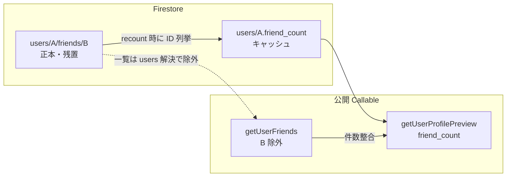

# ユーザーマイページ（プロフィール改修）

> **たべとも（友人一覧）**: [02_友人一覧機能.md](./02_友人一覧機能.md)  
> **友人招待**: [02_友人招待機能.md](./02_友人招待機能.md)  
> **体験拡張案**: [02_友人一覧機能_追加案.md](./02_友人一覧機能_追加案.md)  
> **テンプレート**: 本仕様は [02_仕様書追加ルールとテンプレート.md](../00_仕様概要/02_仕様書追加ルールとテンプレート.md) の構成に準拠する。

## 1. 概要

### 1.1 機能の目的

一般ユーザーの **プロフィール（マイページ）** を、Facebook / mixi のプロフィールのように情報を整理した構成へ改修し、**関係性・参加実績・注文実績**を把握しやすくする。

### 1.2 主要な機能

- **タブ再編**: 「プロフィール」「ともだち」「イベント」「コミュニティ」「フード」「注文履歴（本人のみ）」で構成する
- **プロフィールタブ**: プロフィール情報、各種カウント、各カテゴリのプレビュー（サムネ／短いテキスト）と「詳細へ」の導線を提供する
- **カウントの冗長化**: `users` に **数値カウントのみ**を保持し、マイページ上の数値表示に利用する（整合は再集計で担保）
- **一覧・プレビューのデータ取得**: **プロフィール専用 Callable 1 本**でプレビュー向けデータを集約取得する（`users` に **ID 配列は持たない**）
- **既存ユーザーの移行**: 管理用の **バックフィル Callable** で数値カウントを初期化・再計算できるようにする

### 1.3 対象ユーザー

- **閲覧者**: 本人・他のログインユーザー・未ログインユーザー（**フードタブ等の公開範囲の細則は別イシュー**で検討。Phase 1 では **4.2.0** の限定公開（`is_public == false`）の扱いを正とする）
- **操作の主体**: 本人のみ（注文履歴での領収書・キャンセル等）

## 2. ねらい

### 2.1 ビジネス目標

- プロフィール回遊により **再参加・招待・コミュニティ参加** の導線を強化する
- 実績の可視化により「続けたくなる」体験を作る（トロフィー等の称号は **別イシュー**）

### 2.2 ユーザー価値

- 参加イベント・たべとも・コミュニティ・食事の履歴を **一画面のプロフィール**から辿れる
- 自分の注文に関する操作（例: 領収書）は **注文履歴タブ**に集約する

### 2.3 成功指標（KPI）

- プロフィール閲覧の PV / 滞在時間
- プロフィールから **イベント・コミュニティ・ともだち** 各詳細への遷移率
- 注文履歴タブの利用率（本人）

## 3. 前提条件

### 3.1 技術的前提条件

- **クライアント**: `user` アプリ（Vue 3 + Vite + Vuetify 3）。ユーザーページは `/u/:userId`（実装は `user` パッケージ）
- **バックエンド**: Firebase Functions `functions/default`（TypeScript）に **Callable** を追加する
- **データストア**: Cloud Firestore
- **たべとも**: [02_友人一覧機能.md](./02_友人一覧機能.md) に従い、`getUserFriends` 等の方針と整合させる（友人サブコレはクライアント直 read しない）
- **プロジェクト規約**:
  - Firestore のフィールド名は **snake_case**
  - `common` の **DbSchema / AppSchema**、`TimestampSchema` / `EpochMillisSchema` の慣例に従う（詳細は `/shokujii-common-schemas`）
  - Firestore 操作は **store 経由**、`withConverter` 付き ref（詳細は `/shokujii-firestore`）

### 3.2 ビジネス的前提条件

- 「参加」イベント数（`participated_event_count`）の根拠は **5.1.2**（**ordered を満たすイベントのユニーク数**）。その他の参加表示は既存ドメインに従う
- **イベント主催回数**は **Phase 1 では扱わない**（Phase 2。イベント管理者機能の前提）

### 3.3 依存関係

- [02_友人一覧機能.md](./02_友人一覧機能.md): ともだち一覧・Callable 方針
- [02_友人招待機能.md](./02_友人招待機能.md): 招待導線（必要に応じてプロフィールからの遷移を追加）
- **（任意）** [04_プロフィールタグ機能.md](./04_プロフィールタグ機能.md): 将来のプロフィール拡張との整合

## 4. 画面仕様

### 4.1 画面遷移

- ユーザーページ `/u/:userId` を開く
- 「プロフィール」タブを既定で先頭に表示する（タブ順の先頭）
- 退会済み / 存在しないユーザーは既存どおりエラー表示に集約する
- **タブと URL（確定）**: タブをクリックしたときも「もっと見る」と同様にクエリを更新する。プロフィール以外は `?tab=` を付与する（例: `?tab=events`, `?tab=friends`, `?tab=communities`, `?tab=foods`, `?tab=orders`）。プロフィールタブはクエリなし（`/u/:userId` のみ）

### 4.2 UI 要素（タブ）

実装後のタブ構成（確定）:

| 順序 | タブ名 | 説明 |
| ---: | --- | --- |
| 1 | **プロフィール** | 旧案「概要」。プロフィール情報＋カウント＋各カテゴリのプレビュー |
| 2 | **ともだち** | たべとも一覧（[02_友人一覧機能.md](./02_友人一覧機能.md)） |
| 3 | **イベント** | 参加イベント一覧。限定公開も **本人・他者とも表示**（§4.2.0）。リンクは **本人のみ** |
| 4 | **コミュニティ** | 参加・運営を **1 画面で縦並びセクション**表示。限定公開も **本人・他者とも表示**。リンクは **本人のみ** |
| 5 | **フード** | 注文したフードを **注文単位**で時系列表示（新しい順を既定） |
| 6 | **注文履歴** | **本人のみ表示**。領収書ダウンロード・キャンセル等の操作はここ（UI は `UserEventCard` 踏襲）。限定公開イベントの行も §4.2.0 に従う |

#### 4.2.0 限定公開（`is_public == false`）の扱い（確定・2026-06-02）

URL 限定公開を含む **`is_public == false`** のイベント・コミュニティ、およびそれに紐づくフード・注文履歴・**ともだちタブの meet log** について、マイページ（`/u/:userId`）上では次を共通ルールとする。

| 閲覧者 | 表示 | イベント詳細・コミュニティ詳細へのリンク | 限定公開タグ・チップ（例: `URL限定公開`） |
| --- | --- | --- | --- |
| プロフィール所有者本人 | する | **する** | **しない** |
| 本人以外（他ユーザー・未ログイン） | **する** | **しない** | **しない** |

- **一般公開**（`is_public == true`）: 本人・他者とも **表示しリンクする**
- **対象画面**: プロフィールタブ（各プレビュー）、イベントタブ、コミュニティタブ、フードタブ、注文履歴タブ、**ともだちタブ**（カード日付・`FriendMeetLogDialog` の meet log）。詳細は [02_友人一覧機能.md](./02_友人一覧機能.md) §4.2 / §5.2.1.1
- マイページ UI では公開範囲を示すバッジは出さない（イベント詳細ページ本体の表示は本仕様の対象外）
- 他者に見えるのは **参加実績のメタ情報**（名称・サムネ・日時等）。詳細 URL の直叩きは **既存の Firestore ルール・ルーティング**で拒否する（§5.4）

#### 4.2.1 プロフィールタブ

- **表示**: 画像・表示名・自己紹介・SNS リンク（既存のプロフィール情報）
- **カウント**: イベント参加数・ともだち数・参加コミュニティ数・（将来）主催数・フード数 等。  
  - **カウント表示**: 数値サマリーは **限定公開を含む実績総数**。プレビュー・各タブも §4.2.0 に従い限定公開を含めて表示する（他者はリンク不可のみ）
- **プレビュー**（各ブロックとも「もっと見る」で対応タブへ）:
  - 参加イベント: サムネ中心（件数は **ブレークポイントで可変**。目安 12）。プロフィールタブでは **`ProfileEventCard`**（通常 `EventCard`、注文 UI なし）。§4.2.0
  - ともだち: アバター（件数は **ブレークポイントで可変**。目安: PC md 以上 150、タブレット sm 100、スマホ xs 30）。§4.2.6
  - コミュニティ: サムネ中心（目安 12）。§4.2.0
  - フード: メニュー画像＋メニュー名（目安 12）。§4.2.0
  - 注文履歴: **本人のみ**短いテキストプレビュー（目安 5）

#### 4.2.2 イベントタブ

- 参加したイベントを一覧表示する
- **カード UI（確定）**: トップページやコミュニティページと同様の **通常 `EventCard`** を用いる（参加者アイコンを表示）。注文内容・キャンセル・領収書等の操作系は **出さない**（`UserEventCard` は注文履歴タブ専用）
- **他者閲覧時**は操作系（キャンセル等）を表示しない（コンポーネント分割は必須ではない）
- **限定公開イベント（確定・2026-06-02）**: §4.2.0。本人・他者ともカード・サムネ・タイトルを表示。**本人のみ**イベント詳細へリンク。限定公開タグは出さない

#### 4.2.3 コミュニティタブ

- **参加コミュニティ**セクションと **管理（運営）コミュニティ**セクションを縦に並べる
- **コミュニティカード**: 説明文は **2 行**で省略表示する（`line-clamp: 2`）
- **限定公開コミュニティ（確定・2026-06-02）**: §4.2.0。本人・他者とも一覧・プレビューに表示。**本人のみ**コミュニティ詳細へリンク。限定公開タグは出さない

#### 4.2.4 フードタブ

- **注文ごと**に 1 行（カード）表示し、**時系列**で並べる
- メニュー画像は **Firestore 上の画像 URL 文字列としては保持しない想定**で、**Storage のパス規約**から組み立てる（実装では `common/src/utils/storagePaths.ts` の `getEventMenuImageStoragePath` 等を参照）
- **表示 URL の取得（要検討）**: クライアントが **Storage パスから `getDownloadURL`** するか、Callable が **署名付き URL を返す**かは **セキュリティルール・コールドスタート・キャッシュ**のトレードオフで実装時に決定する（推奨の初期案: 既存パターンに合わせ **クライアントでパス→URL**、ルールやパフォーマンスで Callable 返却を検討）
- **`previews.foods` に必要な最小キー（確定）**: クライアントで `getEventMenuImageStoragePath(event, menuId)` を再現可能とするため、各 food アイテムには **`order_id`, `community_id`, `event_id`, `menu_id`, `menu_name`, `menu_price`, `ordered_at`（または `updated_at`）, `event_status_value`（`accepting_order` か否か）, `partner_id`（accepting_order でない場合に必須）** を返す（DB 真名と一致）
- **限定公開イベント由来のフード（確定・2026-06-02）**: §4.2.0。本人・他者とも表示。イベント名等の詳細リンクは **本人のみ**

#### 4.2.5 注文履歴タブ（本人）

- `UserEventCard` を踏襲し、領収書・キャンセル等を提供する
- **限定公開イベント（確定・2026-06-02）**: 注文履歴行は表示する。**イベント詳細へのリンクは §4.2.0**（本人のみ）。マイページ文脈では `UserEventCard` の **URL限定公開チップ（`private_event`）は出さない**
- **URL 直叩きの挙動（確定）**: 他者プロフィールで `?tab=orders` 等を直接開いた場合、UI 側で **タブを表示しない**かつ **タブに該当しない既定タブ（プロフィール）にフォールバック**する（404 にはしない。本人かどうかは閲覧者の `auth.uid === target_user_id` で判定）

#### 4.2.6 ともだちタブ

- 一覧・ソート・Callable 方針は [02_友人一覧機能.md](./02_友人一覧機能.md) に従う
- **カード表示（確定）**: イベント名・カバー・リンクはカード内に出さず、**初めて会った日** / **最後に会った日**（`first_met_at` / `last_met_at`）を表示する。同席 1 回のみの関係は 1 行にまとめる
- **同席イベントの記録（確定）**: 「同席イベントの記録を見る」から **`FriendMeetLogDialog`** を開き、クリック時に `getUserFriendMeetLog` で **全件**を遅延取得する（一覧 API の `meet_log` 上限は使わない）。本人閲覧と他人閲覧でダイアログタイトルを切り替える
- **限定公開イベントと日付（確定・2026-06-02）**: ともだちカードの日付は **限定公開イベント由来の同席日も含めて**表示（カード内にイベント名・リンクは出さない）
- **meet log ダイアログ（確定・2026-06-02）**: `FriendMeetLogDialog` は §4.2.0 に従う。限定公開の同席イベントも **本人・他者とも行として表示**。**本人（プロフィール所有者）閲覧時のみ**イベント詳細へリンク。限定公開タグは出さない。API は [02_友人一覧機能.md](./02_友人一覧機能.md) §5.2.1.1 の `is_linkable`

#### 4.2.7 空状態

件数が 0 のときの表示（確定）:

| 画面 | 条件 | 表示 |
| --- | --- | --- |
| コミュニティタブ | 参加・運営とも 0 | 「まだ参加しているコミュニティはありません」 |
| コミュニティタブ | 参加のみ 0 | **参加コミュニティ**セクション見出しを出さない |
| コミュニティタブ | 運営のみ 0 | **運営コミュニティ**セクション見出しを出さない |
| プロフィールタブ（コミュニティプレビュー） | 参加・運営とも 0 | 上記と同様の空メッセージ。片方のみ 0 のときは該当ブロックのみ非表示 |
| ともだちタブ | ともだち 0 | 「まだ「ともだち」がいません。」のみ（補足文・イベントを探すボタンは出さない）。ソートトグルは非表示 |
| プロフィールタブ（ともだちプレビュー） | 読込中かつ 0 件 | ローディング表示 |
| プロフィールタブ（ともだちプレビュー） | `has_more` かつ表示 0 件 | 空メッセージは**出さない**（退会者スキップ等で追読み中。自動 `next()`） |
| プロフィールタブ（ともだちプレビュー） | 追読み余地なしかつ 0 件 | `user_profile.empty.friends` |
| フードタブ | `has_more` かつ可視 0 件 | 空メッセージは**出さない**（`IncrementalLoader` 維持＋自動 `next()`） |
| フードタブ | 追読み余地なしかつ可視 0 件 | `user_profile.empty.foods` |
| イベントタブ | 参加 0 | 「まだ参加しているイベントはありません。」 |

#### 4.2.8 プロフィールメニュー（ナビゲーション右上）

- **ユーザー名表示**: フォントをやや大きくし、**マイページ**（`/mypage`）へのリンクとする
- **メニュー項目の順序（確定）**: ユーザー名の下に **カート** → **注文履歴**（`/u/:userId?tab=orders`）→ **プロフィール編集**（`/profile`）の順。いずれも「マイページ」単独項目は **出さない**

## 5. 技術仕様・データ構造設計

### 5.1 Firestore スキーマ設計

#### 5.1.1 方針（確定）

- `users/{user_id}` に **数値カウントのみ冗長化**する
- **ID 配列は持たない**（Firestore doc サイズ・インデックス・更新競合のリスク回避、表示は Callable が `limit(N)` クエリで取得）

#### 5.1.1.1 `friends` サブコレと `friend_count` の二層モデル（確定・2026-06-02）

退会ユーザー周りで「`friends` ドキュメントは残るのに `friend_count` は減る」と見えるが、**Phase 1 では意図した設計**である。不整合の定義を次のとおり固定する。

##### 2 層の役割

| 層 | データ | 意味 | 退会友人 B の扱い |
| --- | --- | --- | --- |
| **正本（グラフ）** | `users/{A}/friends/{B}` | 同席関係の記録（`event_history`, `meet_count` 等） | **ドキュメントは残置**（[02_友人一覧機能.md](./02_友人一覧機能.md) S-7） |
| **表示用キャッシュ** | `users/{A}.friend_count` | マイページに「今見せるともだち数」 | **数えない**（`users/{B}.is_deleted === true` を除外） |

- **`friend_count` は `users/{uid}/friends` の doc 数ではない**。再集計時にサブコレの doc ID を列挙し、**`getUserFriends` と同じ除外ルール**（退会・不存在の `friend_user_id` を除く）で件数を数え、`users/{uid}` に書き戻す（`computeActiveFriendCount` / `recountUserProfileCounts`）。
- したがって Firestore を直接数えると **`friends` ドキュメント数 ≥ `friend_count`** となりうる。これはバグではなく、**非公開の関係エッジが DB に残っている**状態を表す。

##### プロダクト上の整合性（守るべき不変条件）

クライアントは `friends` を直 read しない（Callable 一本化）。整合すべきは次のみ。

1. **`getUserFriends`（退会者除外後）で返る友人件数** と、同一タイミングの **`getUserProfilePreview` の `friend_count`**
2. 退会者本人のプロフィールは **`not-found`**（カウントは凍結でよい）

**守らないもの（Phase 1）**: `friend_count === users/{uid}/friends` の生 doc 数。

##### 退会時に `friends` を消さない理由（要約）

- 退会処理・注文副作用・バッチ再構築との整合を単純化する
- 同席履歴の正本を残し、将来の `purgeUserFriends`（個人情報削除要請・Phase 2）に委ねる
- 公開 API（一覧・meet log・プレビュー）では S-1 / RC-58 により **退会友人を返さない**

##### 一時的なズレと復旧

| 現象 | 原因 | 復旧 |
| --- | --- | --- |
| 一覧に B がいないのに `friend_count` だけ大きい | キャッシュ未再集計 | `deleteUserAccount` 後の相手側 `recountUserProfileCounts`（RC-50）、または次回の友人副作用 / `backfillUserProfileCounts` |
| `friends/{B}` 内の `meet_count` が古い | 正本 doc は残置、UI は B を参照しない | 利用者向け表示には影響しない。物理削除は Phase 2 |

**関連**: [02_友人一覧機能.md](./02_友人一覧機能.md) S-1 / S-7 / A-7 / DS-4、§5.1.2 RC-50

#### 5.1.2 `users/{user_id}` への追加フィールド（論理名・型）

以下は **Phase 1** で追加する想定（実装時に `common/src/schemas/User.ts` へ反映し zod 化する）。

| フィールド名 | 型 | 必須 | 説明 |
| --- | --- | --- | --- |
| `participated_event_count` | number (int, ≥0) | **required**（**backfill 完了後**の新規・更新は常に保持。プロジェクトの DbSchema では新規フィールドは原則 required） | **確定**: **少なくとも 1 件の `status === 'ordered'` の EventMemberOrder が存在し、かつイベント側 `event.is_deleted == false` のイベントのユニーク数**。`event.event_status` が `cancelled` 相当のイベントは含めない。実装は `member_orders` collection group 集計と `events` の `members` 基準クエリのうち高速な方で良いが、**数値は本定義と一致**させる |
| `friend_count` | number (int, ≥0) | **required**（同上） | **確定**: **表示用キャッシュ**（§5.1.1.1）。**`getUserFriends` と同一の除外ルール**のともだち数。`users/{uid}/friends` の生 doc 数ではなく、**退会ユーザー（`is_deleted == true`）等は含めない** |
| `joined_community_count` | number (int, ≥0) | **required**（同上） | **参加**コミュニティ数（`members` に自分が含まれる）。**`is_deleted == true` のコミュニティは除外** |
| `managed_community_count` | number (int, ≥0) | **required**（同上） | **管理（運営）**コミュニティ数（`managers` に自分が含まれる）。同上 |
| `ordered_food_count` | number (int, ≥0) | **required**（同上） | **確定**: **`status === 'ordered'` の EventMemberOrder ドキュメント数（注文件数）**。**キャンセルで `canceled` に推移したものは含めない**（再集計で必ず減る）。`in_cart` も含めない |
| `hosted_event_count` | number (int, ≥0) | **Phase 2** | イベント主催数（イベント管理者機能の前提） |
| `counts_updated_at` | Timestamp | **required**（同上） | マイページ用カウントの最終更新時刻。**更新対象は 5.1.3 の一覧**（注文系だけに限定しない） |

> **表示仕様**: バックフィル前の古いクライアント互換のため、**read 側では未設定を 0 扱い**してもよい（DS-3）。**backfill ・本番移行完了後の DbSchema は上記 required を正とする**。

##### 退会ユーザーの取り扱い（確定）

- 本人退会時、`users/{uid}` 自体は既存仕様に従って **論理削除（`is_deleted == true`）**で扱われる前提（[13_アカウント削除.md](./13_アカウント削除.md) と整合）
- 退会済みユーザー本人の `users` ドキュメントの **カウントは凍結**（再集計しない。`recountUserProfileCounts(uid)` は `is_deleted` で no-op）
- **他ユーザーの冗長カウント**: `friend_count`（および将来同様の除外ルールを持つカウント）は、集計時に退会者を **数えない**（`computeActiveFriendCount` ＝ `getUserFriends` と同一）。一覧 API は即座に退会者を除外するが、**`users.{uid}.friend_count` は再集計まで古い値が残りうる**
- マイページ側は **退会ユーザーのプロフィール表示自体を `not-found`** として返す（5.2.1 の Callable で扱う）

##### 退会時の相手側 `friend_count` 再集計（RC-50・確定・2026-06-02）

**背景**: §5.1.1.1 の二層モデルどおり、退会時も `users/{A}/friends/{B}` は **物理削除しない**が、`friend_count` は退会者を数えない。再集計トリガが無いと、一覧（即時除外）と **`friend_count` キャッシュ**だけ一時的に不一致になりうる。

**例**: A と B が友人。B が `deleteUserAccount` で退会 → A の一覧は B を返さないが、A の `friend_count` が 1 のまま残る。

**確定方針（Phase 1 実装対象）**:

| 項目 | 内容 |
| --- | --- |
| トリガ | `deleteUserAccount` Callable が **Firestore 匿名化トランザクション成功後**・**Auth `deleteUser` の前または後**（本処理の成功パス内） |
| 対象 uid | 退会者 B の `users/{B}/friends` サブコレクションの **ドキュメント ID 集合**（= 同席関係のあった相手 `friend_user_id`）。重複除去し、空 uid は除外 |
| 処理 | 各相手 uid `A` に対し `recountUserProfileCounts(A)` を **`Promise.allSettled` 等で非同期実行**（§5.1.3 副作用の失敗許容ポリシー A1）。**1 件失敗してもアカウント削除本体は成功**とする |
| 再集計内容 | `recountUserProfileCounts` 既存仕様どおり（`friend_count` は退会者除外済み件数に更新）。B 本人には呼ばない |
| 整合 | 更新後の `friend_count` は **`getUserFriends` の件数（退会者除外後）と一致**することを単体テストで担保 |

**Phase 1 で触れないもの（別 Issue 可）**:

- `friends` ドキュメントの物理削除（`purgeUserFriends`・Phase 2）
- 退会者 B が所属していたコミュニティの **他メンバー全員**への `joined_community_count` 再集計（B 脱退は B 本人の `joined_community_count` のみ影響。他者の参加コミュニティ数は変わらない想定）

**関連**: [13_アカウント削除.md](./13_アカウント削除.md) §6.3 処理フロー、[02_友人一覧機能.md](./02_友人一覧機能.md) S-7 / RC-58（一覧・meet log の表示除外）

#### 5.1.3 データ整合・`counts_updated_at`（確定）

- **都度の再集計**（集計クエリ／バッチ）で正確性を優先（DS-2 確定）
- 各種副作用の完了後に **`users` の数値カウントを再計算し、整合した時点の `counts_updated_at` を更新**する

**`counts_updated_at` を更新するタイミング（一覧・推奨）**:

| ドメイン | トリガ（推奨で結びつける箇所） | 影響しうるカウント |
| --- | --- | --- |
| 注文 | `applyOrderConfirmedSideEffects` / `applyOrderCanceledSideEffects` の末尾（[orderConfirmedSideEffects.ts](../../functions/default/src/orderConfirmedSideEffects.ts) / [orderCanceledSideEffects.ts](../../functions/default/src/orderCanceledSideEffects.ts)） | `participated_event_count`, `ordered_food_count`（注文者本人のみ） |
| コミュニティ | メンバー参加・脱退を行う **store / Callable**（注文確定で `community.addMember` も走るため、注文経路と二重発火しないよう注意） | `joined_community_count`（参加・脱退したユーザー本人） |
| コミュニティ | 管理者（managers）追加・削除を行う **store / Callable** | `managed_community_count`（追加・削除された管理者本人） |
| ともだち | **`friendsService.addEventToFriendHistory` / `removeEventFromFriendHistory` の末尾**（pair Transaction の外側、関係する両 uid に対して 1 回ずつ呼ぶ） | `friend_count`（関係する両 uid） |
| アカウント削除 | **`deleteUserAccount` 成功後**（RC-50）。退会者 `users/{B}/friends` の相手 uid それぞれに `recountUserProfileCounts`（try/catch 独立・削除本体は失敗させない） | 相手側の `friend_count`（および同関数が更新する他カウント） |
| 運用 | 管理者 `backfillUserProfileCounts` | 全マイページ用カウント |

##### 副作用の失敗許容ポリシー（A1・確定）

`applyOrderConfirmedSideEffects` の既存パターンに合わせ、`recountUserProfileCounts(uid)` の呼び出しは **独立した try/catch** で実行し、**失敗時はエラーログのみで成功扱い**とする。  
注文・コミュニティ参加・友人グラフなど **強整合が要求される副作用とは独立**にカウントを再集計する（カウント失敗で本処理が止まらない）。  
ズレが生じた場合は **次回の同ドメイン操作**または **`backfillUserProfileCounts`** で復旧する。

##### Transaction 境界（A2・確定）

- `friendsService` の `applyForPair` は **ペア単位 `runTransaction`** を多数回回す既存設計。**`friend_count` の更新は pair Transaction の中ではなく、`addEventToFriendHistory` / `removeEventFromFriendHistory` の最後に関係する両 uid に対して `recountUserProfileCounts(uid)` を 1 回ずつ呼ぶ**ことで、`getUserFriends` の除外規則（`is_deleted` 退会者除外）と同じ集合をカウントできる
- 同様に **コミュニティ系・注文系**でも、ドメイン本処理の Transaction の **外側**で `recountUserProfileCounts(uid)` を呼ぶ（**read-after-write** で最終的な値を再取得する）

##### `recountUserProfileCounts(uid)` の DR/DW 設計（A3・確定）

- **入力**: 対象 uid（カウントを再集計したい 1 ユーザー分）
- **読み取り**: 関連する `count()` aggregation を **`Promise.all` で並列**に走らせ、対象の全カウントを一度に集計する
  - `friend_count`: `users/{uid}/friends` を **`getUserFriends` と同一の除外ロジック**でフィルタした件数（退会者除外を含む）
  - `participated_event_count`: `member_orders` CG で `user_id == uid + status == 'ordered'` を取得し、イベントをユニーク化。`is_deleted == false` かつ `event_status.value !== 'event_canceled'` のみ数える（RC-57）
  - `ordered_food_count`: `member_orders` collection group `user_id == uid + status == 'ordered'` の **集計**（既存 index `status + user_id` を流用）
  - `joined_community_count` / `managed_community_count`: 親 `communities.members` / `managers` 配列の **count 集計**（UI と同データ源。RC-55）。members サブコレは書き込み正本
- **書き込み**: 全カウント＋`counts_updated_at` を **同一の `users/{uid}` 書き込み**で**一括更新**する（部分更新による不整合を避ける）。store 経由（`withConverter` 付き）で書き、必ず先に `get` してから他フィールドを保持して書き戻す
- **冪等性**: 入力が同じなら何度呼んでも同じ結果。**読み取り→書き込み**の間にレースが生じた場合でも、**最後に書いた者勝ち**で良い（次回トリガで上書きされるため、業務影響は最小）
- **失敗時**: counts も `counts_updated_at` も**変更しない**（古い値のままで残る）

#### 5.1.4 再集計の呼び出し元（推奨）

実装時は **ドメイン更新の単一箇所**にフックを集約し、二重実行を避ける。

- **注文系（functions/default）**:
  - `applyOrderConfirmedSideEffects` 末尾で `recountUserProfileCounts(userId)` を独立 try/catch で呼ぶ
  - `applyOrderCanceledSideEffects` 末尾で同様に呼ぶ（`canceled` 化に伴う `ordered_food_count` の減算をカバー）
- **コミュニティ系**: `communities/{id}/members/{uid}` の **`onCommunityMemberWritten`**（参加・脱退・`roles` 変更）で `recountUserProfileCounts(uid)`。親 `community.members` / `managers` 配列の legacy 同期タイミングに依存しない（RC-43/44）。store 成功パスとの二重発火は許容（`recountUserProfileCounts` は冪等）。注文確定経路では `community.addMember` 内部または `applyOrderConfirmedSideEffects` のいずれか **片方だけ**が呼ぶようにし、二重発火しない
- **友人系**: `addEventToFriendHistory` / `removeEventFromFriendHistory` の **末尾**で、関係する全 uid に対し `recountUserProfileCounts(uid)` を呼ぶ（pair Transaction の外側、Promise.allSettled で並列実行）
- **監査・修復**: バックフィル Callable と、必要なら **Cloud Scheduler** による差分検知は別イシューで可

### 5.2 Callable / Functions 設計

#### 5.2.1 `getUserProfilePreview`（仮称・新規）

**目的**: プロフィールタブ初期表示に必要な **プレビューデータ**を **1 往復**で返す。

**認証**:

- **未ログインでも呼べる**ことが望ましい（他者プロフィール閲覧と整合）
- **注文履歴プレビュー**など本人限定データは `auth.uid === target_user_id` のときのみ返す

**`common` 契約（確定）**:

- **Request / Response 型**は **`common/src/apis/`** に定義する（既存の `userFriends.ts` と同じ規約）
- 関数側で **Zod**（`z.object({ target_user_id: z.string().min(1) })`）でバリデーション
- **Callable 引数はプリミティブ中心**とする（ネストした設定オブジェクトは渡さない）

**入力（推奨・Phase 1）**:

- `target_user_id: string`（必須）
- 各プレビューの件数 `limit(N)` は **サーバ既定**とし、**クライアントからは渡さない**（UI のブレークポイントがサーバ側定数で足りる想定）。将来クライアント指定が必要になった場合のみ **`preview_events_limit` 等のフラットな optional number** を **個別に**追加する（`limits: { ... }` のような入れ子は使わない）
- **cursor / pagination**: プロフィールは **プレビュー専用**のため `cursor` を **持たない**（追読込みは各タブの既存 store が担当する）。将来「もっと見る」を Callable 経由にする場合のみ、**ドメインごとに別 Callable を立てる**（`getUserProfilePreview` には足さない）

**エラー（確定）**:

- `target_user_id` が **存在しない / 退会済み（`is_deleted == true`）** の場合は **`HttpsError` `not-found`**（`getUserFriends` の挙動と一致）
- **Phase 1** では件数をクライアントから受け取らないため、**`invalid-argument`（limits 不正）**は **原則不要**（将来フラット引数を足したときに必要なら追加）

**出力（論理）**:

- **フィールド名は DB の物理名（`snake_case`）と一致**させる（**友人系 Callable と同方針**。クライアントの camelCase 変換は別レイヤで統一）
- `user_profile`（公開可能な範囲のプロフィール表示に必要なフィールド）
- `counts`（`users` の冗長カウント。**read 時のみ**未設定を 0 扱い可）
- `previews.events`（サムネ・タイトル等。**限定公開も本人・他者とも返す**。§4.2.0・`is_linkable`）
- `previews.friends`（**`resolveUserFriendsList` 経由**の先頭 N 件・サーバ既定 **30 件**。`getUserFriends` と同一解決関数。二重実装禁止。**現行 UI は未参照**—§5.5 参照）
- `previews.joined_communities` / `previews.managed_communities`（**限定公開も本人・他者とも返す**。§4.2.0・`is_linkable`）
- `previews.foods`（**4.2.4 に列挙した最小キー**。**限定公開イベント由来も本人・他者とも返す**。§4.2.0・`is_linkable`）
- `previews.orders`（本人のみ。短いテキスト用。無ければ `null`）

##### 表示・リンク可否フラグ（B3・確定・2026-06-02）

`previews.events` / `previews.joined_communities` / `previews.managed_communities` / `previews.foods` および `getUserFoods` の各アイテムに、レスポンス専用フィールドを付与する（DB 真名と無関係）:

| フィールド | 意味 |
| --- | --- |
| `is_visible_to_viewer` | マイページ UI に描画する。返却した項目は **常に `true`** |
| `is_linkable` | イベント詳細・コミュニティ詳細へ `<router-link>` してよいとき `true` |
| `is_public` | イベント／コミュニティの公開フラグ（リンク・再判定用に返す） |

判定（`is_public`, `viewer_uid`, `target_user_id`）:

- **`is_public == true`**: `is_linkable = true`（本人・他者共通）
- **`is_public == false`**: `is_linkable = (viewer_uid === target_user_id)`（**本人のみ** `true`）。**本人・他者ともレスポンスに含める**（2026-05-25 の「本人以外は除外」は廃止）

**enum ではなく boolean** とする。

**プレビュー件数・取得順（2026-06-02 更新）**:

- **イベント・コミュニティ**: 本人・他者とも、対象ユーザーの参加・運営実績に基づき **`is_public` でクエリを絞らない**（`limit` は参加実績ベース）
- **フード・注文プレビュー / `getUserFoods`**: `member_orders` をページ取得し、**削除済み等のみ除外**したうえで件数が `limit` に達するまで **最大 20 ページ**まで追読み（限定公開のみの先頭ページでも追読み継続）
- **友人プレビュー**: 退会者のみのページは同様に **最大 20 ページ**まで追読みする
- 他者向けに `is_public == true` のみ先に取る方式（2026-05-31）は **廃止**

**内部実装方針**:

- **並列取得**（`Promise.all`）でレイテンシを抑制
- **友人プレビュー**は **`getUserFriends` が内部で使う友人解決ロジックと同一関数**を呼ぶ（`getUserProfilePreview` 専用にロジックを分岐複製しない）
- Firestore 読み取りは **`functions/default/src/stores/` 経由**（`userProfile.ts` から `getFirestore()` 直クエリしない）
- Firestore は **読み取り回数が最小になるように**バッチ化する
- **Abuse 対策（F1・確定）**: 未ログインで叩ける Callable のため、**レート制限・監視・min instances** 等は本番リリース後の負荷に応じて別途調整する。**App Check は Phase 1 では必須としない**。クライアントに App Check を配布し Callable で `enforceAppCheck` を有効化する場合は別イシューで検討する。なお Firebase コンソール側で App Check をプロダクト全体に強制している場合は、本 Callable のオプションとは別レイヤでブロックされ得るため、環境ごとにコンソール設定を確認する

#### 5.2.2 `backfillUserProfileCounts`（仮称・新規・管理者 Callable）

**目的**: 既存ユーザーの **`participated_event_count` 等**を一括初期化・再計算する（DS-3 / PH-1）。

**要件（方針・確定）**:

- 権限: **管理者（support）のみ**
- 既存 `backfillUserFriends`（[friendsService.ts](../../functions/default/src/utils/friendsService.ts) `runBackfill`）と同等の運用性を持たせる:
  - `dry_run: boolean`（既定 `true`）
  - 1 回あたりの処理上限: **`MAX_USERS_PER_RUN`**（推奨: 既存 `MAX_EVENTS_PER_RUN = 10` と揃え **10 ユーザー/回** から開始し、運用負荷を見て調整）
  - `resume_token: string | null`（base64 エンコードした最後に処理した `user_id`）
  - 範囲指定: `user_id_from` / `user_id_to`（uid のレキシカル順）
- **Request / Response 型**は `common/src/apis/userProfile.ts`（仮）に定義し、`backfillUserFriends` の Request/Response 設計を流用
- **dry_run の出力**: `scanned_users_count`・`updated_users_count`・`no_change_users_count` を返す（書き込みは行わず差分のみカウント）
- 内部実装は **`recountUserProfileCounts(uid)` を 1 ユーザーずつ順次呼ぶ**（並列度はランタイムに合わせて 1〜数並列）。dry_run 時は `users/{uid}` への書き込みは行わない

#### 5.2.3 `getUserFoods`（フードタブ追読み）

**目的**: フードタブの **カーソル付き一覧**（プロフィールプレビューとは別 Callable）。

- **Request**: `target_user_id`（必須）、`limit`（任意）、`cursor`（任意）
- **Response**: `foods[]`（4.2.4 の最小キー＋`is_visible_to_viewer`＋`is_linkable`＋`is_public`）、`next_cursor`、`has_more`
- **取得**: `member_orders` をページ取得し、削除済み等を除いたうえで §4.2.0 に従い `is_linkable` を付与。件数が `limit` に達するまで **最大 20 ページ**（`MAX_PROFILE_PREVIEW_SKIP_PAGES`）まで追読み
- **型**: `common/src/apis/userProfile.ts`。フロントは `base/src/stores/userFoods.ts` から呼ぶ

### 5.3 Firestore インデックス設計（D1・確定・2026-05-31 更新）

Phase 1 のマイページ・友人一覧実装（#1985）で、**既存に加え**次の複合インデックスを `firestore.indexes.json` に追加済み（sandbox デプロイ要）。

| 用途 | クエリ | インデックス |
| --- | --- | --- |
| 参加イベントの一覧・集計（従来） | `events` CG: `is_deleted == false` + `members array-contains userRef` + `orderBy(event_start_datetime desc)` | 既存 |
| **プロフィール・イベントプレビュー（他者・2026-06-02）** | 上記と同クエリ（**`is_public` 条件なし**で参加実績から `limit`） | 既存 CG インデックスを流用 |
| 注文一覧・フードプレビュー / `getUserFoods` | `member_orders` CG: `status == 'ordered'` + `user_id == uid` + `orderBy(updated_at desc, order_id desc)` | **追加済み** |
| 注文集計（カウント用） | `member_orders` CG: `status == 'ordered'` + `user_id == uid` の `count()` | 既存 |
| 参加コミュニティ一覧（従来・タブ等） | `communities`: `members array-contains userRef` + `orderBy(community_num_members desc)` | 既存 |
| **プロフィール・参加コミュニティプレビュー（他者・2026-06-02）** | `communities`: `members` + `limit`（**`is_public` 条件なし**） | 既存インデックスを流用可 |
| **プロフィール・運営コミュニティプレビュー（他者・2026-06-02）** | `communities`: `managers` + `limit`（**`is_public` 条件なし**） | 同上 |
| **`joined_community_count` / `managed_community_count` 集計** | `communities`: `members` / `managers` の `array-contains userRef` + `count()`（RC-55。members CG は非採用） | 既存 |

**注意点**:

- `EventMemberOrder.ordered_at` は **optional** のため、新しい順は **`updated_at desc`** を使う（既存 index と整合）
- `array-contains` と range / `orderBy` の複合には **複合インデックスが必要**（テンプレートの指針）
- 今後クエリを足す場合も、**実装 PR と同タイミングで `firestore.indexes.json` に追加**する

### 5.4 セキュリティルール（方針）

- **原則**: 公開範囲の細則は **別イシュー**（PR-1 / PR-3）。本仕様の **イベント／コミュニティ／フード／meet log**は **§4.2.0**: Callable は **限定公開のメタ情報を本人・他者とも返す**が、**他者向け UI はリンクしない**。**本人限定の注文・決済系**は出さない
- **本人限定項目**: 注文履歴プレビュー・注文系の詳細は **認証 uid の一致**で返却を制御
- **詳細ページの閲覧**: 他者にはリンクを出さないが、URL 直叩きは **既存の Firestore ルール・ルーティング**でブロックする

### 5.5 フロントエンド（`user`）

- **プロフィールタブ**: `getUserProfilePreview` を **単一 store**（`useUserProfilePreviewStore(targetUserId)`）で保持。イベント・コミュニティ・フード・注文プレビューは **`previews.*` を参照**
- **ともだちプレビュー（実装確定）**: `previews.friends` は使わない。初回から `useUserFriendsStore(target_user_id, 'meet_count', page_size=30)` で `getUserFriends` を呼び、表示だけ `profileFriendsPreviewMaxTotal`（xs:30 / sm:100 / md+:150）で `slice` する。ともだちタブは **同一 `meet_count` ストアとデータ共有**（`last_met_at` ソートは別ストア）。概要ブロックは `hasMore` かつ 0 件の間は空文言を出さずローディング＋**自動 `next()`**（サーバの退会者ページスキップと整合）
- **フードタブ**: `useUserFoodsStore` → `getUserFoods`。`hasMore` かつ可視 0 件の間は空表示を出さず `IncrementalLoader`＋自動 `next()`（§4.2.7）
- **各タブの無限スクロール**: 既存の Pinia store（イベント一覧・友人一覧・コミュニティ一覧等）を継続利用（**ハイブリッド**）
- **共有 UI（`base`）**: ともだちカードは `FriendCard.vue`、同席記録は `FriendMeetLogDialog.vue`（[02_友人一覧機能.md](./02_友人一覧機能.md) §4.2.1 / §5.5.1.1）
- **既存ページの扱い（E1・確定）**: ルートは `user/src/pages/u/[userId].vue`（薄いラッパー）。本体は **`user/src/components/profile/UserProfilePage.vue`**（URL `/u/:userId` 維持）
- **限定公開の表示・リンク**: §4.2.0。`is_linkable === false` のとき **`<router-link>` を使わない**（`is_public` または API の `is_linkable` で分岐）。認証 UID 変化時はプレビュー・フード store を **再取得**（RC-59 / RC-60）
- **限定公開タグ**: マイページ上では **出さない**（`UserEventCard` の `private_event` チップ等）

### 5.6 処理フロー（概要）

1. `/u/:userId` を開く
2. プロフィールタブ表示時に `getUserProfilePreview` を呼ぶ
3. Callable が並列でプレビュー用データを構築して返す
4. 画面がプロフィール・各プレビューを描画する
5. 「もっと見る」で該当タブへ遷移し、既存の一覧 store が追読込みする
6. （裏側）注文・友人・コミュニティ等の副作用（**5.1.3**）で **カウント再集計**が走り `users` の数値と `counts_updated_at` が更新される

## 6. データマイグレーション（必要な場合）

### 6.1 既存ユーザーへの初期投入

- `backfillUserProfileCounts`（仮称）で **全ユーザーまたは段階的範囲**を処理する
- **dry_run** で件数・コストの見積もりを行い、本実行する

### 6.2 ロールバック

- **backfill 完了後**は `users` のカウントフィールドは **required** を正とする。問題時は **read 側で未設定を 0 扱い**、**再バックフィル**、または **緊急時のみ**スキーマを緩める等の運用で復旧する（ドキュメントフィールドの削除は原則しない）

## 7. 実装優先度

### 7.1 Phase 1（必須）

- [x] `users` に数値カウント用フィールドを追加（`common/src/schemas/User.ts` の zod / converter、5.1.2 のとおり backfill 後 required）— **#1985 実装済み**
- [x] `recountUserProfileCounts(uid)` ユーティリティを `functions/default/src/utils/` に追加（5.1.3 の DR/DW 設計に従う）
- [x] 副作用フックを以下に挿入し、独立 try/catch で実行（5.1.4）
  - [x] `applyOrderConfirmedSideEffects` 末尾
  - [x] `applyOrderCanceledSideEffects` 末尾
  - [x] `onCommunityMemberWritten`（members サブコレ）
  - [x] `friendsService.addEventToFriendHistory` / `removeEventFromFriendHistory` 末尾（関係する全 uid に並列発火）
- [x] `getUserProfilePreview` Callable: `common/src/apis/userProfile.ts` の Request/Response、`is_visible_to_viewer` フラグ
- [ ] **2026-06-02 仕様**: `is_linkable` 追加、本人以外にも限定公開を返却、UI のリンク・タグ制御（§4.2.0）
- [x] `getUserFoods` Callable（フードタブ追読み）
- [x] `backfillUserProfileCounts` 管理者 Callable: `MAX_USERS_PER_RUN`、dry_run、resume_token、範囲指定
- [x] `user/src/components/profile/UserProfilePage.vue` の改修（`pages/u/[userId].vue` ラッパー、`?tab=orders` フォールバック）
- [x] `firestore.indexes.json` の差分追加（5.3 参照）
- [ ] パフォーマンス計測（プロフィール表示 p50/p95）
- [ ] 退会時の他者 `friend_count` 再集計（§5.1.2 RC-50・`deleteUserAccount` から相手 uid へ `recountUserProfileCounts`）

### 7.1.1 Definition of Done（DoD）

- [x] `friend_count` と `getUserFriends` の除外ルール整合の単体テスト
- [x] `recountUserProfileCounts` の冪等性・集計テスト
- [x] Callable レスポンスの本人 / 他者分岐の単体テスト（`getUserProfilePreview`）
- [ ] §4.2.0: 他者閲覧で限定公開を返し `is_linkable === false`、本人で `true` の単体テスト
- [x] 退会ユーザーの `target_user_id` で `getUserProfilePreview` が `not-found` を返すこと
- [x] `applyOrderCanceledSideEffects` の部分キャンセル時スキップの単体テスト（RC-45）
- [ ] `applyOrderCanceledSideEffects` を経由したキャンセルで `ordered_food_count` が **減ること**を E2E 相当で確認

### 7.2 Phase 2（将来対応）

- [ ] `hosted_event_count`（イベント主催）とその UI
- [ ] 公開範囲設定（友人限定など）と Callable の認可統合（PR-1 / PR-3）
- [ ] トロフィー・称号（[07_アチーブメント系機能.md](./07_アチーブメント系機能.md)）

## 8. 注意事項

### 8.1 既存システムへの影響

#### 8.1.1 データベース

- `users` ドキュメントへフィールド追加（**backfill 後は Zod 上 required**）
- Callable 追加に伴う **読み取り増**（特にプロフィール閲覧 PV）。`limit(N)` とインデックス設計で抑制する

#### 8.1.2 アプリケーション

- `user/src/components/profile/UserProfilePage.vue` の大改修
- `functions/default` に Callable 追加

### 8.2 セキュリティ考慮事項

- 他者プロフィールで **注文・決済系**が漏れないこと（Callable の分岐を単体テスト推奨）
- **限定公開のメタ情報**は本人・他者ともプロフィール API で返しうる（§4.2.0）。**他者 UI はリンクなし**。詳細ページ・推測 URL は **既存権限**でブロック
- **注文・決済系**が他者に漏れないこと（Callable 分岐の単体テスト推奨）

### 8.3 パフォーマンス考慮事項

- プロフィールは **1 Callable** に集約し **フロントの直列 N+1** を避ける
- Functions のコールドスタートがボトルネックになる場合は **min instances** 等を別途検討（コストトレードオフ）
- メニュー画像は **Storage path → download URL** の生成コストに注意（**4.2.4**: クライアント生成と Callable での署名 URL 返却の **要検討**）

## 9. 品質チェック（抜粋）

テンプレート [02_仕様書追加ルールとテンプレート.md](../00_仕様概要/02_仕様書追加ルールとテンプレート.md) 5.1 に準拠:

- [x] 概要・ねらい・前提が記載されている
- [x] Firestore のパス・フィールド（snake_case）・更新方針が記載されている
- [x] 画面（タブ構成とプロフィール）が記載されている
- [x] Functions（Callable）の役割が記載されている
- [x] Phase 1 / 2、注意事項が記載されている
