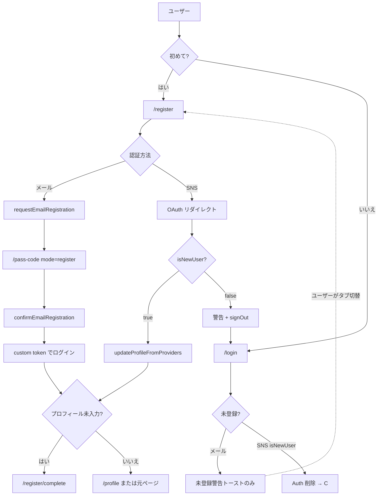

# アカウント作成機能

> **実装イシュー**: [#2090](https://github.com/nijuniinc/bokudeli-event-new/issues/2090)（feat/2090）  
> **関連**: [13_アカウント削除](./13_アカウント削除.md)、[09_アプリ内ブラウザのログイン動作](./09_アプリ内ブラウザのログイン動作.md)、[WS-A 実装設計 A-4](../08_エンタープライズ/30_リファクタ計画/03_WS-A実装設計.md)

## 0. 用語集（初学者向け）

| 用語 | 意味 |
|------|------|
| **PF版** | 一般ユーザー向けアプリ（`user` パッケージ）。URL 例: `https://shokujii.jp` |
| **Firebase Authentication（Auth）** | Google が提供する認証基盤。ログイン状態（`uid`）を管理する |
| **Firestore** | アプリのデータベース。ユーザー名・メール等はここにも保存する |
| **OTP / パスコード** | メールで送る 6 桁のワンタイムコード。パスワードの代わりに使う |
| **Callable Function** | フロントから呼べる Cloud Functions。メール送信やユーザー作成をサーバー側で安全に実行する |
| **OAuth / SNS ログイン** | Google・Facebook・X など外部サービス経由のログイン |
| **custom token** | Functions が発行し、クライアントが `signInWithCustomToken` でログインするためのトークン |

**Auth と Firestore の関係（重要）**

- **Auth**: 「この人は誰か」（`uid`）を証明する
- **Firestore `users` / `users_personal_information`**: 表示名・メール等のアプリ用プロフィール

アカウント作成では、**Auth ユーザー作成**と **Firestore ドキュメント作成**の両方が必要。

---

## 1. 概要

### 1.1 機能の目的

PF版（一般ユーザーアプリ）で、**新規ユーザーが明示的な「新規登録」導線からだけ**アカウントを作成できるようにする。

旧来の問題として、**ログイン画面から未登録メールを入力すると、知らないうちにアカウントが作られていた**。本機能（#2090）でログインと新規登録を分離し、意図しないアカウント作成を防ぐ。

### 1.2 主要な機能

- **新規登録専用画面** `/register` を提供（Google / Facebook / X / メール）
- **ログイン専用画面** `/login` とは UI・API を分離
- メール新規登録: OTP 送信 → パスコード入力 → Auth ユーザー + Firestore 作成 → ログイン
- SNS 新規登録: `/register` から OAuth → プロフィール情報を Firestore に保存
- 登録完了後: プロフィール未入力なら `/register/complete` で設定を促す
- **ログイン導線では新規作成しない**（メール未登録・SNS 初回ログインを拒否。SNS は `/register` へ自動遷移、メールはトーストで新規登録を案内）

### 1.3 対象ユーザー

- まだ shokujii にアカウントを持っていない一般ユーザー
- 対象アプリ: **PF版 `user` のみ**（partner / enterprise は本仕様のスコープ外）

### 1.4 スコープ外

- エンタープライズ版の従業員認証（別 Functions）
- ゲスト参加 UI 自体（将来実装）。ただしゲストの OTP も PF版 Callable を流用する設計は [04_詳細_ゲスト参加](../08_エンタープライズ/10_仕様/04_詳細_ゲスト参加.md) を参照
- エンタープライズユーザー（`enterprise_id` claims あり）の PF 版利用制限（A-3 / PA-03d）。PF 新規登録自体はブロックしないが、ログイン後は PF 利用不可となる（§6 E-10）

---

## 2. ねらい

### 2.1 ビジネス目標

- 意図しない PF版アカウントの増加を抑える（例: エンプラ従業員の誤操作）
- 「ログイン」と「新規登録」の UX を明確化し、参加者獲得導線を整理する

### 2.2 ユーザー価値

- 初めての人は「新規登録」、既存ユーザーは「ログイン」と迷わない
- メール OTP 方式でパスワード不要のまま安全に登録できる

### 2.3 成功指標（KPI）

- 新規登録完了率（`/register` 開始 → プロフィール設定完了）
- ログイン導線からの暗黙アカウント作成件数（**0 件**が目標）
- メール / SNS 各経路の登録成功率

---

## 3. 課題・背景

### 3.1 旧来の問題（#2090 以前）

```
/login で未登録メール入力
  → requestEmailLogin が OTP 送信
  → confirmEmailLogin が user_id 未設定の passCode から createUser
  → Firebase Auth + Firestore users が新規作成される
```

- 画面文言は「ログインまたは新規登録」だが、**実装はログイン画面から作成も可能**だった
- エンプラ従業員が PF版に誤ログインした際も、PF版アカウントが作られる温床になっていた

### 3.2 本機能での方針

入口（`/login` / `/register`）× 認証手段（メール / SNS）× アカウント状態ごとの挙動を以下に示す。

**凡例**

- **変更**: #2090 で挙動が変わった
- **変更なし**: 従来どおり
- **新規**: #2090 で明示的に定義された経路

**「登録済み」の判定**

| 経路 | 判定基準 |
|------|----------|
| メール | Firestore `users_personal_information` にそのメールがあるか（`getUserIdFromEmail`） |
| SNS | Firebase Auth の OAuth 結果 `getAdditionalUserInfo().isNewUser`（`false` = 既存 Auth ユーザー） |

メールと SNS で判定の層が異なる点に注意する。

**判定レイヤの不一致（メール重複の取りこぼし）**

- メール経路は `getUserIdFromEmail`（Firestore）で登録済みを拒否する
- SNS 経路は Auth の `isNewUser` のみで分岐し、**Firestore メール重複の事前チェックはない**
- そのため「Firestore にメールあり・Auth は新規 SNS（`isNewUser=true`）」の組み合わせでは、`updateProfileFromProviders` 内の `getUserIdFromEmail` で `already-exists` となり拒否される（§6 E-11）

#### 3.2.1 メール認証

| 入口 | メール状態 | 挙動 | #2090 |
|------|-----------|------|-------|
| `/login` | 未登録 | `requestEmailLogin` が `not-found`。OTP 送信せず「未登録」警告トースト（文言で新規登録を案内）。**`/register` へは自動遷移しない**（タブ切替はユーザー操作） | **変更**（旧: OTP → 暗黙作成） |
| `/login` | 登録済み | OTP 送信 → `/pass-code`（mode=login）→ ログイン | 変更なし |
| `/register` | 未登録 | OTP 送信 → `/pass-code`（mode=register）→ 新規作成 | **新規** |
| `/register` | 登録済み | `requestEmailRegistration` が `already-exists`。OTP 送信せず「登録済み」警告 | **新規** |

**`/pass-code`（mode=register）の続き**

| 条件 | 操作 | 結果 | #2090 |
|------|------|------|-------|
| 未登録 | OTP 正しい | `confirmEmailRegistration` → Auth + Firestore 作成 → ログイン → `/register/complete` | **新規** |
| 未登録 | OTP 誤り | エラーダイアログ | **新規** |
| 登録済み（競合） | OTP 確定 or 再送 | `already-exists` → 警告 → `/login` | **新規** |
| Auth のみ存在・Firestore なし等 | OTP 確定 | `createUser` が `email-already-exists` → `already-exists` → `/login` | **新規** |

**`/pass-code`（mode=login）の続き**

| 条件 | 操作 | 結果 | #2090 |
|------|------|------|-------|
| 登録済み | OTP 正しい | `confirmEmailLogin` → ログイン → 元ページ等 | 変更なし |
| 登録済み | OTP 誤り | エラーダイアログ | 変更なし |

#### 3.2.2 SNS 認証（Google / Facebook / X）

本番は OAuth **リダイレクト復帰**（`router/index.ts`）。ポップアップ認証はデバッグ用で、`login.vue` / `register/index.vue` に同様のガードがある。

| 入口 | Auth 状態 | 挙動 | #2090 |
|------|----------|------|-------|
| `/login` | 未登録（`isNewUser=true`） | 誤作成した Auth を delete → signOut → 警告 → `/register` へ | **変更**（旧: 暗黙作成） |
| `/login` | 登録済み（`isNewUser=false`） | ログイン成功。プロフィール未入力なら `/register/complete` 等 | 変更なし |
| `/register` | 未登録（`isNewUser=true`） | 新規登録フロー（`updateProfileFromProviders` → プロフィール誘導） | 変更なし |
| `/register` | 登録済み（`isNewUser=false`） | signOut → 警告 → `/login` へ（登録成功扱いにしない） | **変更** |

**SNS 成功後の共通後処理**（`/login` 登録済み / `/register` 未登録）

| 条件 | 遷移先 |
|------|--------|
| メール未設定 | `/register/email` |
| 名前 or 画像未設定 | `/register/complete` |
| 新規かつプロフィール済み | `/profile`（`isNewUser: true`） |
| 既存かつプロフィール済み | `redirectPath` または `/` |

#### 3.2.3 SNS エラー・特殊ケース

| 入口 | 状況 | 挙動 | #2090 |
|------|------|------|-------|
| `/login` | `account-exists-with-different-credential`（別 SNS と同じメール） | 既存がメールのみ → `/pass-code` mode=login / 既存が SNS → `/login?pid1=&pid2=`（連携ダイアログ） | 変更なし |
| `/register` | 同上 | 警告 → **`/login` のみ**（pass-code ログインには進まない） | **変更** |
| 両方 | `credential-already-in-use` | 警告ダイアログ | 変更なし |
| `/login` | `rejectNewUserOnLogin` の delete 失敗 | signOut → ログイン失敗表示。**`/register` には行かない** | **新規** |

#### 3.2.4 入口ガード（ログイン状態・環境）

| 条件 | 挙動 | #2090 |
|------|------|-------|
| ログイン済みで `/login` or `/register` | `/` 等へリダイレクト | 変更なし |
| 未ログインでログイン必須ページ | `/login` + `redirectPath` 保存 | 変更なし |
| in-app ブラウザで `/login` or `/register` | `/inapp-login`（URL コピー誘導。`/register` も対象） | `/register` 追加（RC-7 追補） |

#### 3.2.5 主要 8 パターン早見表

| 入口 | 手段 | アカウント状態 | 結果 | #2090 |
|------|------|---------------|------|-------|
| `/login` | メール | 未登録 | 拒否 → 警告トーストで新規登録を案内（自動遷移なし） | **変更** |
| `/login` | メール | 登録済み | OTP ログイン | 変更なし |
| `/login` | SNS | 未登録 | Auth 削除 → `/register` へ | **変更** |
| `/login` | SNS | 登録済み | ログイン成功 | 変更なし |
| `/register` | メール | 未登録 | OTP → 新規作成 | **新規** |
| `/register` | メール | 登録済み | 拒否 → ログインを案内 | **新規** |
| `/register` | SNS | 未登録 | 新規作成フロー | 変更なし |
| `/register` | SNS | 登録済み | signOut → `/login` へ | **変更** |

#### 3.2.6 変更の要約

| パターン | 旧 | 新 |
|----------|-----|-----|
| 未登録メール × `/login` | 作成 | **拒否**（トースト案内。SNS と異なり `/register` 自動遷移なし） |
| 登録済みメール × `/login` | ログイン | ログイン（**変更なし**） |
| 未登録メール × `/register` | （専用導線なし） | **作成** |
| 登録済みメール × `/register` | （専用導線なし） | **拒否** |
| 未登録 SNS × `/login` | 作成 | **拒否 → /register** |
| 登録済み SNS × `/login` | ログイン | ログイン（**変更なし**） |
| 未登録 SNS × `/register` | 作成 | 作成（**変更なし**） |
| 登録済み SNS × `/register` | ログイン扱いになりうる | **拒否 → /login** |

---

## 4. 画面仕様

### 4.1 URL 一覧

| パス | 役割 | ログイン要否 |
|------|------|-------------|
| `/login` | ログイン専用 | 不要 |
| `/register` | **新規登録専用（本仕様の中心）** | 不要 |
| `/pass-code` | OTP（6 桁）入力。未ログイン時は login/register mode、ログイン済み時はメール変更 | 不要（メール変更時はログイン済み） |
| `/register/complete` | 登録完了・プロフィール誘導 | 要 |
| `/register/email` | SNS 登録後のメール未設定時 | 要 |
| `/profile` | プロフィール設定 | 要 |
| `/inapp-login` | アプリ内ブラウザ向け URL コピー誘導 | 不要 |

### 4.2 共通レイアウト（AuthEntryLayout）

`/login` と `/register` は共通コンポーネント `AuthEntryLayout` を使用する。

- 上部: shokujii ロゴ
- ウェルカム文言: ログイン「おかえりなさい👋」/ 新規「shokujiiへようこそ🎉」
- **タブ切替**: 「ログイン」「新規登録」（`RouterLink` で SPA 遷移。ページ再読み込みしない）
- 本文: 利用規約・プライバシーポリシー同意文 + 認証ボタン群

### 4.3 `/register` 画面 UI

| 要素 | 内容 |
|------|------|
| SNS ボタン | Google / Facebook / X で新規登録 |
| 区切り線 | SNS とメールの間 |
| メール入力 | 必須・形式バリデーション |
| 送信ボタン | 「メールアドレスで新規登録」 |

**エラー表示**

| 条件 | 表示 |
|------|------|
| 登録済みメール（メール経路） | 「このメールアドレスはすでに登録されています。ログインしてください。」 |
| SNS 登録失敗 | 「{SNS名}新規登録できませんでした」 |

### 4.4 画面遷移（全体像）



### 4.5 メール新規登録フロー（詳細）

1. `/register` でメール入力 → 「メールアドレスで新規登録」
2. `requestEmailRegistration` 呼び出し
   - Firestore に同メールがあれば `already-exists` → 警告、処理中断
   - なければ 6 桁 OTP をメール送信（SendGrid）
3. `/pass-code` へ遷移（`history.state`: `{ email, mode: 'register' }`）
4. 6 桁入力（自動 submit）
5. `confirmEmailRegistration` 呼び出し
   - Firebase Auth に `createUser`
   - Firestore に `users` + `users_personal_information` 作成
   - custom token 返却
6. `signInWithCustomToken` でログイン
7. プロフィール未設定なら `/register/complete` へ

### 4.6 SNS 新規登録フロー（詳細）

1. `/register` で SNS ボタン押下
2. OAuth リダイレクト（本番）。ポップアップはデバッグ用
3. 復帰時 `router/index.ts` の初回ガードで処理
4. **`isNewUser === false`（既存）**: 警告 → `signOut` → `/login`
5. **`isNewUser === true`（新規）**: `updateProfileFromProviders` で Firestore 作成/更新
6. メール未設定 → `/register/email`
7. 名前/画像未設定 → `/register/complete`
8. 完了後、保存済み `redirectPath` または `/` へ

### 4.7 `/pass-code` の分岐

`/pass-code` は **3 分岐** がある（`pass-code.vue`）。`history.state.mode` より **ログイン済みかどうか** が優先される。

| 条件 | OTP 再送 | OTP 確定 | 主な遷移元 |
|------|----------|----------|-----------|
| **ログイン済み**（`currentUser != null`） | `requestEmailChange` | `confirmEmailChange` | `/register/email`（SNS 登録後のメール設定）、プロフィールのメール変更 |
| **未ログイン** + `mode=register` | `requestEmailRegistration` | `confirmEmailRegistration` | `/register` メール新規登録 |
| **未ログイン** + `mode=login`（デフォルト） | `requestEmailLogin` | `confirmEmailLogin` | `/login` メールログイン、§3.2.3 の credential 衝突時 |

**mode=login / register の Callable 対応**

| mode | OTP 再送 Callable | OTP 確定 Callable |
|------|-------------------|-------------------|
| `login` | `requestEmailLogin` | `confirmEmailLogin` |
| `register` | `requestEmailRegistration` | `confirmEmailRegistration` |

**その他**

- `history.state.mode` は `'login' | 'register'` のみ有効（それ以外は `login` にフォールバック）
- `register` で `already-exists` → 警告 → `/login`
- email が state に無い場合: 未ログインなら `/login` または `/register` へ戻す。ログイン済みなら `/`
- **「戻る」ボタン**: `mode=register` のとき `/register`、`mode=login` のとき `/login` へ戻る（i18n `passcode.back` は「ログイン画面へ戻る」固定のため、register 時は文言と実装が不一致）

### 4.8 `/register/complete`

| 状態 | タイトル | 次のアクション |
|------|----------|----------------|
| 新規ユーザー | アカウント登録完了 | X 連携 or 自分でプロフィール入力 → `/profile` |
| 既存だがプロフィール未入力 | プロフィール登録 | 同上 |

### 4.9 アプリ内ブラウザ

LINE / Facebook / X 等のアプリ内 WebView から `/register` にアクセスした場合:

- `/inapp-login` へリダイレクト（実装は `router/index.ts`。[09_アプリ内ブラウザのログイン動作](./09_アプリ内ブラウザのログイン動作.md) は `/login` のみ記載のため **09 側の更新が未反映**。本書 §4.9 が正）
- **元 URL（`/register` 含む）を sessionStorage に保持**し、URL コピーで通常ブラウザへ誘導

### 4.10 ログイン必須ページからの導線

カート等のログイン必須ページから `/login` に飛ばされた後:

- `sessionStorage` に `redirectPath` を保存
- タブで `/register` に切り替え可能（SPA 遷移）
- 登録・ログイン完了後、元ページへ戻る

---

## 5. 技術仕様

### 5.1 Callable API 契約

| Callable | 用途 | 未登録メール | 登録済みメール |
|----------|------|-------------|---------------|
| `requestEmailLogin` | ログイン OTP 送信 | `not-found` | OTP 送信 |
| `confirmEmailLogin` | ログイン確定 | — | custom token（passCode に `user_id` 必須） |
| `requestEmailRegistration` | **新規登録 OTP 送信** | OTP 送信 | `already-exists` |
| `confirmEmailRegistration` | **新規登録確定** | Auth 作成 + Firestore 保存 | — |

**型定義**: `common/src/apis/user.ts`  
**クライアント**: `base/src/apis/user.ts`  
**実装**: `functions/default/src/user.ts`

### 5.2 `confirmEmailRegistration` のサーバー処理順

```
1. passCode 検証（有効期限 24h、6 桁一致）
2. passCode.user_id が null であること（登録用 OTP であること）
3. Firebase Auth createUser({ email, emailVerified: true })
4. saveUser → users + users_personal_information
5. deletePassCode
6. createCustomToken(uid)
7. { token } を返却
```

**エラー**

| 条件 | HttpsError / 挙動 |
|------|-------------------|
| Auth に既存メール | `already-exists` |
| passCode 不正 | `invalid-argument` |
| saveUser 失敗 | 例外 throw。**passCode は削除しない**。Auth は `deleteUser` で rollback（§6 E-8） |
| deletePassCode 失敗（saveUser 成功後） | 例外 throw。**passCode は削除しない**。Firestore は `deleteNewUserDocuments`、Auth は `deleteUser` で rollback（Firestore rollback 失敗時も Auth 削除は独立試行） |

### 5.3 passCode（OTP）データ

| 項目 | ログイン用 | 新規登録用 |
|------|-----------|-----------|
| コレクション | `pass_code` | 同左 |
| `user_email` | 入力メール | 入力メール |
| `user_id` | **既存 uid** | **null** |
| 有効期限 | 24 時間 | 24 時間 |
| メールテンプレート | SendGrid `USER_PASS_CODE_TEMPLATE_ID` | 同左 |

### 5.4 作成される Firestore データ

`saveUser` により以下が作成される（初回は最小限）:

| コレクション | 主なフィールド |
|-------------|---------------|
| `users/{uid}` | `user_id`, プロフィール各種（SNS 経由なら provider から自動入力） |
| `users_personal_information/{uid}` | `user_email` |

### 5.5 OAuth 入口ガード（`authEntryGuards.ts`）

| 関数 | 使用場面 | 動作 |
|------|----------|------|
| `rejectNewUserOnLogin` | `/login` で SNS 初回 | Auth ユーザー **delete** + signOut |
| `rejectExistingUserOnRegister` | `/register` で SNS 既存 | signOut のみ（正当ユーザーなので delete しない） |
| `signOutBestEffort` | delete 失敗時 | ログイン済み誤遷移防止 |

**なぜ delete が必要か**: signOut だけだと Auth 孤児が残り、2 回目以降 `isNewUser=false` となりログイン導線から暗黙登録をバイパスしうる。

### 5.6 主要ファイル一覧

| レイヤ | ファイル |
|--------|----------|
| 画面 | `user/src/pages/register/index.vue` |
| 共通 UI | `user/src/components/auth/AuthEntryLayout.vue` |
| OTP 画面 | `user/src/pages/pass-code.vue` |
| 完了画面 | `user/src/pages/register/complete.vue` |
| ルータ | `user/src/router/index.ts`, `user/src/router/authEntryGuards.ts` |
| Functions | `functions/default/src/user.ts` |
| テスト | `functions/default/src/user.test.ts` |
| i18n | `user/src/locales/messages/ja.ts`（`register.*`, `login.*`, `passcode.*`, `complete.*`） |

**実装上の注記**

- `register/index.vue` の `linkRequestDialogParams`（SNS アカウント連携ダイアログ）は、§3.2.3 の RC-14 以降 **`/register` 起点では到達不能**（デッドコード）。同等ダイアログは `/login` 側および `/pass-code`（`pid` query）で使用

---

## 6. エッジケースと UX

| # | 状況 | 挙動 |
|---|------|------|
| E-1 | `/login` + 未登録メール | `not-found` → 「登録されていません」警告トースト。**`/register` へは自動遷移しない**（SNS 未登録とは非対称） |
| E-2 | `/register` + 登録済みメール | `already-exists` → 「すでに登録されています」→ `/login` 誘導 |
| E-3 | `/login` + SNS 初回 | Auth 削除 → 警告 → **`/register` へ自動遷移** |
| E-4 | `/register` + SNS 既存 | signOut → `/login` 誘導 |
| E-5 | 別 SNS と同じメール（credential 衝突） | `/register` 復帰時は pass-code ログインに進まず `/login` へ。**pending link（sessionStorage）もクリア**し自動連携しない |
| E-6 | OTP 再送（register + 既存メール） | submit と同様に already_registered 表示 → `/login` |
| E-7 | ログイン済みで `/register` アクセス | `/` 等へリダイレクト |
| E-8 | confirm 途中で saveUser / deletePassCode 失敗 | passCode 残存。saveUser 失敗時は Auth のみ `deleteUser` で rollback。deletePassCode 失敗時（saveUser 成功後）は Firestore も `deleteNewUserDocuments` で削除し Auth rollback（**Firestore 削除失敗時も Auth `deleteUser` は独立試行**）。OTP 再試行可能。`createCustomToken` は saveUser・deletePassCode 成功後に実行 |
| E-9 | [アカウント削除](./13_アカウント削除.md) 後の同メール再登録 | 削除処理で `user_email` が空文字化されるため `getUserIdFromEmail` では未登録扱い。**同メールで新規登録可能（別 uid）**。過去履歴は引き継がれない（§13 確認ダイアログ文言と整合） |
| E-10 | エンタープライズ claims ユーザーが PF にログイン | PF 新規登録は可能だが、ログイン後 A-3 ガードで PF 利用不可（`/?enterprise_blocked=1`）。#2090 スコープ外だが登録完了後 UX に影響 |
| E-11 | Firestore メール登録済み + Auth 新規 SNS（`isNewUser=true`）で `/register` | `updateProfileFromProviders` で `getUserIdFromEmail` により `already-exists` を返し、router が signOut + Auth delete + `/login` 誘導 |
| E-12 | pass-code「戻る」ボタン（mode=register） | `/register` へ戻る。i18n は `passcode.back_register`（「新規登録画面へ戻る」） |
| E-13 | `/profile` から X 連携、または X 再ログイン | `user_description` が既に設定されていれば X bio で上書きしない（`user_sns_twitter` は連携アカウントに同期） |

---

## 7. ログインとの対称性（まとめ）

本仕様は **アカウント作成** に焦点を当てるが、#2090 はログイン側も同時に整理している。

```
         ┌─────────────┐         ┌──────────────┐
         │   /login    │         │  /register   │
         │  既存のみ    │         │  新規のみ     │
         └──────┬──────┘         └──────┬───────┘
                │                       │
     requestEmailLogin      requestEmailRegistration
     confirmEmailLogin       confirmEmailRegistration
                │                       │
                └───────────┬───────────┘
                            │
                     /pass-code
                  (mode で切替)
```

---

## 8. テスト観点

### 8.1 Functions ユニットテスト（`user.test.ts`）

- `requestEmailRegistration`: 未登録 → OTP 送信 / 登録済み → `already-exists`
- `confirmEmailRegistration`: user_id 付き passCode 拒否 / 新規 passCode で createUser + token
- `confirmEmailRegistration`: saveUser 失敗時 passCode 未削除 + Auth rollback
- `confirmEmailRegistration`: Auth 既存メール → `already-exists`
- （ログイン側）`requestEmailLogin`: 未登録 → `not-found`

### 8.2 手動 E2E 観点

- [ ] `/register` メール新規 → OTP → 完了 → プロフィール設定
- [ ] `/register` 登録済みメール → 警告 → `/login`
- [ ] `/login` 未登録メール → 警告トーストのみ（自動 `/register` 遷移なし）。タブで register へ切替可能
- [ ] `/register` Google 新規 → complete → profile
- [ ] `/login` Google 未登録 → `/register` 誘導（Auth 孤児なし）
- [ ] `/register` Google 既存 → `/login` 誘導
- [ ] ログイン必須ページ → login → タブで register → 完了後元ページ復帰
- [ ] LINE 等 in-app から `/register` → URL コピーに `/register` が含まれる

---

## 9. 関連ドキュメント

| ドキュメント | 関係 |
|-------------|------|
| [13_アカウント削除](./13_アカウント削除.md) | 登録の逆操作。同一 Auth / Firestore 構造 |
| [09_アプリ内ブラウザのログイン動作](./09_アプリ内ブラウザのログイン動作.md) | `/register` も in-app ガード対象。**09 は `/login` のみ記載で未更新。本書 §4.9 が正** |
| [03_WS-A実装設計 A-4](../08_エンタープライズ/30_リファクタ計画/03_WS-A実装設計.md) | 実装完了メモ・API 契約 |
| [04_詳細_ゲスト参加](../08_エンタープライズ/10_仕様/04_詳細_ゲスト参加.md) | ゲスト OTP は registration / login Callable を状態に応じて使い分け |

---

## 10. 変更履歴

| 日付 | 内容 |
|------|------|
| 2026-06-30 | #2090 実装完了（login / registration Callable 分離、UI 分離、OAuth ガード） |
| 2026-07-03 | 本仕様書初版 |
| 2026-07-03 | §3.2 を全パターン網羅版に拡充（登録済み × 各入口、pass-code 続き、SNS エラー等） |
| 2026-07-03 | コードレビュー反映: メール/SNS 誘導差、pass-code 3 分岐、Auth 孤児、削除後再登録、09 不整合等 |
