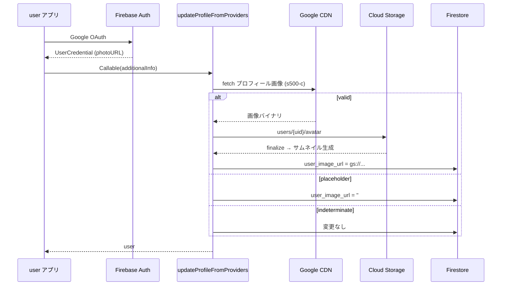
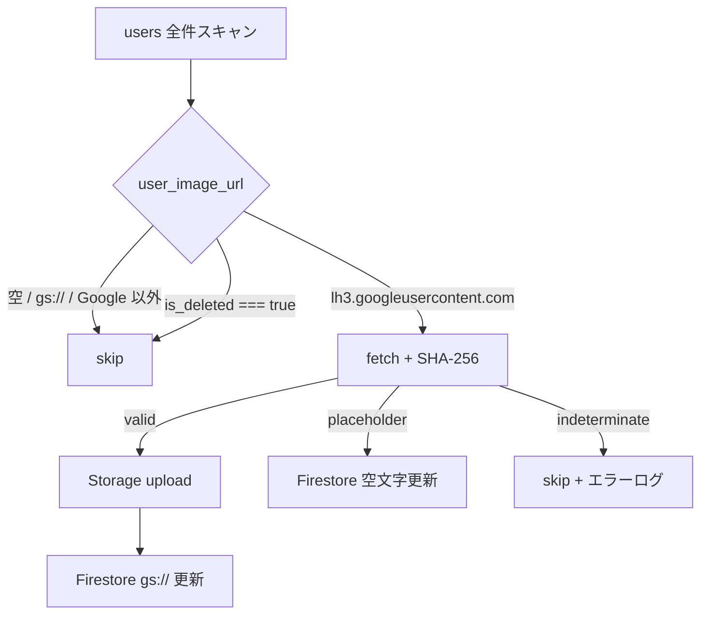

# Google アカウント プロフィール画像の Storage 移行

> **実装イシュー**: [#2005](https://github.com/nijuniinc/bokudeli-event-new/issues/2005)  
> **関連イシュー / PR**: [#2045](https://github.com/nijuniinc/bokudeli-event-new/issues/2045)（Google 無効アカウント時の **表示フォールバック** — 斜線プレースホルダーをデフォルトアバターに置換）、[PR #2046](https://github.com/nijuniinc/bokudeli-event-new/pull/2046)（#2045 / #2005 の **Phase 1** アプリ実装・マージ済み）  
> **関連**: [13_アカウント削除](./13_アカウント削除.md)、[15_アカウント作成](./15_アカウント作成.md)、[02_マイページ](./02_マイページ.md)  
> **バッチ**: [`bokudeli-event-batch`](https://github.com/nijuniinc/bokudeli-event-batch)（本リポジトリ外。既存ユーザーの一括移行はこちらで実施する）

**#2005 と #2045 の関係**

| イシュー | 役割 |
|----------|------|
| **#2005** | 根本対策 — Google 画像を Storage に複製し `user_image_url` を `gs://` 化する（本仕様の主題） |
| **#2045** | 移行完了前の **表示層** 対策 — Google URL 残存時に斜線プレースホルダーを検出しデフォルト表示する（PR #2046 で Phase 1 として実装） |

Phase 2（batch）完了後は #2005 側の Storage 移行が主因となり、#2045 のクライアント側ハッシュ判定は Phase 3 で削除済み（§8.3 参照）。

## 0. 用語集

| 用語 | 意味 |
|------|------|
| **Google プロフィール URL** | Firebase Auth / Google OAuth が返す `photoURL`。ホスト名は `lh3.googleusercontent.com` |
| **Google プレースホルダー画像** | Google アカウント停止・削除後に CDN が返す斜線入りグレー画像。SHA-256 ハッシュで判定する |
| **Storage 移行済み** | `users.user_image_url` が `gs://{bucket}/users/{userId}/avatar` 形式になっている状態 |
| **組織削除ユーザー**（本仕様での呼称） | Google 側でアカウントが削除・無効化され、有効なプロフィール画像が取得できないユーザー。プレースホルダー画像のみ返る |
| **indeterminate** | Google 画像 fetch が HTTP エラー等で失敗し、有効 / プレースホルダーを確定できない状態。`user_image_url` は変更しない |

---

## 1. 概要

### 1.1 機能の目的

Google ログイン利用者のプロフィール画像を、Google CDN URL の参照から **Firebase Storage 上の自前画像** 参照へ移行する。Google アカウント削除後に画像 URL が無効化され、斜線プレースホルダーが表示される問題を解消する。

### 1.2 主要な機能

- **新規 / ログイン時**: SNS プロバイダから取得した Google 画像を Functions 経由で Storage にアップロードし、`user_image_url` を `gs://` 形式で保存する（**Phase 1・コア実装済み**）
- **表示**: `UserAvatar` 等が Storage サムネイル URL を表示する（Google URL 直参照は移行完了後は原則発生しない）
- **プレースホルダー検出**: Google 削除済みアカウントの斜線画像は Storage に保存せず、`user_image_url` を空文字にする
- **既存ユーザー一括移行**: `bokudeli-event-batch` で Firestore 上の Google URL 残存ユーザーを Storage へ移行する（**Phase 2・完了**）

### 1.3 対象

**データ対象（Firestore）**

- `users` コレクションの `user_image_url` — PF版・enterprise 版を問わず **同一 `users` ドキュメント** が対象

**移行トリガー（Callable `updateProfileFromProviders`）**

| トリガー | 経路 | 主な対象 |
|----------|------|----------|
| **主** | PF版 `user` の OAuth 復帰 | `user/src/router/index.ts` — ログイン / 新規登録完了後 |
| **副** | 既存ユーザーの SNS プロバイダ連携 | `base/src/stores/currentUser.ts` の `linkProvider` — PF / enterprise のプロフィール画面 |

**表示対象（UI）**

- プロフィール画像を表示するすべての画面（イベント参加者一覧、友人一覧、チャット、名札 PDF 等）

### 1.4 スコープ外

- **エンタープライズメンバー専用アバター**（`enterprises/{enterpriseId}/members/{userId}/avatar.png`）。本仕様は `users.user_image_url` を対象とする
- **enterprise 専用の認証・ログイン導線**そのもの（Callable は共有だが、本仕様の主たる検証対象は PF版 `user`）
- **Facebook / X（Twitter）画像の batch 移行**（別 task。Facebook は `bokudeli-event-batch` の `0042` を参照）
- Google 側でプロフィール写真を変更した場合の **自動再同期**（Storage 移行後は Shokujii 側の画像を正とする）

---

## 2. ねらい

### 2.1 ビジネス目標

- Google アカウント削除に起因する **プロフィール画像の劣化表示** をなくす
- イベント参加者・友人一覧など、ユーザー画像が並ぶ画面の **信頼感・見た目の品質** を維持する

### 2.2 ユーザー価値

- 過去に参加したイベントや友人リストで、意図しない斜線アイコンが表示されない
- 自分の Google 写真が shokujii 上に安定して残る

### 2.3 成功指標（KPI）

- 本番 Firestore に `lh3.googleusercontent.com` を含む `user_image_url` が **0 件**（batch 完了後）
  - **例外**: `indeterminate`（HTTP エラー等）で移行できなかったユーザーは URL 維持のため残りうる。check スクリプトで **移行失敗 userId 一覧** を別集計し、許容リスト化または再実行で解消する
- Google 削除済みユーザーで斜線プレースホルダーが UI に表示される **問い合わせ件数の減少**

---

## 3. 前提条件

### 3.1 技術的前提条件

- **Firebase Authentication**: Google OAuth で `provider.photoURL` が取得できること
- **Cloud Functions**: Callable `updateProfileFromProviders`、Storage Trigger `generateUserImageThumbnail` がデプロイ済みであること（Phase 1）
- **Cloud Storage**: `users/{userId}/avatar` パスと Storage Rules（本人 write / 全員 read）が有効であること
- **batch 実行環境**: `bokudeli-event-batch` に Firebase Admin SDK 用 credentials が設定されていること（Phase 2）
- **共通 util**: `common/src/utils/googleProfileImage.ts` のハッシュ集合が batch 側実装と一致していること

### 3.2 ビジネス的前提条件

- プロフィール画像は `users.user_image_url` 1 フィールドで管理する（[02_マイページ](./02_マイページ.md) と整合）
- 手動アップロード・Facebook 移行済みユーザーは既に `gs://` 形式であること（batch は Google URL のみ対象）

### 3.3 依存関係

| 依存 | 内容 |
|------|------|
| [15_アカウント作成](./15_アカウント作成.md) | SNS 登録 / ログイン後に `updateProfileFromProviders` が呼ばれる |
| [13_アカウント削除](./13_アカウント削除.md) | 退会時 `user_image_url = ''`。batch の skip 条件と整合 |
| PR #2046 | Phase 1 の表示フォールバック・サーバー側プレースホルダー判定 |
| `bokudeli-event-batch` `0042` | Facebook 版移行 task。Google 版（`0045` 案）の構造参考 |

---

## 4. 課題・背景

### 4.1 問題

`users.user_image_url` に Google CDN URL（例: `https://lh3.googleusercontent.com/...`）をそのまま保存していると、当該 Google アカウントが削除・無効化された後に CDN が **斜線入りプレースホルダー** を返す。shokujii 側の DB には有効 URL が残っているため、一覧・PDF 等で意図しない画像が表示される。

### 4.2 なぜ Storage 移行か

| 方式 | 評価 |
|------|------|
| Google URL を表示し続ける | アカウント削除で劣化。CDN 依存が続く |
| 表示時のみハッシュ判定でフォールバック | 対症療法。PDF 生成等サーバー側でも毎回 fetch が必要 |
| **ログイン / batch で Storage に複製** | 有効な画像を自前保持。表示は Storage CDN のみ参照 |

---

## 5. 方針

### 5.1 基本方針

1. **有効な Google 画像のみ** Storage にアップロードする
2. Firestore の `user_image_url` は移行後 **`gs://` 形式** とする（既存の手動アップロード・Facebook / X 移行と同一形式）
3. **Google プレースホルダー**（削除済みアカウント）は Storage にアップロード **しない**。`user_image_url = ''` とし、UI のデフォルトアバターを表示する
4. **一時的な fetch 失敗**（HTTP 5xx、ネットワーク障害等）では `user_image_url` を **変更しない**（誤って空にしない）
5. 既存ユーザーの一括移行は **`bokudeli-event-batch`** で行う（本リポジトリの `functions/default` では backfill しない）

### 5.2 「組織削除ユーザー」の扱い（決定事項）

Issue #2005 の「組織削除ユーザー」は、**Google 側でアカウントが削除・無効化されプレースホルダーのみ取得できるユーザー** を指す。

| 選択肢 | 採用 | 理由 |
|--------|:----:|------|
| デフォルトアイコンを Storage にアップロードする | ❌ | Storage 容量増。`deleteUserAccount` や手動未設定時と挙動が不一致 |
| **`user_image_url = ''` にし UI デフォルト表示** | ✅ | [13_アカウント削除](./13_アカウント削除.md) と同様。`UserAvatar` / `getDefaultAvatarUrl()` で足りる |

加えて、Shokujii **退会済みユーザー**（`users.is_deleted === true`）は batch 対象外とする。`anonymizeUser` 実行時点で既に `user_image_url = ''` になっている（レガシーデータで Google URL が残っている場合も skip し、上書きしない）。

### 5.3 移行後の Google 写真の更新

`user_image_url` が `gs://` の場合、`updateProfileFromProviders` は **provider.photoURL で上書きしない**（`user_image_url || provider.photoURL` のため）。Google 側で写真を変えても shokujii 側は自動更新されない。ユーザーが変更したい場合は **プロフィール画面から手動アップロード** する（既存仕様どおり）。

### 5.4 batch 完了後のログイン時 upload（Issue #2005 との解釈）

Issue #2005 の「（バッチ処理をかけたら）既存ログイン時のアップロードは不要」は、**コード削除** ではなく **運用上の結果** を指す。

| 観点 | 方針 |
|------|------|
| batch 完了後の既存ユーザー | `user_image_url` が `gs://` または `''` になり、ログイン時の Google fetch + upload は **実質発生しない** |
| Callable の Google 分岐 | **削除しない** — 新規 Google ユーザー・batch 漏れ・Facebook / X 外部 URL 用のセーフティネットとして維持（Phase 3 でも残す） |
| Phase 3 で削除対象 | クライアント / PDF の **Google URL 表示フォールバック** のみ（§8.3） |

---

## 6. 画面仕様

本機能専用の新規画面はない。既存コンポーネントの表示挙動を定義する。

### 6.1 プロフィール画像の表示

| 条件 | 表示 |
|------|------|
| `user_image_url` が `gs://...` | Storage サムネイル（サイズに応じ `avatar_thumb_{small\|medium\|large}`）。読込失敗時は `@error` でデフォルトアバター |
| `user_image_url` が空 | デフォルトアバター（`base/src/utils/defaultAvatar.ts`） |
| `user_image_url` が Google URL（**batch 漏れ・極稀**） | `v-img` で URL 表示。読込失敗時は `@error` でデフォルトアバター（Phase 3 以降はハッシュ事前判定なし） |
| ログイン時 / 名札 PDF | サーバー側 `fetchGoogleProfileImage`（`updateProfileFromProviders` / `namesPrintPdf` の `gs://` 経路）で確定 |

### 6.2 影響する主要 UI

- `base/src/components/UserAvatar.vue` — 参加者アイコン全般
- `user` / `enterprise` のプロフィール設定画面（手動アップロードは従来どおり Storage 直 upload）
- 名札 PDF（`functions/default/src/utils/namesPrintPdf.ts`）

### 6.3 新規登録 / ログイン後

[15_アカウント作成](./15_アカウント作成.md) の SNS 登録・ログイン完了後、`updateProfileFromProviders` が呼ばれ、Google 利用者は自動的に Storage 移行が試みられる。プロフィール未入力フロー（`/register/complete`）の **画像必須チェック** は、移行成功後は `gs://` URL で満たされる。

---

## 7. 技術仕様・データ構造設計

### 7.1 Firestore

**コレクション**: `users/{userId}`

| フィールド | 移行前 | 移行後 |
|-----------|--------|--------|
| `user_image_url` | `https://lh3.googleusercontent.com/...` | `gs://{projectId}.appspot.com/users/{userId}/avatar` |
| `user_image_url`（Google 削除済み） | Google URL または空 | `''`（空文字） |
| `user_image_url`（手動アップロード済み） | 変更なし | 変更なし（既に `gs://` の場合は対象外） |

スキーマ変更は **不要**（`User.user_image_url` は従来どおり string）。

### 7.2 Cloud Storage

| パス | 用途 |
|------|------|
| `users/{userId}/avatar` | オリジナル（拡張子なし） |
| `users/{userId}/avatar_thumb_small` | 50px 相当 |
| `users/{userId}/avatar_thumb_medium` | 100px 相当 |
| `users/{userId}/avatar_thumb_large` | 500px 相当 |

パス定義: `common/src/utils/storagePaths.ts` の `getUserImageStoragePath`。

**Storage Rules**（既存）: `users/{userId}/**` は本人のみ write、誰でも read。

### 7.3 Functions（Phase 1・コア実装済み）

#### Callable: `updateProfileFromProviders`

**ファイル**: `functions/default/src/user.ts`

**処理概要**:

```
1. Auth providerData から user_email / user_name / user_image_url を補完
2. user_image_url が外部 HTTPS URL の場合:
   - Facebook / X: 既存どおり fetch → uploadUserImage
   - Google (isGoogleProfileImageUrl): fetchGoogleProfileImage
     - valid      → Storage 保存 → gs:// URL をセット
     - placeholder → user_image_url = ''
     - indeterminate → 変更なし（URL 維持）
3. 差分があれば saveUser
```

**uploadUserImage**（Functions 内）: Admin SDK で `users/{uid}/avatar` に保存し `gs://...` を返す。

#### Storage Trigger: `generateUserImageThumbnail`

**ファイル**: `functions/default/src/userImage.ts`

`users/{userId}/avatar` の finalize を契機に 3 サイズのサムネイルを生成する。

#### その他サーバー処理

- **名札 PDF**（`namesPrintPdf.ts`）: `gs://` は GCS から取得。Google URL 残存時はハッシュ判定でデフォルト画像にフォールバック

### 7.4 共通ユーティリティ（Phase 1・実装済み）

**ファイル**: `common/src/utils/googleProfileImage.ts`

| 関数 | 用途 |
|------|------|
| `isGoogleProfileImageUrl` | `https:` かつ `hostname === 'lh3.googleusercontent.com'` |
| `normalizeGoogleProfileImageUrl` | サイズパラメータを `s{size}-c` に正規化（判定は 500px） |
| `GOOGLE_UNAVAILABLE_AVATAR_HASHES` | 既知プレースホルダー 3 サイズ分の SHA-256 |
| `fetchGoogleProfileImage` | サーバー向け fetch。戻り値 `valid` / `placeholder` / `indeterminate` |

**表示 URL 生成**: `common/src/utils/buildThumbnailsLinks.ts`

- `gs://` → Firebase Storage の `?alt=media` URL（サムネイルパス）
- その他 `https://` → サイズ付き URL（Phase 3 以降 Google 専用分岐なし。batch 完了後は `gs://` が主経路）

### 7.5 クライアント（Phase 1・実装済み）

| 箇所 | 役割 |
|------|------|
| `base/src/utils/providerService.ts` | ログイン / 登録後に `updateProfileFromProviders` を呼ぶ |
| `base/src/stores/currentUser.ts` | SNS プロバイダ連携（`linkProvider`）後に Callable を呼ぶ |
| `base/src/components/UserAvatar.vue` | サムネイル URL 解決。`@error` フォールバック（Phase 3 以降は Google ハッシュ事前判定なし） |
| `base/src/stores/user.ts` | 手動プロフィール画像 upload（Storage 直書き + サムネイル待ちポーリング） |

### 7.6 処理フロー

#### 7.6.1 新規 Google 登録 / ログイン（アプリ）



#### 7.6.2 既存ユーザー batch 移行（Phase 2）



### 7.7 バッチ処理（Phase 2・`bokudeli-event-batch`）

**実装場所**: [`bokudeli-event-batch`](https://github.com/nijuniinc/bokudeli-event-batch)（本リポジトリ外）

**参考実装**: `tasks/0042_migrate_facebook_user_image_urls.js`（Facebook 版。構造を踏襲する）

**新規 task 案**: `0045_migrate_google_user_image_urls.js`（番号は batch リポジトリの最新連番に従う）

| 項目 | 内容 |
|------|------|
| 対象 | `users` コレクション全件 |
| 移行条件 | `user_image_url` が `isGoogleProfileImageUrl` に該当 |
| skip | 空、`gs://` 済み、Google 以外、`is_deleted === true` |
| valid 時 | `users/{userId}/avatar` に upload → `user_image_url` を `gs://{bucket}/users/{userId}/avatar` |
| placeholder 時 | `user_image_url: ''`（Storage 書き込みなし） |
| indeterminate 時 | Firestore / Storage 変更なし。エラー配列に userId を記録（再実行対象） |
| dry run | 環境変数 `MIGRATE_GOOGLE_USER_IMAGE_DRY_RUN` で制御。**未設定時は dry run（安全側）**。本番書き込みは明示的に `false` |
| transaction | 使用しない（件数制限のため） |
| サムネイル | upload 後 `generateUserImageThumbnail` に任せる（batch 側で完了待ちしない。0042 と同様） |
| **冪等性** | `gs://` 済みは skip。再実行時は未移行 Google URL と indeterminate 残件のみ処理 |
| **スロットリング** | Google CDN への連続 fetch を避けるため、ユーザー間に短い sleep（例: 50〜100ms）を検討 |
| **Storage 既存ファイル** | Firestore が Google URL だが Storage に `users/{userId}/avatar` が既に存在する不整合データは **upload 前に存在チェック**。存在時は Firestore を `gs://` に更新するのみ（上書きしない） |

**対応 check 案**: `checks/0045_migrate_google_user_image_urls.js`

- Google URL 残件数、`gs://` 件数、空文字件数を read のみで集計
- **indeterminate 相当の移行失敗 userId 一覧**（task 実行ログまたは別ファイル出力）との突合
- 本番実行前後の検証に使用

**ロジック共通化**: batch リポジトリは `@shokujii/common` 非依存のため、`googleProfileImage.ts` の定数・判定ロジックを batch 側に同等実装する（ハッシュ集合の drift を避けるため、変更時は両方更新する）。

**注意**: 旧 task `0037_migrate_user_image_urls.js` は Google URL を **そのまま残す** 実装。本移行とは別タスクとして新規追加する。

---

## 8. 実装優先度

### Phase 1（必須）— コア実装済み（PR #2046）

- [x] `common/src/utils/googleProfileImage.ts` 追加
- [x] `updateProfileFromProviders` で Google → Storage 移行
- [x] `UserAvatar` のプレースホルダー検出・フォールバック
- [x] `namesPrintPdf` の Google ハッシュ判定
- [x] 単体テスト（`googleProfileImage.test.ts`）
- [x] **`updateProfileFromProviders` の Google 統合テスト**（`functions/default/src/user.test.ts` — §9.1 のケースをカバー）

### Phase 2（必須）— 完了

- [x] `bokudeli-event-batch` に Google 移行 task + check 追加
- [x] sandbox → development → production 順に dry run / 本実行
- [x] check で Google URL 残件 0（または indeterminate 許容リスト解消後 0）を確認

### Phase 3（任意・移行完了後）— 完了

- [x] `UserAvatar` の Google ハッシュ判定を簡略化（`@error` フォールバックのみ）
- [x] `buildThumbnailsLinks` / `namesPrintPdf` から Google 分岐を削除
- [x] `updateProfileFromProviders` の Google 分岐は **維持**（§5.4 — 新規 Google ユーザー・batch 漏れ用）

---

## 9. テスト・検証

### 9.1 アプリ（Phase 1）

| ケース | 期待結果 | テスト状況 |
|--------|----------|------------|
| 新規 Google 登録（有効画像） | `user_image_url` が `gs://`。UI に Storage 画像 | `user.test.ts` **実装済み** |
| Google 削除済み（プレースホルダー） | `user_image_url` が `''`。デフォルトアバター | `user.test.ts` **実装済み** |
| Google fetch 一時失敗 | `user_image_url` 維持 | `user.test.ts` **実装済み** |
| 既に `gs://` | 再アップロードされない | `user.test.ts` **実装済み** |
| 名札 PDF（`gs://`） | 正常に写真が PDF に埋め込まれる | 手動 / 別途 |
| `googleProfileImage` util | URL 判定・ハッシュ・正規化 | `googleProfileImage.test.ts` **実装済み** |

### 9.2 batch（Phase 2）

| ケース | 期待結果 |
|--------|----------|
| dry run | fetch のみ。Firestore / Storage 不変 |
| valid Google URL | `gs://` に更新 |
| placeholder | `user_image_url = ''` |
| HTTP エラー（indeterminate） | URL 維持、エラーレポートに userId 記載 |
| `is_deleted` ユーザー | スキップ |
| Storage に avatar 既存・Firestore が Google URL | Firestore のみ `gs://` 更新（上書きなし） |
| 再実行 | 未移行分のみ処理（冪等） |

### 9.3 本番移行チェックリスト

1. check で Google URL 残件数・indeterminate 残件数を記録
2. dry run 実行・サンプルログ確認
3. 本実行
4. indeterminate 残件があれば再実行または手動対応
5. check で Google URL **0 件**（許容リスト解消後）を確認
6. UI spot check（イベント参加者一覧、友人、PDF）

---

## 10. 注意事項

### 10.1 既存システムへの影響

- **予約申請バリデーション**: `user_image_url` の空文字チェック（`APPLICANT_USER_IMAGE_MISSING`）は従来どおり。Google 削除済みを空にしたユーザーはプロフィール再設定が必要（[15_予約申請時のバリデーション](../02_主催者獲得と継続/15_予約申請時のバリデーション.md)）
- **アカウント削除**: [13_アカウント削除](./13_アカウント削除.md) で `user_image_url = ''` に匿名化。Storage 上のファイル削除は Phase 1 スコープ外（既存仕様どおり）
- **メール**: `orderCompletionMail` は `getUserImageUrl` で Storage URL を生成。移行後は Google 直参照しない

### 10.2 セキュリティ

- Google URL 判定は **`isGoogleProfileImageUrl`**（hostname 厳密一致）を用い、Functions からの SSRF を防ぐ（PR #2046 RC-23 対応済み）
- Storage Rules は変更なし

### 10.3 パフォーマンス・運用

- batch 実行中は Storage Trigger によるサムネイル生成が並行する。大量実行時は Functions の同時実行数に注意
- batch 直後、サムネイル未生成の短時間は thumb URL が 404 になりうる。`UserAvatar` のリトライ / `@error` で吸収
- ログイン時 upload は **外部 URL が残っている間のみ** 発生。batch 完了後は大半のユーザーで fetch が走らない（§5.4）
- **batch とログインの競合**: batch 実行中に同一ユーザーがログインすると、同一 `users/{userId}/avatar` への並行 write が起こりうる。影響は最終 write 勝ち（いずれも有効画像）だが、本番 batch は低トラフィック時間帯の実行を推奨
- **Google CDN レート制限**: 全件一括 fetch は §7.7 のスロットリングで緩和する

### 10.4 コード重複（既知）

- `uploadUserImage` が `functions/default/src/user.ts` と `base/src/stores/user.ts` に二重存在（TODO コメントあり）。batch 追加時の共通化検討余地あり

---

## 11. 変更ファイル一覧（参考）

### Phase 1（本リポジトリ・マージ済み）

| パス | 概要 |
|------|------|
| `common/src/utils/googleProfileImage.ts` | 判定・fetch ユーティリティ |
| `common/src/utils/googleProfileImage.test.ts` | util 単体テスト |
| `common/src/utils/buildThumbnailsLinks.ts` | `gs://` / Google URL のサムネイル URL 生成 |
| `functions/default/src/user.ts` | ログイン時 Storage 移行 |
| `functions/default/src/utils/namesPrintPdf.ts` | PDF 用フォールバック |
| `base/src/components/UserAvatar.vue` | 表示フォールバック |
| `base/src/utils/defaultAvatar.ts` | デフォルトアバター URL |
| `base/src/stores/currentUser.ts` | `linkProvider` 経由の Callable 呼び出し |

### Phase 1 残タスク（本リポジトリ）

| パス | 概要 |
|------|------|
| `functions/default/src/user.test.ts` | `updateProfileFromProviders` の Google 系統合テスト |

### Phase 2（`bokudeli-event-batch`）

| パス | 概要 |
|------|------|
| `tasks/0045_migrate_google_user_image_urls.js`（案） | 一括移行 |
| `checks/0045_migrate_google_user_image_urls.js`（案） | 残件・indeterminate 検証 |
