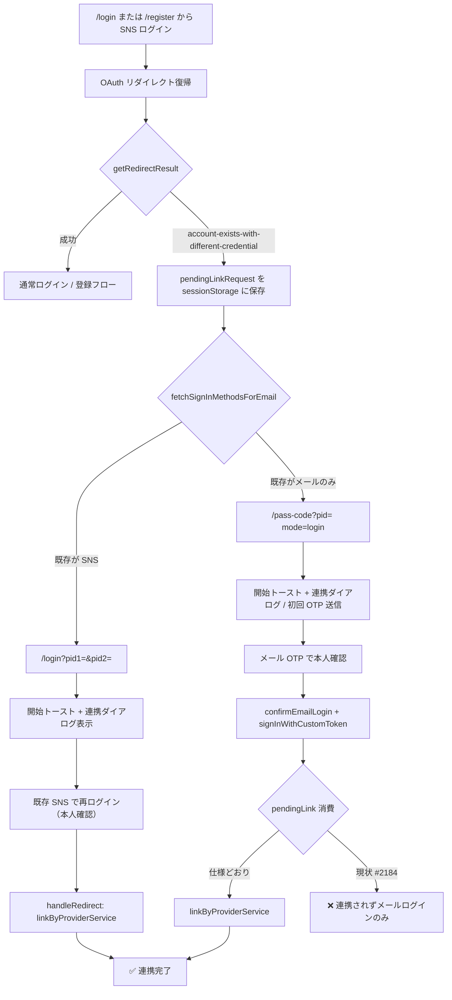

# SNSアカウント自動連携

> **実装イシュー（不具合）**: [#2184](https://github.com/nijuniinc/bokudeli-event-new/issues/2184)  
> **関連**: [15_アカウント作成](./15_アカウント作成.md) §3.2.3、[13_アカウント削除](./13_アカウント削除.md)、[09_アプリ内ブラウザのログイン動作](./09_アプリ内ブラウザのログイン動作.md)

## 0. 用語集（初学者向け）

| 用語 | 意味 |
|------|------|
| **アカウント連携** | 1 つの shokujii アカウントに、複数のログイン方法（メール / Google / Facebook / X）を紐づけること |
| **自動連携** | ユーザーが別の SNS でログインしようとしたとき、**同じメールアドレス** を検知して本人確認後に連携する仕組み |
| **プロバイダ（Provider）** | ログイン手段の種類。Firebase Auth では `google.com` / `facebook.com` / `twitter.com` 等の ID で表す |
| **pid** | **Provider ID** の略。URL のクエリパラメータとして「どの SNS か」を画面に渡すための識別子 |
| **pid1 / pid2** | ログイン画面用。`pid1` = 今ログインしようとした SNS、`pid2` = 既に登録されている SNS |
| **pendingLinkRequest** | OAuth 失敗時に「あとで連携する SNS」を `sessionStorage` に一時保存する仕組み |
| **credential** | OAuth 認証の結果として得られる「この SNS アカウントでログインした」という証明書 |
| **account-exists-with-different-credential** | Firebase Auth のエラーコード。「同じメールだが、別のログイン方法で既に登録されている」ときに発生 |
| **notification（トースト）** | 画面上部の `v-snackbar` による短いメッセージ表示。`useNotification().show(message, color)` で制御 |
| **pendingToast** | OAuth リダイレクト復帰後にトーストを表示するため、`sessionStorage` にメッセージを一時保存する仕組み（`setPendingToast` / `consumePendingToast`） |

**Auth の providerData とアプリの関係**

- **Firebase Auth**: 1 つの `uid` に複数の provider（`google.com` 等）を紐づけられる
- **Firestore `users` / `users_personal_information`**: 表示名・メール等。SNS 連携後は `updateProfileFromProviders` で同期

---

## 1. 概要

### 1.1 機能の目的

PF版（`user` パッケージ）で、ユーザーが **複数のログイン方法** を 1 つのアカウントにまとめられるようにする。

典型例:

- 最初はメールアドレス（OTP）で登録
- 後から Facebook でもログインしたい → 本人確認後に Facebook を既存アカウントに連携

逆に、Google で登録済みの人が Facebook でログインしようとした場合も、同じメールなら自動連携フローに入る。

### 1.2 対象プロバイダ

| プロバイダ | provider ID | メール取得 |
|-----------|-------------|-----------|
| Google | `google.com` | 通常取得可能（`profile` / `openid` スコープ） |
| Facebook | `facebook.com` | `email` スコープで取得 |
| X (Twitter) | `twitter.com` | **取得できないことが多い**（後述 §6.3） |

3 プロバイダとも **同じコードパス**（`providerService.ts` / `router/index.ts`）を使用する。Facebook 専用の分岐はない。

### 1.3 連携の入口

| 入口 | 説明 |
|------|------|
| **ログイン / 新規登録時の自動連携** | 同じメールの別ログイン方法を検知したとき（本仕様の中心） |
| **プロフィール画面の手動連携** | ログイン済みユーザーが `/profile` から「連携する」ボタンを押す（別フロー。`/profile` への OAuth 復帰も `handleRedirect` で処理） |

本仕様は主に **ログイン時の自動連携** を扱う。手動連携は [15_アカウント作成](./15_アカウント作成.md) および `user/src/pages/profile.vue` を参照。

### 1.4 スコープ外

- エンタープライズ版の認証
- partner 管理画面のログイン
- メールアドレスが一致しない場合の連携（手動で別アカウントとして扱う）

---

## 2. ねらい

### 2.1 ユーザー価値

- 登録時に使った方法を覚えていなくても、別の SNS からログインして既存アカウントにたどり着ける
- 連携後は Google / Facebook / X のいずれでも同じアカウントにログインできる

### 2.2 セキュリティ上の前提

メールアドレスが同じでも **自動でくっつけない**。必ず **本人確認**（既存ログイン方法での再認証、またはメール OTP）を挟む。

### 2.3 UX 上の方針（通知）

自動連携フローに入ったとき、ユーザーに **連携が始まったこと** を notification（トースト）で伝える。

- 「自動連携します」だけだと、本人確認なしで完了するように誤解されうる
- トーストは **短い案内**、ConfirmDialog は **詳細と操作** を担う（併用）
- 連携 **完了時** もトーストでフィードバックする（`profile.linkage_completed`）

---

## 3. 全体フロー

### 3.1 トリガー: Firebase エラー

ユーザーが SNS でログイン / 新規登録しようとし、OAuth リダイレクト復帰時に `getRedirectResult()` が次のエラーを返すと自動連携フローが始まる。

```
auth/account-exists-with-different-credential
```

意味: 「試した SNS のメールアドレスは、**別のログイン方法** で既に Auth に登録されている」。

このとき `handleRedirect`（`base/src/utils/redirect.ts`）は:

1. エラーから **試した SNS の provider ID** を取り出す
2. `sessionStorage['pendingLinkRequestProviderId']` に保存（例: `facebook.com`）
3. エラーを上位（ルーター）に再スロー

### 3.2 分岐: 既存アカウントのログイン方法

ルーター（`user/src/router/index.ts`）は `fetchSignInMethodsForEmail(email)` の結果で次に進む画面を決める。

| 既存のログイン方法 | `fetchSignInMethodsForEmail` | 遷移先 |
|-------------------|------------------------------|--------|
| **SNS のみ**（Google 等） | `['google.com']` 等 | `/login?pid1={試したSNS}&pid2={既存SNS}` |
| **メール OTP のみ**（カスタムトークン） | `[]`（空） | `/pass-code`（`mode: login`） |
| **複数** | 先頭 1 件 | 上記 SNS パターン |

メール OTP 登録ユーザーは Auth 上「password 等の sign-in method」を持たないため、空配列になる。

### 3.3 フロー図



---

## 4. 画面・URL 仕様

### 4.1 `pid` / `pid1` / `pid2` とは

**pid = Provider ID**。画面に「どの SNS の話か」を伝える URL パラメータ。

| パラメータ | 使用画面 | 意味 | 例 |
|-----------|---------|------|-----|
| `pid1` | `/login` | 今ログインしようとした SNS | `facebook.com` |
| `pid2` | `/login` | 既に登録されている SNS | `google.com` |
| `pid` | `/pass-code` | 連携したい SNS | `facebook.com` |

表示名への変換は i18n `sns_name` を使用する。

```ts
// user/src/locales/messages/ja.ts
sns_name: {
  'twitter.com': 'X',
  'google.com': 'Google',
  'facebook.com': 'Facebook',
  custom: 'メールアドレス',
}
```

### 4.2 ログイン画面の連携ダイアログ（SNS 同士）

**URL 例**

```
/login?pid1=facebook.com&pid2=google.com
```

**表示文言**（`login.link_dialog_body`）

> {try_login_provider_label}に設定されているメールアドレスは、すでに{link_provider_label}アカウントと連携されています。アカウントを連携するためにログインしてください

**操作**

- 画面表示時: **開始トースト**（`login.auto_linkage_notice`）を表示（§4.6.2）
- 「連携する」→ `handleLogin(pid2)` で **既存 SNS**（例: Google）の OAuth を開始
- 復帰後 `handleRedirect` が `pendingLinkRequest`（例: `facebook.com`）を消費し `linkByProviderService` を実行

**実装**: `user/src/pages/login.vue` の `linkRequestDialogParams`

### 4.3 パスコード画面の連携ダイアログ（メール既存 × SNS 試行）

**想定 URL 例**

```
/pass-code?pid=facebook.com
```

（`history.state`: `{ email, mode: 'login' }`）

**表示条件**

- `route.query.pid != null` のとき `isOpenLinkDialog = true`

**表示文言**（`passcode.link_dialog_body`）

> {email}は既にメールアドレスログインで使用されています。{provider_label}と連携するため、ログインしてください。

**操作**

- 画面表示時: **開始トースト**（`passcode.auto_linkage_notice`）を表示（§4.6.2）
- 画面表示時: `runAutoLinkageOnMount` で `requestEmailLogin` により **初回 OTP を自動送信**（#2184 修正後）
- ConfirmDialog の OK: 説明確認後にダイアログを閉じる（デフォルトラベル `OK`）
- OTP 再送: 画面下部の「コードを再送信する」ボタン（`passcode.resend` / `reSendPassCode`）
- 6 桁入力 → `confirmEmailLogin` → `signInWithCustomToken`
- その後 **pendingLink の消費** で SNS 連携（仕様上の期待。§7 参照）

**実装**: `user/src/pages/pass-code.vue`

### 4.4 `/register` 起点の扱い

`/register` から SNS 新規登録中に credential 衝突した場合は **自動連携に進まない**（[15_アカウント作成](./15_アカウント作成.md) §3.2.3 / E-5）。

| 挙動 |
|------|
| `register.already_registered` を alert |
| `clearPendingLinkRequest()` で pending を破棄 |
| `/login` のみへリダイレクト |

新規登録専用入口から既存アカウントのログイン導線（pass-code / pid リンク）には進めない設計。

### 4.5 `/profile` 起点の手動連携

ログイン済みユーザーがプロフィールから SNS 連携ボタンを押した場合:

- OAuth 復帰先は `/profile`
- 成功時: 連携完了トースト
- `credential-already-in-use` 等: pending をクリアし `/profile` に留まる（`/login` へ pid 付き遷移しない）

### 4.6 通知（トースト）仕様

自動連携では **開始時** と **完了時** の 2 段階で notification を表示する。ルーター（`router/index.ts`）からは `useNotification()` を直接呼べないため、画面側または `pendingToast` 経由で表示する。

#### 4.6.1 表示インフラ

| レイアウト | 提供元 | 備考 |
|-----------|--------|------|
| `user/src/layouts/blank.vue` | `provide('notification')` + `v-snackbar` | `/login` / `/pass-code` 等 |
| `user/src/layouts/default.vue` | 同上 | ログイン後の一般ページ |
| `user/src/layouts/manage.vue` | 同上 | 管理画面 |

`useNotification()` は各レイアウトが provide する reactive オブジェクトを更新し、snackbar を表示する。

#### 4.6.2 開始時トースト（自動連携フロー入場時）

**目的**: 同じメールのアカウントが見つかり、連携フローに入ったことをユーザーに即時伝える。

**表示タイミング**

| 画面 | 条件 | 実装方針 |
|------|------|---------|
| `/login` | `pid1` と `pid2` が両方ある（SNS 同士） | `login.vue` の `onMounted` で `notification.show()` |
| `/pass-code` | `route.query.pid` がある（メール既存 × SNS） | `pass-code.vue` の `onMounted` で `notification.show()` |

ルーターからの SPA 遷移であれば、着地画面の `onMounted` が最も単純。OAuth 直後にメッセージを残す必要がある場合のみ `setPendingToast` を検討する（§4.6.4）。

**文言（i18n・実装済み #2184）**

| キー | 文言 | パラメータ |
|------|------|-----------|
| `login.auto_linkage_notice` | 同じメールアドレスのアカウントが見つかりました。{sns_name}と連携するため、本人確認をお願いします。 | `sns_name` = `pid1` の表示名（試した SNS） |
| `passcode.auto_linkage_notice` | 同じメールアドレスで登録済みです。{sns_name}と連携するため、パスコードで本人確認してください。 | `sns_name` = `pid` の表示名 |

**色**: `info`（案）。既存の `warning` / `success` / `error` と同様に Vuetify の snackbar color に渡す。

**ダイアログとの関係**

| UI | 役割 | 消えるタイミング |
|----|------|----------------|
| 開始トースト | 短い気づき | 数秒で自動消去 |
| ConfirmDialog（§4.2 / §4.3） | 詳細説明と次の操作 | ユーザーがボタンを押すまで |

トーストのみにせず、**ダイアログは残す**（本人確認の説明が必要なため）。

#### 4.6.3 完了時トースト（連携成功時）

**文言（既存）**: `profile.linkage_completed` — 「{snsName}との連携が完了しました」

| 経路 | 現状 | 仕様上の期待 |
|------|------|-------------|
| `/profile` 手動連携 | `router` が `setPendingToast` → レイアウトの `onMounted` で表示 | ✅ 実装済み |
| SNS 同士の自動連携（`/login` 経由） | `handleRedirect` 成功後に `setPendingToast` → `blank.vue` / `default.vue` で consume | ✅ 実装済み（#2184） |
| メール OTP 経由の自動連携 | `startPendingProviderLink` 後の OAuth 復帰で `setPendingToast` → レイアウトで consume | ✅ 実装済み（#2184） |

**完了トーストの共通化（実装済み #2184）**

`consumePendingToast()` の呼び出しを `profile.vue` 専用から、次のいずれかへ広げる。

- `user/src/layouts/blank.vue` の `onMounted`
- `user/src/layouts/default.vue` の `onMounted`

これにより、自動連携完了後に `/` や `redirectPath` へ遷移しても完了メッセージが表示できる。

#### 4.6.4 `pendingToast` の使い分け

| 用途 | 推奨手段 |
|------|---------|
| ルーター → `/login` / `/pass-code` への SPA 遷移後の **開始** トースト | 着地画面の `onMounted` + `useNotification()` |
| OAuth リダイレクト復帰後の **完了** トースト | `setPendingToast`（`base/src/utils/pendingToast.ts`）+ レイアウトで `consumePendingToast` |
| 同一画面内の操作結果（OTP 再送失敗等） | その場で `useNotification()` |

`pendingToast` は `sessionStorage` キー `pendingToast` に `{ message, color }` を JSON 保存する。

#### 4.6.5 表示しないケース

| 状況 | 理由 |
|------|------|
| `/register` で credential 衝突 | 自動連携に進まない。`register.already_registered` の alert のみ |
| `/profile` で連携失敗 | `alert` または既存のエラー通知。開始トーストは不要 |
| 通常のメールログイン（`/login` から、連携なし） | 連携フローではない |
| `credential-already-in-use` | 連携不可。警告ダイアログのみ |

---

## 5. パターン早見表

### 5.1 `/login` 起点（登録済みユーザーが別 SNS でログイン）

| 既存アカウント | 試した SNS | 遷移 | 連携完了 |
|---------------|-----------|------|---------|
| メール OTP | Facebook | `/pass-code` mode=login | **現状: 不具合あり**（#2184） |
| メール OTP | Google | 同上 | **現状: 不具合あり** |
| メール OTP | X | 同上（メール衝突時のみ） | **現状: 不具合あり** |
| Google | Facebook | `/login?pid1=facebook&pid2=google` | ✅ 動作 |
| Facebook | Google | `/login?pid1=google&pid2=facebook` | ✅ 動作 |
| Google | X | `/login?pid1=twitter&pid2=google` | ✅ 動作（X がメールを返す場合） |

### 5.2 入口 × エラー種別

| 入口 | エラー | 挙動 |
|------|--------|------|
| `/login` | `account-exists-with-different-credential` | §3.2 の分岐 |
| `/register` | 同上 | alert → `/login` のみ（pending クリア） |
| `/profile` | 同上 | alert → 画面に留まる（pending クリア） |
| いずれか | `credential-already-in-use` | 「別アカウントで既に使用中」警告 |

---

## 6. 技術仕様

### 6.1 主要ファイル

| レイヤ | ファイル | 役割 |
|--------|----------|------|
| OAuth 共通 | `base/src/utils/providerService.ts` | `signInByProviderService` / `linkByProviderService` / `credentialFromError` |
| リダイレクト処理 | `base/src/utils/redirect.ts` | `handleRedirect` / pendingLink の保存・消費 |
| ルータ | `user/src/router/index.ts` | credential 衝突時の画面遷移・pid 付与 |
| ログイン画面 | `user/src/pages/login.vue` | pid1/pid2 連携ダイアログ・開始トースト |
| パスコード画面 | `user/src/pages/pass-code.vue` | pid 連携ダイアログ・OTP 確定・開始トースト |
| プロフィール | `user/src/pages/profile.vue` | 手動連携・完了トースト consume |
| レイアウト | `user/src/layouts/blank.vue`, `default.vue` | notification provide / snackbar |
| トースト一時保存 | `base/src/utils/pendingToast.ts` | `setPendingToast` / `consumePendingToast` |
| Store | `base/src/stores/currentUser.ts` | `linkProvider` / `unlinkProvider` |
| Functions | `functions/default/src/user.ts` | `requestEmailLogin` / `confirmEmailLogin` 等 |

### 6.2 pendingLinkRequest のライフサイクル

```
1. getRedirectResult() が account-exists エラー
   → setPendingLinkRequest(試したSNSのproviderId)

2. 次のログイン成功時、handleRedirect(user) 内で（user != null のときのみ pending を消費）:
   → getPendingLinkRequest() で読み取り
   → clearPendingLinkRequest() で削除
   → getRedirectResult が link でないとき:
     reserveLinkageCompletedToast(pendingId) → linkByProviderService(user, pendingId)
   → link 同期失敗時は pending と予約トーストを復元

3. メール OTP 経由（startPendingProviderLink）では linkWithRedirect 前に:
   → clearPendingLinkRequest() + reserveLinkageCompletedToast(pendingId)
   → 同一 URL（/pass-code）から OAuth 開始。復帰後 handleRedirect が link credential を処理
   → 同期失敗時は pending と予約トーストを復元（redirect 成功後はページ離脱のため catch には入らない）

4. /pass-code 自動連携で pid と pending が不一致のときは stale pending を破棄する（pass-code.vue / `clearStalePendingLinkRequestOutsideAutoLinkage`）

5. 自動連携フロー外、または query と pending が不一致のときは `clearStalePendingLinkRequestOutsideAutoLinkage` で stale pending を破棄する:
   - `/login` に pid1/pid2 が無い、または pid1/pid2 が無効
   - `/login` に pid1/pid2 があるが **pending が pid1 と一致しない**
   - `/pass-code` に pid が無い、または pid が無効
   - `/pass-code` に pid があるが **pending が pid と一致しない**
   （login.vue / pass-code.vue）

   **`/login` マウント時（RC-29）**: `onMounted` 冒頭で、有効な pid1/pid2 による自動連携通知を出すかどうかに**関わらず**、常に `clearStalePendingLinkRequestOutsideAutoLinkage({ loginPid1, loginPid2 })` を呼ぶ（`runLoginPageMountAutoLinkage`）。通知表示直前でも stale pending が検証・破棄される。

   **`/pass-code` マウント時**: `runPassCodeMountAutoLinkageSetup` で stale pending を検証し、login モード・未ログイン・有効 pid のとき OTP 自動送信要否（`shouldAutoSendOtp`）を返す（pass-code.vue / `passCodeAutoLinkage.ts`）。

   **`/pass-code` OTP ログイン後**: `runPassCodePostOtpLinkPreCheck` で stale 検証と pending / pid / ログイン状態の前提チェックを行い、`proceed` のときのみ `startPendingProviderLink` を開始する（pass-code.vue / `passCodeAutoLinkage.ts`）。
```

**重要**: `handleRedirect` が呼ばれるのは、初回ナビゲーションで `/login` / `/register` / `/register/complete` / `/profile` / **`/pass-code`** に着地したときのみ（`router/index.ts` の `isFirstTime` ガード）。

**未ログイン時の pending 保持**: `handleRedirect(null)` では pending を clear しない。`/pass-code?pid=` 表示中のリロード後も OTP 自動連携が継続できる。

**未ログイン `/pass-code` リロード**: `user == null` かつ `to.path === '/pass-code'` のときは `getRedirectPath()` による遷移を行わず、OTP 画面に留まる（`redirectPath` は消費しない）。

予約トーストの消費（`resolveLinkageCompletedProviderId`）は、予約 providerId と credential が一致し、かつ **`operationType === 'link'`** のときに限定する（通常 signIn との偶然一致を防ぐ）。

### 6.3 X (Twitter) の特殊性

`TwitterAuthProvider` には **email スコープを付与していない**（`providerService.ts`）。

そのため X ログイン時:

- Firebase にメールが渡らないことが多い
- `account-exists-with-different-credential` が **発生しない** 場合がある
- 別 `uid` の新規アカウントとして作成される、または `user_email` 未設定で `/register/email` へ誘導される

**メール衝突が起きた場合**のコードパスは Facebook / Google と同一。起きない場合は本仕様の自動連携対象外。

### 6.4 OAuth スコープ一覧

| プロバイダ | スコープ / 設定 |
|-----------|----------------|
| Facebook | `email`, `public_profile` |
| Google | `profile`, `openid` + `prompt: select_account` |
| X | デフォルトのみ |

### 6.5 本番と開発の差

| 環境 | OAuth 方式 |
|------|-----------|
| 本番 | `signInWithRedirect` / `linkWithRedirect` |
| 開発 (`import.meta.env.DEV`) | `signInWithPopup` / `linkWithPopup` |

自動連携のロジック自体は環境共通。開発時はポップアップ成功パスが `login.vue` 側に別途ある。

---

## 7. 既知の不具合（#2184）

### 7.1 現象

メールアドレス（OTP）で登録済みのアカウントに対し、**同じメールの Facebook**（Google も同様）でログインしようとしたとき:

1. パスコード画面には遷移するが **初回メールが送信されない**
2. 「コードを再送信する」で OTP は届く
3. OTP でログインはできるが **SNS 連携が完了しない**（メールログインのみ）

### 7.2 原因

| # | 問題 | 詳細 |
|---|------|------|
| 1 | **初回 OTP 未送信** | ルーターが `/pass-code` へ遷移するとき `requestEmailLogin` を呼ばない。通常メールログイン（`login.vue`）では遷移前に呼ぶ |
| 2 | **`pid` 未付与** | ルーターが `query: { pid: pendingCred?.providerId }` を渡していない。`pass-code.vue` の連携ダイアログが開かず、初回送信トリガーも動かない |
| 3 | **pendingLink 未消費** | OTP 確定後 `signInWithCustomToken` → ホーム等へ遷移するだけで、`handleRedirect` / `linkByProviderService` が走らない。`pendingLinkRequest` は sessionStorage に残ったまま |

### 7.3 現状のルーター遷移（問題箇所）

```ts
// user/src/router/index.ts（existingProviderId == null の分岐）
return {
  path: '/pass-code',
  state: { email, mode: 'login' },
  // query.pid が無い ← 不具合
}
```

### 7.4 修正方針（対応済み #2184）

**コア修正（#2184）**

1. `/pass-code` リダイレクト時に `query.pid` を付与する
2. 連携フロー時は `requestEmailLogin` を初回から実行する（`pass-code` マウント時）
3. `confirmEmailLogin` 成功後、`pendingLinkRequestProviderId` を読み取り `linkByProviderService` を実行する（または共通関数 `completePendingLink()` を `redirect.ts` に export）

**通知（トースト）追加（本仕様 §4.6）**

4. `login.vue`: `pid1` / `pid2` があるとき `login.auto_linkage_notice` を `onMounted` で表示
5. `pass-code.vue`: `route.query.pid` があるとき `passcode.auto_linkage_notice` を `onMounted` で表示
6. 自動連携完了時: `setPendingToast(profile.linkage_completed)` を設定し、`blank.vue` / `default.vue` で `consumePendingToast` を共通化
7. i18n: `user/src/locales/messages/ja.ts` に上記キーを追加

修正時は Facebook / Google / X（メール衝突時）すべてに効く **共通修正** となる。

---

## 8. エッジケース一覧

| # | 状況 | 挙動 |
|---|------|------|
| L-1 | `/register` で credential 衝突 | pending クリア → alert → `/login` のみ |
| L-2 | `/profile` で連携時に credential 衝突 | pending クリア → alert → `/profile` に留まる |
| L-3 | `credential-already-in-use` | その SNS は別 uid に既に紐づいている。連携不可 |
| L-4 | メール OTP のみ既存 × 任意 SNS | `/pass-code` + pendingLink + 初回 OTP + 連携完了。**#2184 対応済み** |
| L-5 | SNS 既存 × 別 SNS（同メール） | `/login?pid1&pid2` ダイアログ → 既存 SNS 再ログインで連携 |
| L-6 | X でメール未取得 | 自動連携フローに入らない可能性が高い |
| L-7 | in-app ブラウザ | `/login` / `/register` は `/inapp-login` へ。SNS OAuth 自体が抑止される |
| L-8 | 連携後のプロフィール同期 | `updateProfileFromProviders`（Functions）でメール・名前・画像等をマージ。X の `user_description` は既存値があると上書きしない（E-13） |
| L-9 | 自動連携開始時のトースト | ✅ 実装済み（#2184）。§4.6.2 の `auto_linkage_notice` |
| L-10 | メール OTP 経由の連携完了トースト | ✅ 実装済み（#2184）。レイアウトで `consumePendingToast` |
| L-11 | 自動連携途中離脱後、pid なし `/login` | `clearStalePendingLinkRequestOutsideAutoLinkage` で stale pending 破棄 |
| L-12 | stale pending 残存で pid なし pass-code OTP | 同上（マウント時 + `completePendingLinkAfterEmailLogin` 先頭） |
| L-13 | 未ログイン `/pass-code` リロード（`redirectPath` あり） | OTP 画面に留まる。`redirectPath` は消費しない |
| L-14 | `/manage` 経由ログイン後の自動連携完了 | `manage.vue` でも `consumePendingToast` |

---

## 9. i18n キー一覧

### 9.1 既存キー

| キー | 用途 |
|------|------|
| `login.link_dialog_body` | ログイン画面・SNS 同士の連携ダイアログ |
| `passcode.link_dialog_body` | パスコード画面・メール既存 × SNS 連携ダイアログ |
| `passcode.send_code` | パスコード送信の文言（画面再送等。連携ダイアログの OK はデフォルト `OK` で閉じるのみ） |
| `profile.account_linkage` | ダイアログタイトル |
| `profile.linkage` | 「連携する」ボタン |
| `profile.linkage_completed` | 連携成功トースト（完了時） |
| `user.exists_credential` | SNS が別アカウントで使用中 |

### 9.2 追加キー（§4.6・実装済み #2184）

| キー | 用途 | 文言案 |
|------|------|--------|
| `login.auto_linkage_notice` | SNS 同士の自動連携開始トースト | 同じメールアドレスのアカウントが見つかりました。{sns_name}と連携するため、本人確認をお願いします。 |
| `passcode.auto_linkage_notice` | メール既存 × SNS の自動連携開始トースト | 同じメールアドレスで登録済みです。{sns_name}と連携するため、パスコードで本人確認してください。 |

`sns_name` パラメータは `sns_name['${providerId}']` で解決する（既存と同様）。

---

## 10. テスト観点（修正時）

| # | シナリオ | 期待結果 |
|---|---------|---------|
| T-1 | メール既存 + Facebook ログイン（同メール） | 初回 OTP 送信 → 入力 → Facebook 連携完了 |
| T-2 | メール既存 + Google ログイン（同メール） | T-1 と同様 |
| T-3 | Google 既存 + Facebook ログイン（同メール） | pid1/pid2 ダイアログ → Google 再ログイン → 連携完了 |
| T-4 | `/register` + credential 衝突 | `/login` のみ。pending 残さない |
| T-5 | 通常メールログイン（`/login` から） | 従来どおり OTP 送信・ログイン（回帰なし） |
| T-6 | `/profile` 手動連携 | 従来どおり（回帰なし） |
| T-7 | Google 既存 + Facebook（pid1/pid2） | 開始トースト `login.auto_linkage_notice` が表示される |
| T-8 | メール既存 + Facebook（pid 付き pass-code） | 開始トースト `passcode.auto_linkage_notice` が表示される |
| T-9 | 自動連携完了（`/profile` 以外へ遷移） | 完了トースト `profile.linkage_completed` が表示される |
| T-10 | 通常メールログイン（連携なし） | 開始トーストは **出ない**（回帰なし） |

---

## 11. 関連ドキュメント

| ドキュメント | 関係 |
|-------------|------|
| [15_アカウント作成](./15_アカウント作成.md) | ログイン / 登録の全体仕様。§3.2.3 が自動連携の入口定義 |
| [13_アカウント削除](./13_アカウント削除.md) | 連携解除・Auth provider の削除 |
| [09_アプリ内ブラウザのログイン動作](./09_アプリ内ブラウザのログイン動作.md) | SNS ログイン抑止 |

---

## 12. 変更履歴

| 日付 | 内容 |
|------|------|
| 2026-07-16 | 初版作成（#2184 調査結果を反映。現状の不具合と仕様上の期待動作を併記） |
| 2026-07-16 | §4.6 通知（トースト）仕様を追加。開始時・完了時の notification、`pendingToast` 使い分け、i18n 案を追記 |
| 2026-07-16 | #2184 コア修正・通知実装を反映。§7.4 / L-4 / L-9 / L-10 / §9.2 を対応済みに更新 |
