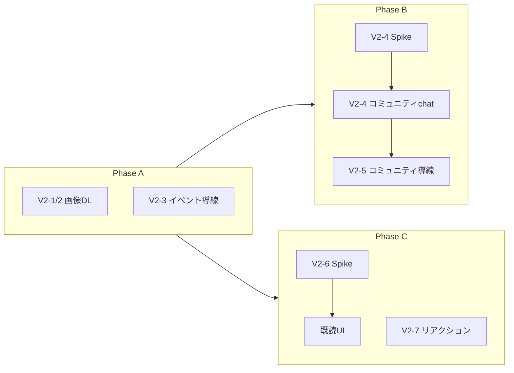

# チャット機能 v2（改善・拡張）

v1（[`01_チャット機能_01.md`](./01_チャット機能_01.md)）リリース後の改善・拡張について、検討内容・懸念・実装案・Issue 一覧をまとめる。

- **関連 Issue**: [#2214](https://github.com/nijuniinc/bokudeli-event-new/issues/2214) 〜 [#2220](https://github.com/nijuniinc/bokudeli-event-new/issues/2220)（ラベル `チャット機能`）

- **正本（v1）**: [`01_チャット機能_01.md`](./01_チャット機能_01.md) — イベントグループチャット・画像添付・送信取り消し等
- **本書の位置づけ**: v2 の **要件整理・設計検討**。確定した仕様は本書 → v1 への反映、または実装 PR と同期して更新する
- **ステータス**: Issue 起票済み（2026-07-23）。GitHub Issue 一覧 §末尾参照

---

## 工数見積もり（S / M / L）

| 記号 | 目安 | 例 |
|------|------|-----|
| **S** | 半日〜1日 | UI ボタン追加、既存 API 利用の導線、ユーティリティ追加 |
| **M** | 2〜5日 | ライトボックス改修 + 実機検証、composable 抽出、Functions 1 本 |
| **L** | 1週間以上 | コミュニティ chat 一式、既読/リアクション（スキーマ + Rules + UI） |

---

## v1 実装状況（2026-07 時点）

| 機能 | v1 計画 | 実装 |
|------|---------|------|
| イベントグループチャット | Phase 1 | ✅ |
| 画像添付・拡大表示 | Phase 3（v1 に前倒し） | ✅ |
| 送信取り消し | Phase 2 | ✅ |
| 画像ダウンロード | 未記載 | ❌ |
| イベントページ「チャットをひらく」 | Phase 2 | ❌（注文完了ダイアログのみ） |
| コミュニティグループチャット | Phase 2 | ❌（スキーマ `room_type: 'community'` のみ） |
| 1:1 チャット | Phase 2 | ❌ |
| 既読表示（チェックアイコン等） | Phase 1 省略 | ❌（`last_read_at` / 未読バッジのみ） |
| リアクション | 未計画 | ❌ |
| FCM プッシュ | 別仕様 | ❌（[`02_プッシュ通知.md`](./02_プッシュ通知.md)） |

---

## v2 スコープ一覧

| ID | 機能 | 分類 | 工数 | 設計判断 | 優先度（案） |
|----|------|------|------|----------|--------------|
| V2-1 | 画像ダウンロード（モバイル対応） | 改善 | S〜M | 不要 | 高 |
| V2-2 | メッセージ内ダウンロードボタン | 改善 | S | 不要 | 高 |
| V2-3 | イベントページ「チャットをひらく」 | 導線 | S | 不要 | 高 |
| V2-4 | コミュニティチャット | 新機能 | L | **要** | 中（Spike 後） |
| V2-5 | コミュニティページ「チャットをひらく」 | 導線 | S | V2-4 依存 | 中 |
| V2-6 | 既読表示（閲覧人数等） | 新機能 | M〜L | **要** | 中 |
| V2-7 | リアクション | 新機能 | M〜L | **要** | 低〜中 |

**v2 スコープ外（確定）**: チャット新着のメール通知 — レター（#21）および FCM（[`02_プッシュ通知.md`](./02_プッシュ通知.md)）に役割分担。

---

## V2-1 / V2-2: 画像ダウンロード

### 背景・課題

- チャット画像は Storage の **メンバー限定 read** のため `getDownloadURL` ではなく `getBlob` → `Object URL` で表示している（[`base/src/utils/storage.ts`](../../base/src/utils/storage.ts) の `getChatAttachmentBlob`）
- 拡大表示は [`AlbumLightbox.vue`](../../base/src/components/AlbumLightbox.vue)（`vue-easy-lightbox`）だが **ダウンロード UI なし**
- **iOS Safari** では blob URL の長押し保存・`<a download>` が期待どおり動かないことが多い

### 要件

| # | 要件 |
|---|------|
| D-1 | スマホ（iOS Safari / Android Chrome）で画像を端末に保存できる |
| D-2 | メッセージログ内および拡大表示中から明示的にダウンロードできる |
| D-3 | ファイル名は `ChatAttachment.file_name` を使用（サニタイズ済み） |
| D-4 | 既存のメンバー限定 read モデルを維持（公開 URL にしない） |

### 実装案

#### 1. 共通ユーティリティ `downloadBlob`

新規: `base/src/utils/downloadBlob.ts`

```typescript
/** Blob をファイルとして保存。iOS では Web Share API にフォールバック */
export async function downloadBlob(blob: Blob, fileName: string): Promise<void>
```

| 環境 | 方式 |
|------|------|
| Desktop / Android | `<a download>` + `URL.createObjectURL`（[`downloadCsv.ts`](../../base/src/utils/downloadCsv.ts) と同パターン） |
| iOS Safari | `navigator.canShare({ files: [File] })` が true なら `navigator.share({ files })` → 「写真に保存」 |
| フォールバック | トーストで「長押しで保存」等を案内（最終手段） |

#### 2. UI 配置

| 場所 | 変更ファイル | 内容 |
|------|-------------|------|
| 拡大表示 | `ChatLog.vue` + `AlbumLightbox.vue` | ライトボックス表示中、右下または上部にダウンロードボタン（Teleport）。現在表示中スライドの `title` を fileName に |
| メッセージ一覧 | `ChatAttachmentImage.vue` | 画像右上に小さな DL アイコンボタン（`@click.stop` で拡大と競合しない） |

#### 3. i18n

`base/src/locales/messages/ja.ts` に追加:

- `chat.download_attachment`: 「画像をダウンロード」
- `chat.download_failed`: 「画像の保存に失敗しました」
- `chat.download_ios_hint`: 「共有メニューから「写真に保存」を選んでください」（フォールバック時）

#### 4. テスト

- Vitest: `downloadBlob` のモック（`canShare` 分岐）
- 実機: [`01_チャット機能_04_リリースチェックリスト.md`](./01_チャット機能_04_リリースチェックリスト.md) の IMG 系に DL 項目を追加

### GitHub Issue

- V2-1 + V2-2 統合: [#2214](https://github.com/nijuniinc/bokudeli-event-new/issues/2214)

---

## V2-3: イベントページ「チャットをひらく」

### 背景

- 現状の導線は **注文完了ダイアログ**（[`UserSuccessJoinEventDialog.vue`](../../base/src/components/UserSuccessJoinEventDialog.vue)）のみ
- イベント詳細 [`user/src/pages/c/[communityAccount]/e/[eventId]/index.vue`](../../user/src/pages/c/[communityAccount]/e/[eventId]/index.vue) にはボタンなし

### 要件

| # | 要件 |
|---|------|
| E-1 | イベント参加者（`event.members` に uid 含む）かつログイン済みのときボタン表示 |
| E-2 | タップで `waitForEventChatMembership` → `/chat/{roomId}` へ遷移 |
| E-3 | membership 未準備時は既存トースト `chat.error.preparing` |
| E-4 | イベント詳細のボタン文言は `event_details.open_group_chat`（「グループチャット」）。参加者セクション横の pill ボタン向けに短いラベルとする。注文完了ダイアログは引き続き `chat.open_chat`（「グループチャットをひらく」） |

### 実装案

#### 1. composable 抽出

新規: `base/src/composable/useNavigateToEventChat.ts`（または `user/src/composable/`）

[`UserProfilePage.vue`](../../user/src/components/profile/UserProfilePage.vue) の `navigateToEventChatFromOrder` を共通化:

```typescript
export function useNavigateToEventChat(options: {
  userId: Ref<string | undefined>
  router: Router
  getChatPath: (roomId: string) => string
  notify: NotificationFn
}): { navigateToEventChat: NavigateToEventChatFn; isNavigating: Ref<boolean> }
```

#### 2. イベントページ UI

- ツールバーまたは `EventDetailsCard` 付近に `VBtn`（`mdiMessageTextOutline`）
- `canOpenChat`: `currentUserId != null && event.members.includes(currentUserId)`

#### 3. 既存箇所のリファクタ

- `UserProfilePage.vue` / `UserSuccessJoinEventDialog.vue` を composable 経由に差し替え（任意・同一 PR 推奨）

### GitHub Issue

- [#2215](https://github.com/nijuniinc/bokudeli-event-new/issues/2215)

---

## V2-4 / V2-5: コミュニティチャット

### 背景

- v1 §5.2.3 に仕様あり。**未実装**
- スキーマ [`ChatRoom`](../../common/src/schemas/ChatRoom.ts) は `room_type: 'community'` をサポート
- イベント chat の参考: [`syncEventChatMember.ts`](../../functions/default/src/syncEventChatMember.ts)

### 懸念（要決定）

#### 懸念 1: 過去メッセージを新規参加者に見せるか

イベント chat と同じ実装にすると、**参加以前のメッセージもすべて閲覧可能**（Rules 上、membership があれば `messages` サブコレクション全体を read 可）。

| 方針 | 説明 | メリット | デメリット |
|------|------|----------|------------|
| **A. 全履歴表示** | イベント chat と同じ | 実装が単純 | 後から参加した人が過去の私的なやりとりも見える |
| **B. 参加以降のみ** | `joined_at` 以降のメッセージのみ query | プライバシーに強い | Rules / query / UI が複雑。既存メッセージの扱い要設計 |
| **C. オプトイン** | コミュニティメンバー ≠ チャット参加者。別途「チャットに参加」 | メンバー数と閲覧者を分離 | UX ステップ増 |
| **D. 見送り** | v2 ではコミュニティ chat を出さない | リスク回避 | ニーズ未充足 |

**推奨（案）**: まず **Spike Issue で A/B/C を決定**。プライバシー重視なら **B または C**。Shokujii の「自由参加コミュニティ」との組み合わせでは **A はリスクが高い**。

v1 §6.1「過去イベント全件をマイグレーションしない理由」と同様、**参加時のユーザー期待**（いきなり全履歴が見える）を明示しないと問題になりうる。

#### 懸念 2: 自由参加＝実質誰でも閲覧可

[`10_コミュニティに参加・退会.md`](../03_参加者獲得/10_コミュニティに参加・退会.md): コミュニティは **自由参加/自由離脱**（承認制なし）。

```
ログイン → 「コミュニティに参加」→ members 追加 → （現仕様どおりなら）chat membership 付与 → チャット閲覧可
```

イベント chat は **注文確定（event.members）** が壁。コミュニティ chat は **参加ボタン 1 タップ** が壁。

| 緩和案 | 内容 |
|--------|------|
| 管理者のみ投稿・全員閲覧 | 掲示板型。雑談用途は弱い |
| イベント参加者限定ルームのみ | コミュニティ全体 chat は作らない |
| 公開コミュニティのみ chat 提供 | `is_public` 等で制限 |
| 参加時同意ダイアログ | 「過去のメッセージが見えます」等を明示 |

#### 懸念 3: メール通知 vs レター

| | **チャット** | **レター (#21)** |
|--|-------------|-----------------|
| 性質 | 双方向・リアルタイム | 管理者発信・一方向・公式 |
| トリガー | ユーザー投稿 | スケジュール送信 |
| 正本 | 本仕様 / プッシュ | [`04_詳細_メール配信.md`](../08_エンタープライズ/10_仕様/04_詳細_メール配信.md) §2.1.6 |

**推奨（案）**:

- チャット新着の **メール通知は v2 スコープ外**（確定）
- 気づきは [`02_プッシュ通知.md`](./02_プッシュ通知.md)（FCM）に委ねる
- 公式連絡は **レター** を使う（管理者 UI・送信意図が明確）
- 将来メールが必要なら **@mention 時のみ** や **日次ダイジェスト** 等に限定

**法務**: コミュニティ chat 追加時は [`03_電気通信事業届出準備.md`](./03_電気通信事業届出準備.md) の届出内容・変更届要否を再確認（v1 は event room 限定で整理済み）。

### 確定待ちチェックリスト（Spike）

- [ ] 過去メッセージ方針: A / B / C / D
- [ ] 参加条件: 全メンバー / 管理者のみ投稿 / その他
- [ ] 既存メンバーへのバックフィル: 要 / 不要 / lazy のみ
- [ ] コミュニティページ・イベントページからの導線（V2-5 / V2-3）
- [x] メール通知: **v2 スコープ外**（レター + FCM に委ねる）
- [ ] レターとのユーザー向け説明文案
- [ ] terms / privacy 更新要否
- [ ] 電気通信事業届出の変更届要否

### 実装案（方針 A: 全履歴・全メンバー — イベント chat ミラー）

Spike で別方針が選ばれた場合は §「代替実装メモ」を参照。

#### Functions

| ファイル | 内容 |
|----------|------|
| `functions/default/src/syncCommunityChatMember.ts` | `communities/{communityId}/members/{userId}` の `onDocumentWritten` で join/leave |
| `functions/default/src/stores/chatRoom.ts` | `findCommunityChatRoom`, `createCommunityChatRoom` |
| `functions/default/src/stores/chatMembership.ts` | `createCommunityChatMembership` |
| `.github/workflows/deploy_functions.yml` | export 追加時は `--only` 更新 |

`syncEventChatMember` と同型:

- join: room なければ create、`member_user_ids` 追加、membership 作成、システムメッセージ `member_joined`
- leave: `member_user_ids` から除外、membership **削除**（履歴は room に残るが Rules で read 不可）

#### Firestore

- composite index: `chat_rooms` — `(room_type, community_id)` where `room_type == 'community'`
- Rules: 既存 `isChatRoomMember` を community ルームでもそのまま利用（`member_user_ids` ベース）

#### base / user

| ファイル | 内容 |
|----------|------|
| `base/src/stores/chatRoomDisplay.ts` | `subscribeCommunityRoomDisplay(communityId)` — コミュニティ名・アイコン |
| `base/src/stores/chat.ts` | `waitForCommunityChatMembership`, `membershipToListItem` の community 分岐 |
| `user/src/pages/c/.../index.vue` | V2-5 ボタン |

#### 既存メンバー backfill

- 原則 **`bokudeli-event-batch`** 側（v1 §6.1 と同方針）
- 対象: チャット提供開始時点の `communities/{id}/members` 全員
- dry-run 必須

### 代替実装メモ

#### 方針 B: 参加以降のみ

- `chat_memberships` に `joined_at: Timestamp` を追加（community ルームのみ必須）
- メッセージ query: `where('created_at', '>=', joined_at)` — **ただしページネーションと整合要検証**
- Rules: `request.auth.uid` の membership の `joined_at` と message `created_at` を比較（Rules 式が複雑化）

#### 方針 C: オプトイン

- `communities/{id}/chat_participants/{uid}` サブコレクション、または membership に `chat_opt_in: true`
- コミュニティ参加 ≠ チャット参加。UI で明示 opt-in

### GitHub Issue

- Spike: [#2216](https://github.com/nijuniinc/bokudeli-event-new/issues/2216)
- 実装（V2-4 + V2-5）: [#2217](https://github.com/nijuniinc/bokudeli-event-new/issues/2217)

---

## V2-6: 既読表示（閲覧人数）

### 背景

- 現状の既読は **ルーム単位**（[`ChatMembership.last_read_at`](../../common/src/schemas/ChatMembership.ts) + `unread_count`）
- v1 §4.3.7: 既読チェックアイコン（`mdi-check-all`）は **Phase 1 省略**
- 要望: 「どれだけの人が閲覧したか」表示

### 現状データでできること / できないこと

| やりたいこと | 現状のみ | 備考 |
|-------------|----------|------|
| 自分の未読件数 | ✅ | `unread_count` |
| 「ルームを開いたか」近似 | △ | 各 member の `last_read_at >= message.created_at` で **人数カウント** |
| 「誰が読んだか」一覧 | ❌ | 他ユーザーの membership は Rules で read 不可 |
| メッセージ単位の正確な既読 | ❌ | message doc に既読情報なし |

**`last_read_at` 集計の限界**:

- ルームを開いた時点で **それ以前の全メッセージが既読扱い**（個別メッセージの scroll 既読ではない）
- バックグラウンドタブでは既読化しない（v1 §5.3）
- クライアントだけでは他メンバーの `last_read_at` を読めない → **Functions 集計が必要**

### 要件案（Spike で選択）

| レベル | UX 例 | データ |
|--------|-------|--------|
| **L1（最小）** | 送信者のみ「既読 3」と表示 | Callable が `last_read_at` 集計 |
| **L2（標準）** | タップで既読者名一覧（送信者のみ） | 同上 + user_name join |
| **L3（正確）** | メッセージごとに既読 / 未読 | `messages/{id}/reads/{uid}` サブコレクション |

### 実装案

#### L1 / L2: `last_read_at` 集計（推奨スタート）

新規 Callable: `getMessageReadStats`

```
Request:  { room_id, message_id }
Response: { read_count, total_members, read_user_ids? }  // L2 のみ read_user_ids
```

処理:

1. message の `created_at` を取得
2. room の `member_user_ids` を取得
3. 各 uid の `chat_memberships` から `last_read_at` を Admin SDK で読む
4. `last_read_at >= created_at` の人数を返す

UI（[`ChatLog.vue`](../../base/src/components/chat/ChatLog.vue)）:

- **自分のメッセージ**の下にのみ「既読 N」表示（LINE 風）
- L2: タップでダイアログ（既読者リスト）

コスト: メッセージ表示のたびに Callable は重い → **送信者が自分のメッセージを表示したとき / タップ時のみ** 取得

#### L3: メッセージ既読サブコレクション

```
chat_rooms/{roomId}/messages/{messageId}/reads/{userId}
  read_at: Timestamp
```

- クライアント: ルーム表示中に viewport 内メッセージへ `setDoc`（batch / throttle）
- Functions: 任意で `read_count` を message doc に denormalize
- Rules: member のみ create（自分の uid のみ）

工数 L。グループ chat（最大 ~25 人）なら L3 も現実的。

### 確定待ち

- [ ] レベル: L1 / L2 / L3
- [ ] 表示対象: 送信者のみ / 全員
- [ ] 既読者名の公開: OK / 人数のみ
- [ ] システムメッセージ・画像のみメッセージへの適用

### GitHub Issue

- Spike: [#2218](https://github.com/nijuniinc/bokudeli-event-new/issues/2218)
- 実装: [#2219](https://github.com/nijuniinc/bokudeli-event-new/issues/2219)

---

## V2-7: リアクション

### 背景

- 閲覧だけでは交流が弱い。軽いフィードバック UI の要望
- **現状スキーマにリアクション字段なし**

### 要件案

| # | 要件（案） |
|---|-----------|
| R-1 | ユーザーメッセージ（`message_type: 'user'`）かつ未削除に付与可能 |
| R-2 | 絵文字は **固定セット**（例: 👍 ❤️ 😂 🎉 🙏）— 実装・モデレーション容易 |
| R-3 | 1 ユーザー 1 メッセージあたり **1 リアクション**（変更可 = toggle / 別 emoji で上書き） |
| R-4 | リアクション追加時の **プッシュ通知は v2 では送らない**（通知疲れ防止） |
| R-5 | 送信取り消し時: リアクションも非表示（message ごと論理削除のため自動） |

### 実装案

#### データモデル（推奨: サブコレクション）

```
chat_rooms/{roomId}/messages/{messageId}/reactions/{userId}
  emoji: string          // 許可リスト内
  created_at: Timestamp
  updated_at: Timestamp
```

message doc への denormalize（任意）:

```typescript
reaction_summary: { '👍': 3, '❤️': 1 }  // 表示用。onWrite Trigger で更新
```

#### Rules

- read: ルーム member
- create/update/delete: 自分の `{userId}` のみ、emoji は許可リスト

#### UI

- メッセージ長押し or ホバーでリアクションピッカー（モバイル: 長押し / PC: ホバー）
- メッセージ下に `👍 3  ❤️ 1` チップ表示。タップで自分のリアクション toggle
- 変更: [`ChatLog.vue`](../../base/src/components/chat/ChatLog.vue)

#### store

- `base/src/stores/chat.ts` に `toggleReaction(roomId, messageId, emoji)`
- Firestore 直 write（Callable 不要。Rules で制限）

#### 工数

- スキーマ + Rules + store + UI: **M**
- denormalize Trigger + 集計 UI: **+S**

### GitHub Issue

- [#2220](https://github.com/nijuniinc/bokudeli-event-new/issues/2220)

## 実装フェーズ（推奨）

```
Phase A（設計不要・すぐ着手可）
  V2-1 + V2-2  画像 DL
  V2-3         イベントページ導線

Phase B（Spike → 実装）
  V2-4 Spike → コミュニティ chat 実装 → V2-5 導線

Phase C（Spike → 実装）
  V2-6 既読
  V2-7 リアクション

Phase D（別 Epic）
  FCM プッシュ（02_プッシュ通知.md）
  1:1  chat（v1 Phase 2 残）
```



---

## GitHub Issue 一覧

ラベル: **`チャット機能`** / milestone: **`v2.12`**

| v2 | Issue | タイトル | 依存 |
|----|-------|----------|------|
| V2-1, V2-2 | [#2214](https://github.com/nijuniinc/bokudeli-event-new/issues/2214) | `[base][user] チャット画像のダウンロード（モバイル対応・メッセージ内ボタン）` | — |
| V2-3 | [#2215](https://github.com/nijuniinc/bokudeli-event-new/issues/2215) | `[user] イベントページに「チャットをひらく」ボタン追加` | — |
| V2-4 | [#2216](https://github.com/nijuniinc/bokudeli-event-new/issues/2216) | `[doc] コミュニティチャット要件確定（Spike）` | — |
| V2-4, V2-5 | [#2217](https://github.com/nijuniinc/bokudeli-event-new/issues/2217) | `[functions][base][user] コミュニティチャット実装` | #2216 |
| V2-6 | [#2218](https://github.com/nijuniinc/bokudeli-event-new/issues/2218) | `[doc] チャット既読表示要件確定（Spike）` | — |
| V2-6 | [#2219](https://github.com/nijuniinc/bokudeli-event-new/issues/2219) | `[functions][base] チャット既読表示（閲覧人数）` | #2218 |
| V2-7 | [#2220](https://github.com/nijuniinc/bokudeli-event-new/issues/2220) | `[common][firebase][base] チャットリアクション` | — |

---

## 関連ドキュメント

| ドキュメント | 関係 |
|-------------|------|
| [`01_チャット機能_01.md`](./01_チャット機能_01.md) | v1 正本 |
| [`01_チャット機能_03_画像添付.md`](./01_チャット機能_03_画像添付.md) | 画像表示・DL 補足先 |
| [`02_プッシュ通知.md`](./02_プッシュ通知.md) | 新着通知（メール代替） |
| [`03_電気通信事業届出準備.md`](./03_電気通信事業届出準備.md) | コミュニティ chat 追加時の法務 |
| [`10_コミュニティに参加・退会.md`](../03_参加者獲得/10_コミュニティに参加・退会.md) | 自由参加と chat の関係 |

---

## 変更履歴

| 日付 | 内容 |
|------|------|
| 2026-07-23 | 初版。v2 検討内容・実装案・Issue 案を起票 |
| 2026-07-23 | V2-8（メール通知）を v2 スコープ外として削除。GitHub Issue 7 件起票 |
| 2026-07-23 | V2-3 要件 E-4: イベントページは短ラベル「グループチャット」（`event_details.open_group_chat`）。注文完了ダイアログは `chat.open_chat` のまま |
