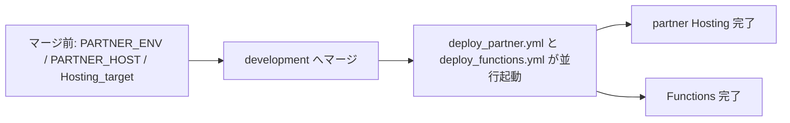

# admin から partner へリネーム

## 概要

飲食店向けの Vue パッケージ `admin/` を `partner/` に改名する。

エンタープライズ開発（`enterprise` パッケージ追加）では、全社管理者画面を `enterprise/src/pages/admin/`（URL `/admin/*`、ロール `enterprise_role == "admin"`）として実装する計画があり、**飲食店パッケージ名 `admin` と意味が衝突する**。本リネームはこの命名衝突を解消し、3 アプリ（`user` / `partner` / `enterprise`）の境界を明確にすることを目的とする。

`documents/00_仕様概要/01_仕様概要.md` §3.6 に「名称を admin から partner に移行予定」と既に記載があり、計画上も整合している。

**実施状況**: [PR #2057](https://github.com/nijuniinc/bokudeli-event-new/pull/2057) で PR-A（機械的改名）と PR-B（意味上の改名）を一体実施済み（2026-06）。

**参照**:
- [01_仕様概要](../00_仕様概要/01_仕様概要.md) §3.6 admin（飲食店・パートナー向け）
- [02_エンタープライズ_全体構成・アーキテクチャ](../08_エンタープライズ/02_エンタープライズ_全体構成・アーキテクチャ.md) §1.3 全社管理者画面のパッケージ構成

---

## 改名する／しないの整理

| 概念 | 現状 | 改名後 | 変える？ |
| :-- | :-- | :-- | :-- |
| 飲食店向け Vue パッケージ | `admin/` | `partner/` | **はい** |
| エンプラ全社管理者の URL | `/admin/settings` 等 | そのまま | いいえ |
| エンプラ管理者ロール | `enterprise_role == "admin"` | そのまま | いいえ |
| Firestore 飲食店データ | `/partners/{partnerId}` | そのまま | いいえ（既に partner） |
| Firebase Admin SDK | `firebase-admin/*` | そのまま | いいえ（npm パッケージ名） |
| イベントステータス | `applying_to_admin` | そのまま | いいえ（ドメイン用語） |
| Legacy 運営画面 | `manager/src/views/admin/` | そのまま | いいえ（別物） |

エンプラ Phase 3 の `/admin/*` は `enterprise` パッケージ内のルートであり、パッケージ名 `partner` とは衝突しない。

```
partner/                         … 飲食店（旧 admin パッケージ）
enterprise/（未追加）
  └── src/pages/admin/           … 全社管理者（URL /admin/*、ロール enterprise_role=="admin"）
user/
base/ + common/                  … partner_id / PartnerShop はもともと partner 命名
```

---

## 着手タイミング

`enterprise` パッケージ追加（エンプラ Phase 1-2）**前**にリネームしておく。

- 新規ドキュメント・`router/utils` 同期ルールを最初から `partner` で書ける
- エンプラの `package.json` workspaces 追加例（`02_...アーキテクチャ.md` §1.1）がそのまま使える
- 進行中 PR の `admin/**` path filter や `[admin]` コミットタグとの混在を避けるため、**独立 PR** とする

---

## 推奨アプローチ（2 段階）

| PR | 内容 | 主なリスク | 実施状況 |
| :-- | :-- | :-- | :-- |
| **PR-A（機械的改名）** | `admin/` → `partner/`、workspaces、CI、`firebase.json`、ツール・規約、ドキュメント用語 | Hosting target の同時更新が必要 | **PR #2057 で実施済み** |
| **PR-B（意味上の改名）** | `ADMIN_HOST` → `PARTNER_HOST`、`getAdminOrderUrl` → `getPartnerOrderUrl`、ClientError `app: 'partner'` | Functions 再デプロイ・メール URL・ログ監視に影響 | **PR #2057 で PR-A と同 PR に統合実施済み** |

当初は PR-A だけでもエンプラ Phase 3 の `/admin/*` との混同はほぼ解消でき、PR-B は別 PR に分けて切り分けやすくする方針だった。**#2057 では 6 コミットに論理分割しつつ、1 PR に統合してマージする**形で実施した。PR-B 単独 PR は不要。

---

## マージ前チェックリスト（必須）

`development` へマージする**前**に、以下を完了すること（未設定のままマージすると CI デプロイ失敗・空 `.env`・メール URL 障害が起き得る）。

1. **GitHub Actions Variables**: `ADMIN_ENV` → `PARTNER_ENV` に改名（値は従来の飲食店向け `.env` 内容のまま）
2. **GitHub Variables / Firebase Functions パラメータ**: `ADMIN_HOST` → `PARTNER_HOST` に改名（値は従来の飲食店ホスト名のまま）
3. **Firebase Hosting target**: `firebase target:apply hosting partner <site-id>`（development / production 各環境。`.firebaserc` は CI で生成）
4. **520 監視クエリ**: 新規ログは `jsonPayload.app="partner"`。過去分は `app="admin"` が残るため、調査時は OR 条件を検討（[01_520エラー通知](../09_運営向け機能/01_520エラー通知.md) 参照）

---

## マージ後のデプロイ順序と注意

`development` へのマージ後、`partner/**` 変更で [`deploy_partner.yml`](../../.github/workflows/deploy_partner.yml)、`functions/**` 変更で [`deploy_functions.yml`](../../.github/workflows/deploy_functions.yml) が**並行起動**する。



**運用ルール**（ClientError スキーマに `admin` 後方互換は入れない前提）:

- **Functions が先に完了**し、かつブラウザが旧 JS（`app: 'admin'`）を保持している間、ClientError 報告は [`clientErrorReport.ts`](../../functions/default/src/clientErrorReport.ts) の Zod parse で拒否され、520 は表示されるが Cloud Logging に残らない**短時間の窓**が生じうる
- **推奨**: [マージ前チェックリスト](#マージ前チェックリスト必須) 完了 → マージ → Actions タブで **partner Hosting デプロイ完了を確認してから** Functions デプロイ完了を確認（並行でも partner が先に終わるよう待つ）。必要なら `deploy_partner.yml` を `workflow_dispatch` で再実行して partner JS の配信を確実化
- **partner Hosting 完了後**は新 JS が `app: 'partner'` を送るため、Functions 側スキーマ `['user', 'partner']` と整合

---

## PR-A: 機械的改名（必須）

### 1. パッケージ本体

| 対象 | 内容 |
| :-- | :-- |
| ディレクトリ | `admin/` → `partner/`（`git mv` 推奨、約 56 ファイル） |
| `package.json`（ルート） | `workspaces` の `"admin"` → `"partner"` |
| `partner/package.json` | `"name": "admin"` → `"partner"` |
| `package-lock.json` | `npm install` で再生成（必ずコミット） |
| `partner/README.md` | タイトル・説明の更新 |

コード上の依存関係は軽い。`admin` は `@shokujii/base` / `@shokujii/common` を import するだけで、`user` / `base` / `common` / `functions` から `@shokujii/admin` のような逆依存はない。パッケージ内の `@/` エイリアスはローカル解決のため、ディレクトリ移動だけで済む。`admin/src/main.ts` の `app: 'admin'`（ClientError）だけは PR-B の対象。

### 2. CI/CD・Firebase Hosting

| ファイル / 設定 | 変更内容 |
| :-- | :-- |
| `firebase.json` | `"public": "admin/dist"` → `"partner/dist"`、`"target": "admin"` → `"partner"` |
| `.github/workflows/deploy_admin.yml` | ファイル名（`deploy_partner.yml`）、`name: Deploy admin`、`paths: admin/**`、`working-directory: ./admin`、`npm -w admin`、`--only hosting:admin` |
| GitHub Actions Variables | `ADMIN_ENV` → `PARTNER_ENV`（リポジトリ Variables の手動更新） |
| Firebase Hosting target | `firebase target:apply hosting partner <site-id>`（`.firebaserc` は CI で生成） |

> **注意**: `--only hosting:admin` が失敗する前に、**target 名・workflow・`firebase.json`・Firebase Console の target を同時に**更新する必要がある。
> Hosting target を `admin` のまま `public` だけ `partner/dist` にする部分改名も可能だが、長期的には target 名も `partner` に揃えた方が混乱が少ない。

### 3. 開発ツール・規約

| 対象 | 変更内容 |
| :-- | :-- |
| `AGENTS.md` / `CLAUDE.md`（シンボリックリンク） | ディレクトリ表、Git タグ `[admin]` → `[partner]` |
| `.github/copilot-instructions.md` | ディレクトリ表、Git タグ `[admin]` → `[partner]` |
| `.github/pull_request_template.md` | 例 `[admin]`、対象パッケージの `- admin` → `- partner` |
| `.agents/skills/lint-and-format/SKILL.md` | `npm -w admin` の記述（`.cursor` / `.claude` はシンボリックリンクで追随） |
| `.cursor/commands.json` | lint / format / format:check の `npm -w admin` |
| `.claude/hooks/lint-and-format.sh` | `PACKAGES` 配列の `"admin"` |
| `.claude/settings.json` | `Bash(npm -w admin run build:types)` |
| Git スキル（`git-commit-message` / `git-split-commit` / `git-create-pull-request`） | タグ一覧・例の `[admin]` |
| `.agents/skills/shokujii-code-review/shokujii-code-review.md` | チェックリストの `user / admin` 表記 |
| ルート `README.md` | `/admin` セクション |

> 将来 `[enterprise]` タグを追加する想定がある場合は、AGENTS.md のタグ一覧に方針を一文添えると 3 アプリの境界が明確になる。

### 4. ドキュメント用語（エンプラ着手前は実質必須）

| 対象 | 変更内容 |
| :-- | :-- |
| `08_エンタープライズ/02_...アーキテクチャ.md` | workspaces 例・`firebase.json` 例の `"admin"` → `"partner"` |
| `08_エンタープライズ/05_..._baseの依存関係整理.md` | 「user / enterprise / admin の router/utils 同期」→ `user / enterprise / partner` |
| `08_エンタープライズ/05_..._userをbaseに機能移行.md` | 同上の同期記述 |
| `00_仕様概要/01_仕様概要.md` | §3.6 の見出し・「移行予定」注記の更新（本リネーム完了で実態化） |

仕様書・リファクタ・レビュー履歴（`documents/02_...` `07_...` `レビューコメント/pr-*.md` 等、`admin/src/...` 言及は 20 ファイル超）は機械的置換だが量が多い。PR-A では上記の運用に直結する箇所を優先し、履歴系（`pr-*.md`）は段階的更新または履歴として残す方針とする。

---

## PR-B: 意味上の改名（PR #2057 で PR-A と統合実施済み）

> **インフラ手動作業**は [マージ前チェックリスト（必須）](#マージ前チェックリスト必須) を参照。コード変更は #2057 に含まれている。

## PR-B: 意味上の改名（詳細）

飲食店アプリを指す `admin` という**意味上の名前**を `partner` に揃える。**#2057 では PR-A と同 PR に統合して実施**した。

| 対象 | 旧 | 新（#2057 反映後） | 影響 |
| :-- | :-- | :-- | :-- |
| Functions 環境変数 | `ADMIN_HOST` | `PARTNER_HOST` | Functions 再デプロイ + GitHub Variables / Secret 更新 |
| URL ユーティリティ | `getAdminOrderUrl` | `getPartnerOrderUrl` | `common/src/utils/urls.ts` + `functions/default` のメール 5 ファイル |
| クライアントエラー報告 | `app: 'user' \| 'admin'` | `'user' \| 'partner'` | `common` / `base` / `partner/src/main.ts` |
| Cloud Logging フィルタ | `app=admin` | `app=partner` | 運用ダッシュボード・監視クエリ |

### 該当箇所（#2057 反映後）

```3:3:common/src/apis/clientError.ts
export const ClientErrorAppSchema = z.enum(['user', 'partner'])
```

```7:17:base/src/utils/reportClientError.ts
  app?: 'user' | 'partner'
  ...
let defaultApp: 'user' | 'partner' = 'user'
...
export function configureClientErrorReporting(options: { app: 'user' | 'partner' }): void {
```

```32:36:partner/src/main.ts
  configureClientErrorReporting({ app: 'partner' })
  ...
  setupGlobalErrorHandling(app, routerMod.router, { app: 'partner' })
```

```6:6:functions/default/src/utils/urls.ts
const PARTNER_HOST = defineString('PARTNER_HOST')
```

```37:40:common/src/utils/urls.ts
export function getPartnerOrderUrl(host: string, eventId: string) {
  return `https://${host}/order/${eventId}`
}
```

`getPartnerOrderUrl` を使用するメール送信（`functions/default`）:
- `eventStatusChangeMail.ts`
- `eventCancellation.ts`
- `rejectOrderMail.ts`
- `orderRemindMail.ts`
- `orderDeadlineMail.ts`

> `functions/legacy/src/utils/urls.js` にも `process.env.ADMIN_HOST` があるが、Legacy のため優先度は低い（変更なし）。

### PR-B のリスク

1. **`PARTNER_HOST` 未設定**: Functions 再デプロイ後、メール内の飲食店注文 URL が壊れる。[マージ前チェックリスト](#マージ前チェックリスト必須) で `PARTNER_HOST` を設定してからマージする。
2. **ClientError の `app` 値変更**: 既存ログは `app=admin`、以降は `app=partner` になる。[09_運営向け機能/01_520エラー通知](../09_運営向け機能/01_520エラー通知.md) のフィルタ条件も更新済み。デプロイ順序の注意は [マージ後のデプロイ順序と注意](#マージ後のデプロイ順序と注意) を参照。

---

## 変更不要なもの（混同注意）

grep で頻出するが、いずれも飲食店パッケージとは無関係なので改名しない。PR 説明に明記しておく。

| 残す名前 | 理由 |
| :-- | :-- |
| `enterprise/src/pages/admin/*` | 全社管理者画面（エンプラ固有・別レイヤ） |
| `enterprise_role == "admin"` | 全社管理者ロール名 |
| `applying_to_admin`（イベントステータス） | ドメイン用語「管理者申請中」。`common/src/schemas/Event.ts`、`base/src/locales/messages/ja.ts` 等 |
| `sendApplyingMailToAdmin` 等 | 上記ステータス由来。PR-B でのリネームは任意 |
| `base/src/stores/partner.ts` / `functions/default/src/stores/partner.ts` | 既に partner 命名。改名後に用語が揃う |
| `manager/src/views/admin/` | Legacy 運営画面の内部パス |
| `firebase-admin/*` | Firebase Admin SDK（npm パッケージ名） |
| Materio テンプレート名（`...-admin-template`） | 外部製品名（README の記述） |

---

## 作業規模の目安

| 区分 | ファイル数 | 難易度 |
| :-- | :-- | :-- |
| ディレクトリ + npm workspaces | 3 + lockfile | 低 |
| CI/CD + firebase.json | 2〜3 | 中（GitHub Variables / Hosting target 手動作業） |
| ツール・規約（AGENTS / skills / hooks / PR テンプレ） | 15〜20 | 低 |
| ドキュメント用語（エンプラ §・仕様概要） | 5〜10（運用直結） | 低 |
| ドキュメント一括更新（仕様・履歴） | 50+（任意） | 低〜中（機械的だが量が多い） |
| パッケージ内 Vue/TS ソース | 実質パス移動のみ（`main.ts` は PR-B） | 低 |
| セマンティック改名（PR-B: HOST / URL / ClientError） | 10〜15 | 中（Functions 再デプロイ） |

---

## チェックリスト

### PR-A（#2057 で実施済み）

- [x] `git mv admin partner`
- [x] ルート `package.json` の workspaces を `partner` に更新
- [x] `partner/package.json` の `name` を `partner` に更新
- [x] `npm install` で `package-lock.json` 再生成
- [x] `firebase.json` の `public` / `target` を更新
- [x] `deploy_admin.yml` → `deploy_partner.yml`（name / paths / working-directory / npm -w / hosting target）
- [ ] GitHub Actions Variables `ADMIN_ENV` → `PARTNER_ENV`（[マージ前チェックリスト](#マージ前チェックリスト必須)）
- [ ] Firebase Console で Hosting target を `partner` に適用（[マージ前チェックリスト](#マージ前チェックリスト必須)）
- [x] AGENTS.md / copilot-instructions.md / PR テンプレ / git スキルの `[admin]` タグ
- [x] lint-and-format / commands.json / hooks / settings.json の `npm -w admin`
- [x] README.md / エンプラ § / 仕様概要 §3.6 の用語
- [x] `npm -w partner run build` / lint / format:check が通ること

### PR-B（#2057 で PR-A と統合実施済み）

- [x] `common/src/apis/clientError.ts` の `ClientErrorAppSchema`
- [x] `base/src/utils/reportClientError.ts` の型・既定値
- [x] `partner/src/main.ts` の `app: 'partner'`
- [x] `common/src/utils/urls.ts` の `getPartnerOrderUrl`
- [x] `functions/default` のメール 5 ファイルの呼び出し
- [x] `functions/default/src/utils/urls.ts` の `PARTNER_HOST`
- [ ] GitHub Variables / Secret の `ADMIN_HOST` → `PARTNER_HOST`（[マージ前チェックリスト](#マージ前チェックリスト必須)）
- [ ] Functions 再デプロイ（マージ後 CI または手動）
- [x] 520 エラー通知ドキュメント・監視クエリのフィルタ更新
