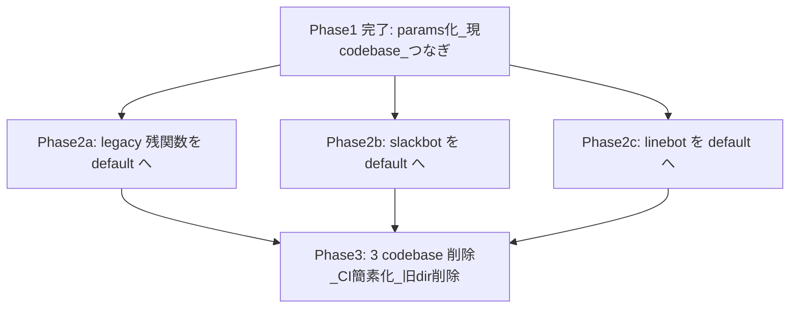
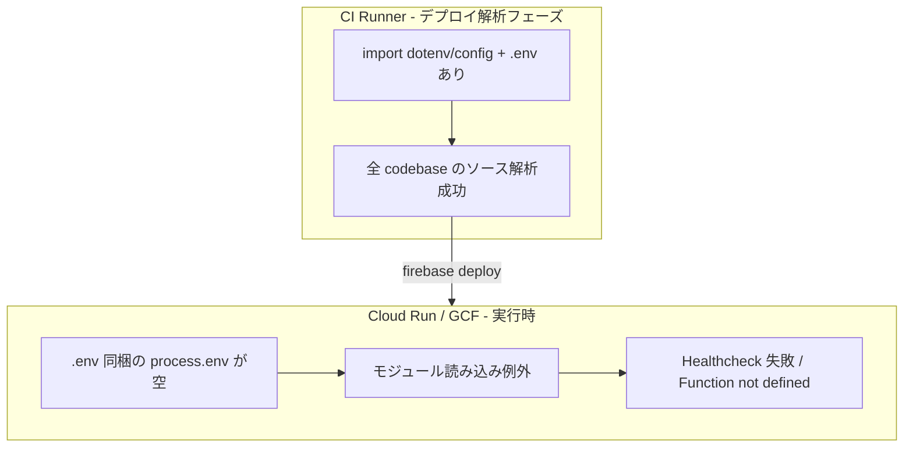

# bot / legacy の default 完全移行

## 1. 概要

### 1.1 機能の目的

`functions/legacy`・`functions/shokujii-slackbot`・`functions/shokujii-linebot` の全 Function を `functions/default` へ移行（TypeScript 化・Firebase Functions v2 化・params/Secret Manager 化・store 経由化）し、**最終的に 3 つの codebase（legacy / shokujii-slackbot / shokujii-linebot）とディレクトリを削除する**。

これにより、firebase-tools **15.15.0** 以降の CI デプロイ失敗を恒久的に解消し、メンテナンス対象を `default` codebase 1 本に統合する。

### 1.2 主要な機能

- **全 Function の default 移行**: legacy / Slack bot / LINE bot の計 10 関数を `functions/default` に統合
- **v1 → v2 化**: `firebase-functions/v1` 依存を排除し、v2 API（`onDocumentWritten` / `onSchedule` / `onRequest` / `onCall`）へ統一
- **params / Secret Manager 化**: `dotenv` + `process.env.*` を廃止し、`defineSecret` / `defineString` へ
- **store 経由化**: Firestore 直接操作を `functions/default/src/stores/` 経由に統一（withConverter 必須）
- **codebase 撤去**: 移行完了後に 3 codebase を `firebase.json` から削除し、ディレクトリと CI ステップを撤去

### 1.3 対象ユーザー

- 開発者（バックエンド開発者）
- インフラ担当（Secret Manager 登録・GitHub Environment 設定・Slack/LINE 外部設定）

### 1.4 段階構成（全体像）

本移行は 3 段階で進める。Phase 1 は完了済みで、完全移行が完了するまで現 codebase を稼働させ続けるための「つなぎ」である。



| Phase | 内容 | 状態 |
|-------|------|------|
| Phase 1 | params 化で現 codebase のデプロイを復旧（つなぎ） | 完了 |
| Phase 2a | legacy 残関数を default へ移行（TS + v2 + store） | 完了 |
| Phase 2b | Slack bot を default へ移行（store 新規 + Bolt 遅延初期化） | 完了 |
| Phase 2c | LINE bot を default へ移行 | 完了 |
| Phase 3 | 3 codebase・ディレクトリ・CI ステップの撤去 | 完了 |

## 2. ねらい

### 2.1 ビジネス目標

- GitHub Actions の Functions デプロイを安定化し、調査工数を削減する
- メンテナンス対象を `default` 1 本に統合し、保守性・型安全性を向上する
- 機密情報を `.env` 同梱から Secret Manager へ移し、セキュリティを向上する

### 2.2 ユーザー価値

- bot 通知（Slack / LINE）・legacy 機能の変更が確実にデプロイ・反映される
- 障害調査・新機能追加が `default` の統一パターンで行える

### 2.3 成功指標（KPI）

- `firebase.json` の codebase が `default` のみになる
- `firebase deploy --only functions` が exit code 0 で完了する
- `functions/{legacy,shokujii-slackbot,shokujii-linebot}` ディレクトリが削除されている
- 移行対象 10 関数が default で稼働し、関数名（=外部 URL）が維持されている

## 3. 前提条件

### 3.1 技術的前提条件

- Firebase Functions v2 / params（`defineSecret` / `defineString`）の理解
- 既存 `functions/default` の実装パターン（store 経由・withConverter・`defineSecret`・`createModuleLogger`）の理解
- [01_legacy_to_default移行.md](./01_legacy_to_default移行.md) の v1→v2 移行パターン
- firebase-tools **15.15.0**（[`.github/actions/deploy/action.yml`](../../.github/actions/deploy/action.yml) の既定値、維持する）

### 3.2 ビジネス的前提条件

- Slack / LINE bot は**今後も継続利用する**（両方とも default へ移行する。廃止はしない）
- 移行中もサービスを継続運用する

### 3.3 依存関係

- GCP Secret Manager（各 Firebase プロジェクト）
- Slack App 設定（OAuth redirect / slash command Request URL）
- LINE Developers 設定（webhook / channel access token）
- `common`（スキーマ追加が必要な場合）

## 4. 画面仕様

本機能はバックエンドのみの変更のため、画面仕様は該当なし。

## 5. 技術仕様・データ構造設計

### 5.1 背景（問題の核心）

#### 5.1.1 きっかけ

2026-04-22 頃、以下の CI 変更が入った。

| Issue | 変更内容 |
|-------|----------|
| #1938 | firebase-tools 既定を `13.35.1` → **`15.15.0`** に更新 |
| #1940 | deploy 引数を `--only functions` → **`--force --only functions`** に変更 |

#### 5.1.2 症状

`default` codebase の関数は成功するが、bot/legacy の以下 6 関数が失敗し、プロセス全体が exit code 2 になっていた。

| 関数 | エラー種別 |
|------|-----------|
| `legacy:flyer` | Cloud Run Container Healthcheck failed |
| `shokujii-slackbot:slackbot` | Cloud Run Container Healthcheck failed |
| `shokujii-slackbot:eventNotification` | Function not defined in the provided module |
| `shokujii-slackbot:orderNotification` | Function not defined in the provided module |
| `shokujii-linebot:broadcast_event_message_request` | Function not defined in the provided module |
| `shokujii-linebot:line_event_information` | Function not defined in the provided module |

#### 5.1.3 根本原因



bot/legacy は [firebase-tools #6499](https://github.com/firebase/firebase-tools/issues/6499) のワークアラウンドとして `import 'dotenv/config'` を使い、同梱した `.env` を runtime で読む方式だった。firebase-tools **15 系**ではこの方式がコンテナ実行時に機能せず、モジュール最上位の初期化（`sgMail.setApiKey`、`new ExpressReceiver(...)` 等）が例外を投げる。

完全移行により、この方式そのものを廃止し、`default` と同じ params / Secret Manager 方式へ統一する。

### 5.2 移行方針

| 方針 | 内容 |
|------|------|
| 配置 | 全関数を `functions/default/src/` 配下へ。`index.ts` の dynamic import 集約に追加 |
| 言語 | JavaScript → TypeScript |
| 世代 | v1 → **v2 へ統一**（`onDocumentWritten` / `onSchedule` / `onRequest` / `onCall`） |
| 機密 | `defineSecret('NAME')` + Function に `secrets: ['NAME']` バインド + `NAME.value()` |
| 非機密 | `defineString('NAME').value()`（既存 `utils/urls.ts` を流用） |
| Firestore | **store 経由**（`functions/default/src/stores/`、withConverter 必須） |
| ログ | `createModuleLogger`（`utils/logger.ts`）を使用 |
| 関数名 | **外部 URL 維持のため export 名を完全一致**で維持 |

### 5.3 移行対象インベントリ

| 元 codebase | 関数 | 現世代 | v2 変換先 | default での扱い | 主な論点 |
|------|------|------|-----------|------------------|----------|
| legacy | `flyer` | v2 onRequest | `onRequest` | `PdfGenerator` 基盤へ統合 | URL は関数名維持で不変。`makePdf` の `defineString`→`defineSecret` |
| legacy | `scheduled_firestore_export` | v1 sched | `onSchedule` | 単純移行 | `@google-cloud/firestore` 追加。`GCLOUD_PROJECT` は予約変数で維持 |
| legacy | `log_event_status` | v1 onWrite | `onDocumentWritten` | store 経由化 | [01](./01_legacy_to_default移行.md) 5.3.3 で計画済み・未実施 |
| legacy | `on_write_community_members` | v1 onWrite | `onDocumentWritten` | **重複精査が必要** | default の `onCommunityMemberWritten` と統合判断。マネージャー追加/削除メールは未移行 |
| legacy | `send_email` | v1 onCall | `onCall` | **移行 or 廃止を要判断** | フロントの直接呼び出しが未確認。生存確認のうえ判断 |
| shokujii-slackbot | `slackbot` | v2 onRequest | `onRequest` | **slackbot store 新規** + Bolt 遅延初期化 | OAuth redirect / slash command URL（Slack App） |
| shokujii-slackbot | `eventNotification` | v1 sched | `onSchedule` | store 経由化 | EVENT_HOST の defineString 化 |
| shokujii-slackbot | `orderNotification` | v1 onWrite | `onDocumentWritten` | store 経由化 | 現役（#1928 member_orders 集約） |
| shokujii-linebot | `broadcast_event_message_request` | v1 onRequest | `onRequest` | 単純移行 | `@line/bot-sdk` 追加。外部トリガ URL |
| shokujii-linebot | `line_event_information` | v1 sched | `onSchedule` | 単純移行 | date-fns named import |

### 5.4 関数名・URL 維持（必須要件）

完全移行で codebase が変わっても、**関数名（export 名）を完全一致で維持すれば外部 URL は変わらない**。

- **flyer**: フロントは関数名ベース URL を直接組み立てている。

```3:7:base/src/utils/flyer.ts
export const getFlyerPdf = async (eventId: string, size: string = 'A4') => {
  const token = await getAuth().currentUser!.getIdToken()
  const data = await fetch(
    `https://asia-northeast1-${import.meta.env.VITE_PROJECT_ID}.cloudfunctions.net/flyer/${eventId}?size=${size}`,
```

- **slackbot**: Slack App の OAuth redirect URL / slash command Request URL に登録済み。URL パス・sandbox ごとの App 分離・トラブルシュートは [22_Slack連携セットアップ.md](./22_Slack連携セットアップ.md) を参照。
- **linebot `broadcast_event_message_request`**: 外部から HTTP で叩かれる想定の URL。

これらは `https://<region>-<project>.cloudfunctions.net/<関数名>` 形式で関数名に紐づくため、関数名維持で URL は保たれる。Gen2 では Cloud Run URL（`https://<関数名>-xxxxx-an.a.run.app`）も併用される。移行後に各エンドポイントの疎通を確認すること。

### 5.5 v1 → v2 変換パターン

詳細は [01_legacy_to_default移行.md](./01_legacy_to_default移行.md) 5.2 を参照。主要パターンの要約:

#### onWrite → onDocumentWritten

```typescript
// v1
export const fn = functions.region('asia-northeast1')
  .firestore.document('communities/{communityId}/events/{eventId}')
  .onWrite(async (change, context) => { /* ... */ })

// v2
import { onDocumentWritten } from 'firebase-functions/v2/firestore'
export const fn = onDocumentWritten('communities/{communityId}/events/{eventId}', async (event) => {
  const before = event.data?.before?.data()
  const after = event.data?.after?.data()
  const { communityId, eventId } = event.params
  // ...
})
```

#### schedule.onRun → onSchedule

```typescript
// v1
export const fn = functions.region('asia-northeast1')
  .pubsub.schedule('0 2 * * *').timeZone('Asia/Tokyo').onRun(async () => { /* ... */ })

// v2
import { onSchedule } from 'firebase-functions/v2/scheduler'
export const fn = onSchedule(
  { schedule: '0 2 * * *', timeZone: 'Asia/Tokyo', region: 'asia-northeast1', secrets: ['LINE_CHANNEL_ACCESS_TOKEN'] },
  async () => { /* ... */ },
)
```

#### onRequest（v2）+ secrets

```typescript
import { onRequest } from 'firebase-functions/v2/https'
export const fn = onRequest(
  { region: 'asia-northeast1', secrets: ['PDF_SERVICES_CLIENT_ID', 'PDF_SERVICES_CLIENT_SECRET'] },
  async (req, res) => { /* ... */ },
)
```

### 5.6 store の新規作成（slackbot）

Slack bot は `slackbots` / `communities/{id}/bots` コレクションを直接操作している。`functions/default` では store 経由が必須（[AGENTS.md](../../AGENTS.md) 厳守ルール）のため、新規 store を作成する。

- 新規: `functions/default/src/stores/slackBot.ts`（`slackbots` ドキュメント・`channels` サブコレクション・OAuth installation の read/write）
- 既存利用: `communities/{id}/bots` は community 配下のため、`stores/community.ts` に bot 取得メソッドを追加するか、専用 store を設ける
- `common/src/schemas` に SlackBot / CommunityBot 相当のスキーマが無ければ追加（withConverter 用）

LINE bot は Firestore 書き込みが少なく（`collectionGroup('events')` の読み取り中心）、既存の event/community store の query 流用を検討する。

### 5.7 依存の移設

[functions/default/package.json](../../functions/default/package.json) に以下を追加する（各 codebase の現行バージョンを基準に、firebase-admin v13 系との整合を確認）。

| パッケージ | 用途 | 元 codebase |
|-----------|------|-------------|
| `@slack/bolt` | Slack bot | shokujii-slackbot |
| `@line/bot-sdk` | LINE bot | shokujii-linebot |
| `@google-cloud/firestore` | Firestore export（backup） | legacy |
| `date-fns` | 日付整形（既に default にあれば共用） | shokujii-linebot |

### 5.8 機密の params / Secret Manager 化

`default` の既存パターン（[functions/default/src/utils/sendgrid.ts](../../functions/default/src/utils/sendgrid.ts)）に準拠する。

```typescript
import { defineSecret } from 'firebase-functions/params'
const SLACK_SIGNING_SECRET = defineSecret('SLACK_SIGNING_SECRET')
// Function 定義で secrets: ['SLACK_SIGNING_SECRET'] をバインドし、SLACK_SIGNING_SECRET.value() で参照
```

#### slackbot: ExpressReceiver の遅延初期化（重要）

`new ExpressReceiver({...})` をモジュール最上位で実行すると、`defineSecret('...').value()` がデプロイ解析時に解決できず例外になる。Phase 1 で現 codebase に適用した遅延初期化（初回リクエスト時にメモ化生成）の設計を、default 移行版でも踏襲する。

```typescript
let cachedReceiver: ExpressReceiver | undefined
const getExpressReceiver = () => {
  if (cachedReceiver != null) return cachedReceiver
  cachedReceiver = new ExpressReceiver({
    signingSecret: SLACK_SIGNING_SECRET.value(),
    clientId: SLACK_CLIENT_ID.value(),
    clientSecret: SLACK_CLIENT_SECRET.value(),
    stateSecret: SLACK_STATE_SECRET.value(),
    // ...
  })
  // command 登録
  return cachedReceiver
}

export const slackbot = onRequest(
  { region: 'asia-northeast1', invoker: 'public', secrets: ['SLACK_SIGNING_SECRET', 'SLACK_CLIENT_ID', 'SLACK_CLIENT_SECRET', 'SLACK_STATE_SECRET'] },
  (req, res) => getExpressReceiver().app(req, res),
)
```

#### Secret 一覧（種別と作業）

| 名前 | 種別 | 保管先 | default で使用中（移行前） | 作業 |
|------|------|--------|---------------------------|------|
| `SENDGRID_API_KEY` | Secret | GCP Secret Manager | はい | 既存参照 |
| `PDF_SERVICES_CLIENT_ID` / `PDF_SERVICES_CLIENT_SECRET` | Secret | GCP Secret Manager | はい | 既存参照（`makePdf` を `defineSecret` へ） |
| `STRIPE_API_KEY` / `STRIPE_WEBHOOK_ENDPOINT_SECRET` | Secret | GCP Secret Manager | はい | 既存参照 |
| `SLACK_SIGNING_SECRET` / `SLACK_CLIENT_ID` / `SLACK_CLIENT_SECRET` / `SLACK_STATE_SECRET` | Secret | GCP Secret Manager | いいえ | **新規登録**（各プロジェクト） |
| `LINE_CHANNEL_ACCESS_TOKEN` | Secret | GCP Secret Manager | いいえ | **新規登録** |
| `EVENT_HOST` / `PARTNER_HOST` | String | GitHub `FUNCTIONS_ENV` → `.env` | はい | 既存運用を維持 |
| `SLACK_COMMAND_NAME` | String | GitHub `FUNCTIONS_ENV` → `.env` | いいえ | 任意（未設定時 `'shokujii'`） |
| `CORS` | 環境変数 | GitHub `FUNCTIONS_ENV` → `.env` | はい（flyer 等） | `process.env.CORS` で参照（`defineList` ではない） |

> **保管先の整理**: Functions ランタイムが `defineSecret` で読むのは **GCP Secret Manager のみ**。GitHub Secrets の `GCLOUD_SERVICE_KEY` は CI デプロイ認証用で、Functions からは参照しない。非機密は [deploy_functions.yml](../../.github/workflows/deploy_functions.yml) が `vars.FUNCTIONS_ENV` を `functions/default/.env` に書き出す。

#### Google Cloud Secret Manager 登録一覧（運用 Runbook）

移行完了後の `functions/default` が `defineSecret` で参照する Secret は **計 10 件**。**development / production / 各 sandbox ごと**に、対象 Firebase プロジェクトの [Secret Manager](https://console.cloud.google.com/security/secret-manager) へ値を登録する。

- **キー（Secret リソース）**: [terraform/functions.tf](../../terraform/functions.tf) の `local.function_secret_ids` で Terraform が 12 件作成（うち Functions が参照するのは上記 10 件。`TWITTER_*` はレガシー）
- **値（version）**: 手動登録（Terraform には含めない）

Terraform 管理済みプロジェクトで `for_each` 統合後に初回 apply する場合は、[terraform/README.md](../../terraform/README.md) の **state 移行**を先に実施する。Terraform 未管理の本番/テストプロジェクトは同 README の **Terraform 未管理プロジェクト**を参照。

##### 本移行で新規登録が必要（5 件）

旧 `shokujii-slackbot` / `shokujii-linebot` の `.env` は Phase 3 で削除済みのため、値は Slack App / LINE Developers コンソール、または各環境のバックアップから取得する。

| Secret 名 | 値の取得元 | バインド先関数 |
|-----------|-----------|----------------|
| `SLACK_SIGNING_SECRET` | [Slack App](https://api.slack.com/apps) → **Basic Information** → **Signing Secret** | `slackbot` |
| `SLACK_CLIENT_ID` | 同 App → **OAuth & Permissions** → **Client ID** | `slackbot` |
| `SLACK_CLIENT_SECRET` | 同 App → **OAuth & Permissions** → **Client Secret** | `slackbot` |
| `SLACK_STATE_SECRET` | OAuth state 用の任意の長いランダム文字列（旧 `.env` の値を流用可） | `slackbot` |
| `LINE_CHANNEL_ACCESS_TOKEN` | [LINE Developers Console](https://developers.line.biz/) → 対象チャネル → **Messaging API** → **Channel access token** | `broadcast_event_message_request`, `line_event_information` |

`slackEventNotification` / `slackOrderNotification`（旧 `eventNotification` / `orderNotification`）は Secret を直接使わない（Firestore + `EVENT_HOST` のみ）。

##### 既存（移行前から default で使用中・登録確認が必要）

| Secret 名 | 主な用途 | 主な関数 |
|-----------|----------|----------|
| `SENDGRID_API_KEY` | メール送信 | メール系 Callable / Trigger 多数、`stripeWebhook` 等 |
| `PDF_SERVICES_CLIENT_ID` | Adobe PDF 生成 | `flyer`, `namesPrint`, `eventBillInvoice`, `eventReceipt`, `pollingTask` |
| `PDF_SERVICES_CLIENT_SECRET` | 同上 | 同上 |
| `STRIPE_API_KEY` | Stripe API | `stripe`, `stripeWebhook`, `cancelOrders` |
| `STRIPE_WEBHOOK_ENDPOINT_SECRET` | Webhook 署名検証 | `stripeWebhook` |

Stripe の登録手順の詳細は [03_stripe決済の環境構築手順.md](./03_stripe決済の環境構築手順.md) を参照。

##### Secret Manager ではない項目（`FUNCTIONS_ENV`）

GitHub Environment Variables の `FUNCTIONS_ENV` に含め、デプロイ時に `functions/default/.env` へ出力する。Secret Manager には登録しない。

| 名前 | 説明 |
|------|------|
| `EVENT_HOST` | ユーザー向け URL（Slack/LINE 通知のリンク等） |
| `PARTNER_HOST` | パートナー向け URL |
| `SLACK_COMMAND_NAME` | Slack スラッシュコマンド名（任意。未設定時 `shokujii`） |
| `CORS` | `flyer` 等の CORS 許可オリジン |

##### 登録時の前提・確認

1. **プロジェクト単位**: development / production / sandbox で Secret の値は別（Slack/LINE は環境用 App・チャネルに合わせる）。
2. **CI サービスアカウント**: デプロイ用 SA（`firebase-deploy@...`）には、Terraform が各シークレット単位で `roles/secretmanager.admin` を付与する（[terraform/functions.tf](../../terraform/functions.tf)）。プロジェクト全体の `secretAccessor` は不要。ランタイム SA への accessor は `firebase deploy` が Function の `secrets` バインド時に設定する。
3. **ローカル開発**: Secret Manager の値は `functions/default/.secret.local` に置く（[functions/default/README.md](../../functions/default/README.md)）。
4. **登録後の確認**: デプロイ成功（7.5）と 8.5 の疎通チェック（`slackbot` OAuth/コマンド、LINE broadcast、flyer PDF 等）。

##### 作業チェックリスト（コピー用）

```
□ 対象 GCP プロジェクトを特定（dev / prod / sandbox）

【新規（本移行）】
□ SLACK_SIGNING_SECRET
□ SLACK_CLIENT_ID
□ SLACK_CLIENT_SECRET
□ SLACK_STATE_SECRET
□ LINE_CHANNEL_ACCESS_TOKEN

【既存確認（未登録なら追加）】
□ SENDGRID_API_KEY
□ PDF_SERVICES_CLIENT_ID
□ PDF_SERVICES_CLIENT_SECRET
□ STRIPE_API_KEY
□ STRIPE_WEBHOOK_ENDPOINT_SECRET

【非機密（FUNCTIONS_ENV）】
□ EVENT_HOST
□ PARTNER_HOST
□ SLACK_COMMAND_NAME（任意）
□ CORS

□ firebase-deploy SA に各 Secret の secretmanager.admin（Terraform 適用済みなら自動）
□ デプロイ → 8.5 疎通確認
```

新規 Firebase プロジェクト作成時の Terraform / GitHub 設定との対応は [firebaseプロジェクト新規作成.md](../firebaseプロジェクト/firebaseプロジェクト新規作成.md) を参照。Terraform 未管理プロジェクトでは [terraform/README.md](../../terraform/README.md) の手動キー作成手順に従う。

### 5.9 デプロイ切替手順（関数名衝突・ダウンタイム）

**最大の注意点**: 同一の関数名は 2 つの codebase に同時存在できない。default に `slackbot` 等を追加しつつ旧 codebase にも残すと衝突する。

切替は次のいずれかで行う。

1. **同一デプロイで「default 追加 + 旧 codebase 関数削除」を実施**
   - 旧コードベースから対象関数を削除（コードを消す or codebase を外す）し、同じ `firebase deploy --force --only functions` で default 版を作成する。
   - `--force` により削除と作成が同一デプロイで処理される。
   - 関数の「削除→再作成」が瞬間的に発生するため、**短時間の不通が起こり得る**ことを許容する（Slack/LINE/flyer の対象時間帯に注意）。

2. **codebase 単位で段階切替**（推奨）
   - Phase 2a/2b/2c ごとに、対象 codebase の関数を default へ移し、当該 codebase を空にしてからデプロイ。
   - 各 Phase 完了後に該当 codebase を `firebase.json` から外す（Phase 3 に集約も可）。

いずれも、デプロイ後に **関数 URL の疎通確認**（5.4）と **Slack/LINE 外部設定の URL 不変の確認**を行う。

### 5.10 Phase 3 デプロイ前: 旧 Gen1 関数の GCP 明示削除

Phase 3 で `firebase.json` から legacy / shokujii-slackbot / shokujii-linebot の codebase を削除しても、**GCP 上に既にデプロイ済みの 1st Gen 関数は自動削除されない**。

Firebase の codebase annotation は、デプロイ時に `firebase.json` に存在しない codebase の関数を **無視（ignores）** するだけで、既存リソースを削除しない（[Organize functions in codebases](https://firebase.google.com/docs/functions/organize-functions#organize_functions_in_codebases)）。

そのため、同名の Gen2 関数を `default` codebase からデプロイしようとすると、次のエラーで失敗する。

```
Upgrading from 1st Gen to 2nd Gen is not yet supported
```

**development / production / 各 sandbox すべて**で、Phase 3（旧 codebase 削除・default 一本化）の Functions デプロイ前に、旧 Gen1 関数を GCP から明示削除する必要がある。

#### 削除対象（Gen1 の 8 件）

Phase 2 で default へ移行した関数のうち、旧 codebase 側に **1st Gen として残存**しているもの。関数名（export 名）は default 側と同一のため、削除後に default から Gen2 として再デプロイする。

| 関数名 | 元 codebase |
|--------|-------------|
| `broadcast_event_message_request` | shokujii-linebot |
| `line_event_information` | shokujii-linebot |
| `eventNotification` | shokujii-slackbot |
| `orderNotification` | shokujii-slackbot |
| `log_event_status` | legacy |
| `scheduled_firestore_export` | legacy |
| `on_write_community_members` | legacy |
| `send_email` | legacy（廃止。旧 Gen1 が残っていれば削除） |

**削除不要**: `flyer` と `slackbot` は Phase 1 時点で既に **Gen2** のため、本手順の対象外。

#### 手順

1. **対象 GCP プロジェクトを特定**（development / production / sandbox ごとに実施）
2. **残存 Gen1 関数を確認**

```bash
# Firebase CLI
firebase --project <PROJECT_ID> functions:list --region asia-northeast1

# または gcloud
gcloud functions list --project=<PROJECT_ID> --regions=asia-northeast1 \
  --filter="environment:GEN_1" --format="table(name,status)"
```

3. **旧 Gen1 関数を一括削除**

```bash
firebase --project <PROJECT_ID> functions:delete \
  broadcast_event_message_request \
  line_event_information \
  eventNotification \
  orderNotification \
  log_event_status \
  scheduled_firestore_export \
  on_write_community_members \
  send_email \
  --region asia-northeast1 \
  --force
```

> `--force` は確認プロンプトを省略する。本番・development でも同コマンド形式。プロジェクト ID のみ環境に合わせて差し替える。

4. **削除完了を確認**

```bash
gcloud functions list --project=<PROJECT_ID> --regions=asia-northeast1 \
  --filter="environment:GEN_1 AND (name:broadcast_event_message_request OR name:line_event_information OR name:eventNotification OR name:orderNotification OR name:log_event_status OR name:scheduled_firestore_export OR name:on_write_community_members OR name:send_email)" \
  --format="table(name,status)"
```

上記 8 件が一覧に出なければ削除完了。

5. **default codebase の Functions をデプロイ**

Gen1 削除後、GitHub Actions の `Deploy functions`（または `firebase deploy --only functions`）で default のみをデプロイする。8 件は Gen2 として新規作成される。

6. **疎通確認**（8.5）

#### 注意

- Phase 2 を先行デプロイ済みで、旧 codebase の関数が `--force` デプロイにより既に削除されている環境では、本手順はスキップしてよい。未実施の環境では **Phase 3 デプロイ前に必須**。
- Gen1 削除から Gen2 再デプロイまでの間、該当関数は一時的に不通になる（5.9 のダウンタイムと同様）。Slack/LINE 通知・定期バックアップ等の影響時間帯に注意する。

### 5.11 Firestore バックアップ用インフラ（Terraform）

`backupFirestore`（旧 `scheduled_firestore_export`）は毎日 2:00 JST に `gs://<PROJECT_ID>-firestore-backups` へ export する。コードは [backupFirestore.ts](../../functions/default/src/backupFirestore.ts)。

**Terraform 管理プロジェクト**（`init.sh` 済み）では [firestore_backup.tf](../../terraform/firestore_backup.tf) と [service_account.tf](../../terraform/service_account.tf) が次を provision する。

| 項目 | 内容 |
|------|------|
| GCS バケット | `<PROJECT_ID>-firestore-backups`（リージョン `asia-northeast1`） |
| バケット IAM | `service-<PROJECT_NUMBER>@gcp-sa-firestore.iam.gserviceaccount.com` → `roles/storage.admin` |
| プロジェクト IAM | Compute / App Engine デフォルト SA → `roles/datastore.importExportAdmin` |

`PERMISSION_DENIED` で失敗する場合は、当該プロジェクトで `terraform apply` が未実施、またはバケットのみ手動作成で IAM 不足の可能性がある。[terraform/README.md](../../terraform/README.md) の import 手順を参照。

実機確認は [07_21_bot_legacy移行_実機テスト.md](../テスト/07_21_bot_legacy移行_実機テスト.md) の BKP-01〜03。

### 5.12 Slack 通知関数のリネームと Gen2 旧名削除

移行完了後、Slack 専用の export 名に変更した（legacy 名 → 現行名）。

| legacy / 旧 Gen2 名 | 現行 export 名 | 種別 |
|---------------------|----------------|------|
| `eventNotification` | `slackEventNotification` | `onSchedule`（毎分） |
| `orderNotification` | `slackOrderNotification` | `onDocumentWritten`（member_orders） |

**HTTP 公開関数**（`slackbot` 等）は外部 URL のためリネームしない。上記2件は外部 URL を持たないためリネーム可能。

#### デプロイ後の必須手順（各環境）

`firebase deploy --only functions` だけでは **旧 Gen2 名の関数が残り二重実行**する（毎分通知・注文ごと通知）。デプロイ成功後に必ず旧名を削除する。

1. 新関数の存在確認

```bash
firebase functions:list --project <PROJECT_ID> | grep -E 'slackEventNotification|slackOrderNotification'
```

2. 旧 Gen2 関数の明示削除

```bash
firebase --project <PROJECT_ID> functions:delete \
  eventNotification \
  orderNotification \
  --region asia-northeast1 \
  --force
```

3. 孤立リソース確認（推奨）

- Cloud Scheduler に `firebase-schedule-eventNotification-asia-northeast1` が残っていれば削除。新ジョブは `firebase-schedule-slackEventNotification-asia-northeast1`
- `firebase functions:list` に `eventNotification` / `orderNotification` が無いこと

§5.10 の Gen1 削除リストは **未削除環境向けに旧名のまま**維持する。Gen2 旧名削除は本節を参照。

実機確認は [07_21_bot_legacy移行_実機テスト.md](../テスト/07_21_bot_legacy移行_実機テスト.md) の SLK-EVT-07 / SLK-ORD-06。

## 6. データマイグレーション

Firestore データ構造の変更は伴わないため、データマイグレーションは不要。`slackbots` 等のコレクションは既存のまま store 経由でアクセスする。

## 7. 実装優先度

### 7.1 Phase 1（完了・つなぎ）

- [x] `shokujii-slackbot/app.js` — ExpressReceiver 遅延初期化 + secrets バインド
- [x] `shokujii-linebot/index.js` — defineSecret + date-fns named import + runWith
- [x] `deploy_functions.yml` — 機密 `.env` echo 削除

### 7.2 Phase 2a（legacy 残関数 → default）

- [x] Secret Manager 登録（`SLACK_*`, `LINE_CHANNEL_ACCESS_TOKEN`）※ Phase 2b/2c の前提（各プロジェクトで運用時に登録）
- [x] `flyer` を default へ（`PdfGenerator` 統合、`makePdf` の `defineSecret` 化）
- [x] `scheduled_firestore_export` を default へ（`onSchedule`、`@google-cloud/firestore` 追加）
- [x] `log_event_status` を default へ（`onDocumentWritten`、store 経由）
- [x] `on_write_community_members` の**重複精査**→`onCommunityMemberWritten` へ統合
- [x] `send_email` の**生死判定**→フロント未使用のため**廃止**（Phase 3 で legacy codebase ごと削除）

### 7.3 Phase 2b（Slack bot → default）

- [x] `stores/slackBot.ts`（および community bots アクセス）と必要スキーマを作成
- [x] `slackbot`（Bolt 遅延初期化 + secrets）を default へ
- [x] `eventNotification`（`onSchedule`）を default へ → 現行名 `slackEventNotification`（§5.12）
- [x] `orderNotification`（`onDocumentWritten`）を default へ → 現行名 `slackOrderNotification`（§5.12）
- [x] `@slack/bolt` を default に追加

### 7.4 Phase 2c（LINE bot → default）

- [x] `broadcast_event_message_request`（`onRequest` + secrets）を default へ
- [x] `line_event_information`（`onSchedule` + secrets）を default へ
- [x] `@line/bot-sdk` を default に追加（date-fns は不使用、luxon の `convertToDuration` で代替）

### 7.5 Phase 3（撤去）

- [x] `firebase.json` から legacy / shokujii-slackbot / shokujii-linebot の codebase を削除
- [x] `deploy_functions.yml` の各 codebase 用 install / .env 生成ステップを削除
- [x] `functions/{legacy,shokujii-slackbot,shokujii-linebot}` ディレクトリを削除
- [ ] **各環境で旧 Gen1 関数 8 件を GCP から明示削除**（5.10。development / production / sandbox すべて）
- [ ] `firebase deploy --only functions` が default のみで exit code 0 を確認（Gen1 削除後に実施）

## 8. 注意事項

### 8.1 重複機能の精査（事故防止）

- **`on_write_community_members`**: default に `onCommunityMemberWritten`（[communityMemberCountsTrigger.ts](../../functions/default/src/communityMemberCountsTrigger.ts)）が既にある。メンバー数更新と**マネージャー追加/削除メール**が二重に走らないよう、統合先・発火条件を明確にする。
- **`send_email`**: legacy の Callable。フロントからの直接呼び出しが grep で確認できていない。生存していれば default へ移行、死んでいれば**廃止**（移行しない）。Phase 2a 着手時に最終確認する。

### 8.2 既存システムへの影響

- Cloud Run / GCF は新リビジョン失敗時に旧リビジョンが稼働継続するが、**関数名の codebase 間移動時のみ削除→再作成**が起き、短時間の不通があり得る（5.9）。
- **外部 HTTP URL を持つ関数**（`flyer`, `slackbot`, `broadcast_event_message_request` 等）は export 名を変えると URL が壊れるため**不変**を厳守する。
- **onSchedule / onDocumentWritten の Slack 通知**（`slackEventNotification`, `slackOrderNotification`）は外部 URL を持たないためリネーム可。デプロイ後は §5.12 の Gen2 旧名削除が必須。

### 8.3 セキュリティ考慮事項

- Secret はプロジェクトごとに管理（development / production / sandbox で値が異なる）。キーは Terraform、値は手動登録（5.8 Runbook）
- CI サービスアカウント `firebase-deploy` には各 Secret 単位で `roles/secretmanager.admin`（Terraform）。プロジェクト全体の `secretAccessor` は付与しない
- store 経由・withConverter を維持し、Zod バリデーションを壊さない

### 8.4 運用考慮事項（ロールバック）

- コードを revert して再デプロイ、または Cloud Console で旧リビジョンへトラフィックを戻す
- codebase 撤去（Phase 3）は Phase 2 完了・疎通確認後に行う。撤去前に各関数が default で稼働していることを `firebase functions:list` で確認する
- Phase 3 の Functions デプロイ前に、旧 Gen1 関数 8 件の GCP 明示削除が必要（5.10）。`firebase.json` から codebase を外すだけでは Gen1 は残る

### 8.5 動作確認チェックリスト

| 確認項目 | 方法 |
|----------|------|
| CI デプロイ成功 | GitHub Actions `Deploy functions` が緑（exit code 0） |
| flyer URL | フロントから PDF 取得（関数名 URL 不変） |
| slackbot OAuth / コマンド | Slack で `/shokujii add ...`、OAuth redirect 疎通 |
| 注文通知 | テストイベントで member_orders を ordered に |
| イベント通知（Slack/LINE） | `slackEventNotification` を Scheduler 手動実行 or 時刻到来で確認（§5.12） |
| LINE ブロードキャスト | `broadcast_event_message_request` を HTTP 呼び出し |
| backup | `backupFirestore`（Cloud Scheduler 手動実行）で `gs://<PROJECT_ID>-firestore-backups` に出力（5.11・BKP-01） |
| codebase | `firebase functions:list` が default のみ |

### 8.6 関連ドキュメント

- [terraform/README.md](../../terraform/README.md) — Secret Manager for_each 化・state 移行・Terraform 未管理プロジェクト手順
- [firebaseプロジェクト新規作成.md](../firebaseプロジェクト/firebaseプロジェクト新規作成.md) — Terraform / GitHub / GCP Secret Manager の初期設定
- [03_stripe決済の環境構築手順.md](./03_stripe決済の環境構築手順.md) — `STRIPE_*` Secret の登録と Webhook 設定
- [01_legacy_to_default移行.md](./01_legacy_to_default移行.md) — legacy 機能の default 移行（v1→v2 パターンの正本）
- [15_EventMemberOrder_SlackBot.md](./15_EventMemberOrder_SlackBot.md) — Slack 注文通知の member_orders 対応
- [20_adminからpartnerへリネーム.md](./20_adminからpartnerへリネーム.md) — `ADMIN_HOST` → `PARTNER_HOST`
- [17_onDocumentWritten不具合.md](./17_onDocumentWritten不具合.md) — マルチ codebase デプロイの注意点
- [firebase-tools #6499](https://github.com/firebase/firebase-tools/issues/6499) — dotenv ワークアラウンドの経緯
- [Firebase: Configure your environment](https://firebase.google.com/docs/functions/config-env) — params / Secret Manager 公式
- [22_Slack連携セットアップ.md](./22_Slack連携セットアップ.md) — Slack App 設定・Request URL（`/slack/events`）・sandbox 運用
- [07_21_bot_legacy移行_実機テスト.md](../テスト/07_21_bot_legacy移行_実機テスト.md) — 移行後の実機テスト項目書

### 8.7 移行時の要点（まとめ）

- **外部 HTTP URL を持つ関数の export 名は維持**（flyer / slackbot / LINE HTTP 等）。Slack 通知2件は `slackEventNotification` / `slackOrderNotification` にリネーム済み（§5.12）
- **同名関数の codebase 間移動は削除→再作成**になる。切替手順とダウンタイムを意識する（5.9）
- **Phase 3 デプロイ前に旧 Gen1 関数を GCP から明示削除**する（5.10）。codebase 削除だけでは Gen1 が残り Gen2 デプロイが失敗する
- **Firestore は store 経由・withConverter 必須**。slackbot 用 store を新規作成
- **slackbot は ExpressReceiver 遅延初期化**を踏襲
- **v1 は v2 へ統一**（`onDocumentWritten` / `onSchedule` / `onRequest` / `onCall`）
- **重複（community-members）・死活（send_email）を精査**してから移行/廃止を確定
- **Secret Manager**: キー 12 件は Terraform（5.8 Runbook）、値は手動。CI SA はシークレット単位 `secretmanager.admin`
- firebase-tools は **15.15.0 を維持**
