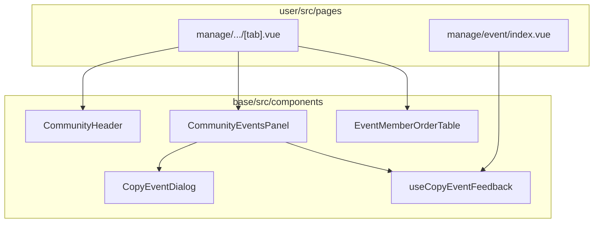

# PF版 user から base への機能移行（改訂版）

**Issue / ブランチ**: #2051 / `dev/2051-v2`（`origin/development` 起点で Phase 0 + Phase 1 実装中）  
**旧版**: `05_エンタープライズ_PF版_userをbaseに機能移行_01_旧.md`  
**関連**: `05_エンタープライズ_PF版_userとenterpriseの共通化.md` / `05_エンタープライズ_PF版_baseの依存関係整理.md` / `base/README.md` / `base/src/components/pages/@CAUTION.md`

---

## 1. 改訂の背景

### 1.1 dev/2051（旧方針）でやったこと

manage 配下を **ページ相当のトップレベルコンポーネント** として base に移した。

| 種別 | 例 | 行数目安 |
|------|-----|---------|
| タブシェル | `CommunityTabLayout`, `EventTabLayout` | 110〜120 |
| 一覧ページ | `CommunityIndex`, `EventIndex` | 105〜223 |
| タブ本体 | `CommunityMember`, `EventMember`, `EventOverview`, `CommunityAlbum` 等 | 155〜442 |
| 横断 UI | `MemberSnsButtons`, `useManageMemberEmail` | 小 |

user 側は薄いラッパー化されたが、**ルーティング・タブ構成・画面全体** が base に固定された。

### 1.2 旧方針の問題

1. **カスタマイズ粒度が粗い**  
   enterprise でタブ 1 つ・ボタン 1 つ・文言だけ変えたい場合、base の巨大コンポーネントを fork するか、props/slot を大量追加する必要がある。

2. **`@CAUTION.md` / `base/README.md` と矛盾**  
   - `pages/` は暫定・編集不可・将来削除  
   - 新規は **パネル / カード / Dialog 単位** で分離し、各 app の `pages` で組み立てるべき  
   - 旧 dev/2051 は `manage/*TabLayout`, `*Index` 等で **ページ相当を base に追加** しており、方針と逆。

3. **user ↔ base の境界が不自然**  
   タブシェルが一部のタブ本体だけ `@/components/...`（user 本体）を dynamic import している。`CommunityTabLayout` の `events` タブ（`@/components/manage/community/events.vue`）、`EventTabLayout` の `flyer` タブ（`@/components/manage/event/flyer.vue`）が該当。**base 化と user 残置が混在した半端な状態**。

4. **重複ロジック**  
   `handleCopySuccess` + 完了/エラーダイアログが `EventOverview` / `EventIndex` / `community/events.vue` に重複。

### 1.3 改訂方針（一行）

> **base には「画面」ではなく「再利用可能な UI 部品と composable」を置き、ページ組み立ては user / enterprise の `pages` に残す。**

既存の良い先例（**粒度の先例**）: `UserBioPanel`, `CommunityBioPanel`, `EventDetailsCard`, `eventcreate/EventBasicInfoCard`, `LetterTable`, `CopyEventDialog`。

> ⚠ これらは「**コンポーネント粒度**の先例」であって「**path 注入の先例ではない**」。`UserBioPanel` / `CommunityBioPanel` / `EventDetailsCard` はいずれも内部で `@/router/utils`（`getProfile` / `getCommunityPath` / `getLogin` 等）を静的 import している。新規パネルの path の扱いは §2.3 の方針に従うこと。

---

## 2. 設計原則

### 2.1 base に置くもの（移行候補）

| 条件 | 例 |
|------|-----|
| user / enterprise / partner で **同じ UI・同じ業務ロジック** | メンバー一覧テーブル行、キャンセル理由 Dialog |
| **1 つの v-card / Dialog / パネル** に収まる | `EventCommunityBillAlert`, `ManagerInvitationDialog` |
| **複数画面から再利用** | `CopyEventDialog`, `MemberSnsButtons` |
| ロジックのみ共通化 | `useCopyEventFeedback`, `useMemberCsvExport` |

### 2.2 user（各 app）に残すもの

| 条件 | 例 |
|------|-----|
| **ルーティング・タブ・レイアウト** | `[tab].vue`, `layouts/manage.vue` |
| **PF / enterprise 固有の文言・リンク・ナビ** | `manage/index.vue`, `navigation/manage.ts` |
| **画面全体の store wiring と条件分岐** | enterprise で非表示タブ、ゲスト向け導線 |
| **ブランド依存** | manage TOP マーケ、フライヤーロゴ（`flyerLogoUrl` prop パターンは維持） |

### 2.3 コンポーネント設計（base/README 準拠）

- 子コンポーネントは **props / emits / slot** でデータ受け取り。store 直叩きは最小限。
- **`base/src/components/pages/` への新規追加は禁止**。既存（cart / mypage / members）は将来分解対象。

#### path（`@/router/utils`）の扱い — 方針決定

`CLAUDE.md` は「`base` の依存反転（`@/router/utils` 参照）は**新規コードでは避けて設計**」と明記している。本移行の新規パネルは次の優先順位で設計する。

- **(A) 原則**: path 生成・遷移は **props / emit で注入**する（例: `:manage-community-path="getManageCommunityPath(account)"`、`@navigate="..."`）。enterprise で URL 仕様を変えても base を触らずに済む。
- **(B) 例外**: 注入の配線コストが見合わない場合のみ、既存同様 `@/router/utils` の静的 import を許容する。**その場合は user / partner / enterprise のスタブ整備（§7）が前提**。

> 既存の base コンポーネント（`UserBioPanel` 等）や dev/2051 で維持するコンポーネント（§3.1）は (B) のままでよい。**新規抽出するパネル（§4.1〜§4.3）は (A) を原則**とする。

### 2.4 命名・配置

```
base/src/components/
  manage/
    shared/          # 横断（MemberSnsButtons 等）
    community/       # コミュニティ manage 向けパネル・Dialog
    event/           # イベント manage 向けパネル・Dialog
  eventcreate/       # 既存パターン（Card 単位）に倣う
```

- `*TabLayout`, `*Index` のような **ページ名接尾辞は新規禁止**。
- **`Manage` / `Managed` 接頭辞は付けない**（`manage/` ディレクトリがスコープを表す。旧版 §4.1.4 規則を継承）。`Community` / `Event` 接頭辞は維持。
- Dialog は `*Dialog`、v-card パネルは `*Panel` / `*Card` / ドメイン名。

---

## 3. dev/2051 で「維持」vs「やり直し」

### 3.1 維持（粒度が適切）

| ファイル | 理由 |
|----------|------|
| `MemberSnsButtons.vue` | 小さな横断 UI |
| `MemberEmailNotSetDialog.vue` | Dialog 単位 |
| `useManageMemberEmail.ts` | composable |
| `CopyEventDialog.vue` | 機能単位 Dialog（内部分割は任意） |
| `EventSettings.vue`, `CommunitySettings.vue` | EventEdit / CommunityEdit の薄いラッパー |
| `NewCommunity.vue`, `NewEvent.vue` | 小〜中、作成フロー 1 画面 |
| `EventLetter.vue`, `CommunityLetter.vue` | LetterEdit + LetterTable 組み合わせ |
| `CommunitySlackSetting.vue`, `CommunityInvoice.vue`, `EventFlyer.vue` | 単機能（Flyer は `flyerLogoUrl` prop） |
| `EventBillInvoicePdf.vue` | PDF 表示 1 用途 |
| SNS / Slack アセット | 共通化済み |

### 3.2 やり直し（ページ単位 → 分解 or user へ戻す）

| 旧 base ファイル | 方針 |
|------------------|------|
| `CommunityTabLayout`, `EventTabLayout` | **user の `[tab].vue` に戻す**。ヘッダーだけ `CommunityHeader` 等に抽出 |
| `CommunityIndex`, `EventIndex` | **user の `pages/manage/.../index.vue` に戻す**。一覧 UI は小コンポーネント化 |
| `CommunityMember`, `EventMember` | **分解**（§4.2） |
| `EventOverview` | **分解**（§4.3） |
| `CommunityAlbum` | 現状 442 行。**Album グリッド / アップロード UI** に分割検討 |
| user の `components/manage/*/settings.vue` 等 **re-export 薄ラッパー** | 削除し pages から base を直接 import |

---

## 4. user から base へ移すべきもの（洗い出し）

### 4.1 manage 横断（新規抽出）

| 候補 | 移行元 | 概要 | 優先度 |
|------|--------|------|--------|
| `useCopyEventFeedback.ts` | `EventOverview`, `EventIndex`, `events.vue` | コピー成功/失敗 Dialog 状態・文言・遷移 | **高** ✅ Phase 1 |
| `useMemberCsvExport.ts` | `CommunityMember`, `EventMember` | CSV 生成（community / event 列定義は引数） | 中 |
| `ManagerInvitationDialog.vue` | `CommunityMember` 280〜301 行付近 | 管理者招待 URL 生成 | 高 ✅ Phase 1 |
| `ManagerRoleChangeDialog.vue` | `CommunityMember` add/remove | 管理者追加・解除確認 | 高 ✅ Phase 1 |
| `MemberListRow.vue` | member 2 画面 | Avatar + 名前 + SNS + **actions slot** | 高 ✅ Phase 1 |
| `MemberEmailAction.vue` | member 2 画面 | メールボタン + EmailDialog 連携 | 中（`useManageMemberEmail` 拡張でも可） |

### 4.2 manage / community

| 候補 | 移行元 | 概要 | 優先度 |
|------|--------|------|--------|
| `CommunityEventsPanel.vue` | `user/.../events.vue` | 新規作成・コピー・Help・EventCard グリッド・IncrementalLoader | **高**（未 base 化の唯一のタブ本体） |
| `CommunityHeader.vue` | 旧 `CommunityTabLayout` template 上部 | アイコン・名称・公開ページリンク | 中 |
| `CommunityMemberTable.vue` | 旧 `CommunityMember` | v-table + 上記 Row / Dialog 組み合わせ | 高 |
| `CommunityAlbumGrid.vue` | 旧 `CommunityAlbum` | draggable グリッド部分 | 中 |
| `CommunityAlbumUpload.vue` | 同上 | アップロード・バリデーション | 中 |

**user の pages に残す**: `pages/manage/community/[communityAccount]/[tab].vue`（タブ定義・`v-tabs`・タブ本体の出し分け）。

### 4.3 manage / event

| 候補 | 移行元 | 概要 | 優先度 |
|------|--------|------|--------|
| `EventCommunityBillAlert.vue` | 旧 `EventOverview` | 請求書払い v-alert | 中 |
| `EventOverviewActionPanel.vue` | 旧 `EventOverview` | 編集・削除・コピー・キャンセルボタン群 | 高 |
| `EventCancelFlow.vue` | 旧 `EventOverview` | 理由入力〜確認〜完了 Dialog 群 | **高**（EventMemberOrder と関連） |
| `EventDeleteDialogs.vue` | 旧 `EventOverview` | 削除確認・完了 | 中 |
| `EventMemberOrderTable.vue` | 旧 `EventMember` | ステータス別 v-table。**列定義は props で外出し**（§7 EventMemberOrder 依存参照） | **最高** |
| `EventCardGrid.vue` | `EventIndex`, `events.vue` | EventCard + IncrementalLoader（props: query, columns） | 高 |

**user の pages に残す**: `pages/manage/event/[eventId]/[tab].vue`, `pages/manage/event/index.vue`。

### 4.4 公開ページ（Phase 3・enterprise 要件と並行）

現状 **base パネル + user pages で組み立て** が正しい方向。ページ丸ごと base 化はしない。

| 候補 | 移行元 | 概要 | 優先度 |
|------|--------|------|--------|
| `CommunityPublicEventList.vue` | `pages/c/.../index.vue` | 公開/下書き/限定のフィルタ + EventCard グリッド | 高 |
| `CommunityPublicAlbumSection.vue` | 同上 | PublicAlbumGallery ラッパー | 低 |
| （既存利用） | `pages/c/.../e/.../index.vue` | `EventDetailsCard`, `EventMenuList`, `EventCartDialog` は既に分解済み。**page は user に残す** | — |

| user に残す（base 化しない） | 理由 |
|-------------------------------|------|
| `pages/index.vue` | PF トップ。enterprise は別デザイン |
| `pages/communitylist/index.vue` | enterprise は企業内一覧に変更見込み |

### 4.5 プロフィール（enterprise マイページ仕様と連動）

| 候補 | 移行元 | 概要 | 優先度 |
|------|--------|------|--------|
| `UserProfileFriendsTab.vue` | `UserProfilePage.vue` | 友人一覧タブ | 中（enterprise で非表示 props） |
| `UserProfileEventsTab.vue` | 同上 | 参加イベント | 中 |
| `UserProfileCommunitiesTab.vue` | 同上 | 所属コミュニティ | 中 |
| `UserProfileFoodsTab.vue` | 同上 | 食事ログ | 低 |
| `UserProfileOrdersTab.vue` | 同上 | 注文履歴 | 中 |

`UserProfilePage.vue`（約 1,300 行）は **タブ shell は user**、**各 v-window-item を base パネル** に分割。`07_エンタープライズ_マイページ・友人.md` の enterprise 差分（SNS 非表示・友人招待非表示）は **props / タブ定義の omit** で対応。

### 4.6 composable / utils（横断）

| 候補 | 移行元 | 概要 | 優先度 |
|------|--------|------|--------|
| `useManageAccessGuard.ts` | `user/router/index.ts` | 旧版 §6.2 どおり | 高 |
| `useManageTabSync.ts` | 旧 TabLayout | route.params.tab ↔ v-tabs 同期 | 中（user pages 用） |

---

## 5. user に残すもの（旧 §5 継承 + 追記）

| ファイル | 理由 |
|---------|------|
| `pages/manage/index.vue` | PF マーケ・ブランディング |
| `navigation/manage.ts` | 外部リンク PF 固有 |
| `components/ManageTopCard.vue` | manage TOP 専用 |
| `layouts/manage.vue` | Channel.io / Footer |
| `locales` の `manage.top.*`（または `manageTop.*`） | PF マーケ文言 |
| **すべての `pages/**`** | ルート定義・meta・layout・タブ構成 |
| `components/Footer.vue`, `UserProfile.vue` | アプリシェル |

### i18n の分割方針（旧版 §5 継承）

- 機能文言（`manage.community.tabs.*` 等）→ base の `locales`
- PF マーケ文言（`manage.top.*`）→ user。推奨は `manageTop.*` へ namespace 分割（旧版 方針 A）
- `base/src/plugins/i18n/index.ts` は app 側が base を上書きする merge 構成

---

## 6. 改訂後のアーキテクチャイメージ



**旧 dev/2051**:

```
user/pages → import CommunityTabLayout（base がページ全体を握る）
```

**改訂後**:

```
user/pages → v-tabs + タブごとに base の Panel / Table / Dialog を import
```

enterprise では同じ Panel を import しつつ、**タブ配列から `slackSetting` を omit**、**Header のリンク先を差し替え**、といった変更が pages 側だけで可能。

---

## 7. 実施順序（改訂版）

```
Phase 0: dev/2051 の方針転換（詳細は §10.7）
  - origin/development から作業ブランチを切る（または dev/2051 を reset）
  - §10.3 の cherry-pick 候補のみ取り込む
  - TabLayout / Index 等 §3.2 対象が base に存在しない状態にする
  ↓
Phase 1: 横断 composable + Dialog
  - useCopyEventFeedback, ManagerInvitationDialog, ManagerRoleChangeDialog
  - MemberListRow
  ↓
Phase 2: manage 高優先パネル
  - CommunityEventsPanel（events.vue 本体）
  - EventMemberOrderTable, EventCancelFlow, EventOverviewActionPanel
  ↓
Phase 3: manage 残り + user pages 組み立て
  - CommunityMemberTable, EventCardGrid, CommunityHeader
  - user [tab].vue / index.vue を Panel 組み立てに書き換え
  ↓
Phase 4: 公開ページ・プロフィール
  - CommunityPublicEventList, UserProfile*Tab
  ↓
Phase 5: 横断（旧版 §10.7）
  - useManageAccessGuard, i18n namespace, pages/ レガシー整理
```

### 7.1 実装進捗（`dev/2051-v2`）

**Phase 0（完了）**

- [x] `origin/development` から `dev/2051-v2` を作成
- [x] §10.3「そのまま cherry-pick」8 件を取り込み（TabLayout 変更は除外）
- [x] `e8d22b9d` 部分採用: `CopyEventDialog.vue` のみ（`EventOverview.vue` 除外）
- [x] `e4220d37` 部分採用: i18n は `2524abd0` 済みのため Member モノリスは取り込まない
- [x] base に `*TabLayout` / `*Index` / `EventOverview` / `EventMember` / `CommunityMember` が存在しないことを確認
- [x] `npm -w user run build` / `npm -w partner run build` / `npm -w base run build:types` 成功

**Phase 1（完了）**

- [x] `useCopyEventFeedback.ts`（path / navigate は `onNavigateToEvent` 注入）+ vitest
- [x] `ManagerInvitationDialog.vue`
- [x] `ManagerRoleChangeDialog.vue`
- [x] `MemberListRow.vue`（`userPath` props、`actions` slot）
- [x] 新規 4 点が `@/router/utils` を静的 import していない
- [x] lint / format / build / unit test

> Phase 1 部品の **user pages への組み込み**（`CommunityMemberTable` 等）は Phase 2/3 で実施。

**EventMemberOrder 対応**: Phase 2 の `EventMemberOrderTable` を最優先。ただし `06_エンタープライズ_EventMemberOrder対応論点.md` の **スキーマ変更（`pay_enterprise_subsidy_amount` 等）と密結合**。次のいずれかで手戻りを防ぐ。

- スキーマ確定後にテーブル分解する、または
- **列定義（ヘッダ・セル）を props で外出し**し、スキーマ追加に追従できる構造にする（§4.3 参照）

**router/utils**: base が path を静的 import する場合（§2.3 (B)）、追加時は **user / partner / enterprise** の `router/utils.ts` へ同時にスタブ追加（旧版 §7.1 参照）。

> ⚠ **`admin` → `partner` リネーム済み**: #2056 で旧 `admin` パッケージは `partner` にリネームされた。dev/2051 当時のコミットは `[base][admin]` 表記だが、**新規実装のスタブ追加先は `partner/src/router/utils.ts`**。§2.3 (A) で props 注入する新規パネルは、このスタブ整備自体が不要になる。

---

## 8. 受け入れ条件（改訂）

- [ ] user / partner / enterprise（作成後）で `npm run build` 成功（partner は #2056 リネーム後の名称）
- [ ] manage の各タブが **user pages の組み立て変更だけ** で enterprise 向けカスタム可能（PoC: 1 タブ omit）
- [ ] `base/src/components/pages/` に **新規ファイル追加なし**
- [ ] `CommunityTabLayout` 相当が **user の dynamic import `@/components/...` に依存しない**
- [ ] コピーイベント完了フローのロジックが **1 composable** に集約
- [ ] **新規パネルが §2.3 (A) の path 注入**になっている（やむを得ず (B) の場合は partner/enterprise スタブ整備済み）
- [ ] **i18n キー未解決（生表示）がない** — base へ移したキーと user 残置キーの**両方**を確認（旧版 §8.1 継承）
- [ ] lint / format（`/lint-and-format`）

---

## 9. 旧チェックリストとの対応

| 旧版 §10 | 改訂後 |
|--------|--------|
| Phase 1-A settings | **維持** |
| Phase 1-B member 丸ごと | **分解して再実装** |
| Phase 1-C TabLayout / Index | **user pages に戻す** + パネル抽出 |
| Phase 2 letter/album/... | letter/invoice/flyer/slack **維持**。album/member **分解検討** |
| events.vue 未 base 化 | **CommunityEventsPanel** として Phase 2 |
| 命名整理 §10.10 | `*TabLayout` / `*Index` は **廃止方向** |

---

## 10. dev/2051 ブランチの扱い（fixup vs やり直し）

改訂方針を採用する場合、**既存 `dev/2051`（または `backup/dev/2051`）への fixup 継続より、実装のやり直し**を推奨する。本節は 2026-06 時点の git 状態に基づく判断メモ。

### 10.1 現状（git）

| 項目 | 状態 |
|------|------|
| PR #2054 | GitHub 上は **MERGED**（2026-06-03） |
| `origin/development` | **2051 の実装は入っていない**（`CommunityTabLayout` 等なし） |
| `backup/dev/2051` | `development`（#2057 マージ後）から **19 コミット**が積まれている |
| 2054 マージコミット `3954a537` | `backup/development-before-revert-2051` にのみ存在。**一度マージ後に development から外した**形 |

`development` はクリーンな状態であり、改訂方針での再着手と相性が良い。

### 10.2 結論：**fixup よりやり直し**

#### fixup で進めにくい理由

1. **アーキテクチャの方向転換が大きい** — コミットの約半分は §3.2「やり直し」対象（TabLayout / Index / モノリシック Member / Overview）。
2. **fixup ＝ 同じコミット群の上で取り消し＋再構成** — TabLayout を user pages に戻しつつ Overview を Panel 分解する作業を 17 コミットに fixup すると diff が追いにくく、レビュー負荷が高い。
3. **無関係なコミットが混在** — 先頭付近に 2051 本体と無関係な doc コミットがある（§10.5 参照）。
4. **`development` に未マージ** — やり直しコストが低く、履歴をきれいに切れる。

#### 推奨の進め方

```
origin/development から新ブランチ dev/2051-v2 を作成（推奨）
  ↓
「残すコミット」（§10.3）だけ cherry-pick（またはファイル参照）
  ↓
改訂ドキュメント §7 Phase 0〜2 で新規実装
  ↓
旧 dev/2051 / backup/dev/2051 は参照用に残す
```

> **ブランチ戦略の確定**: `dev/2051` は **`origin/dev/2051` に push 済み**かつ PR #2054 が GitHub 上 MERGED 表示。既存 `dev/2051` を reset → force push すると PR・他者のローカルと齟齬が出るため**避ける**。**新ブランチ `dev/2051-v2`（origin/development 起点）を推奨**する。`/git-*` 系スキルの「`origin/development` にマージ済みの古いコミットを吸収先にしない」方針とも整合する。

fixup を使う場合も、**既存 19 コミットへの積み上げ fixup ではなく**、新ブランチ上で **cherry-pick し直す**形が現実的。

### 10.3 残すべきコミット（cherry-pick 候補）

`backup/dev/2051` 上のコミット（`development` 分岐点 `b91dd05a` 以降）。**上から新しい順**。

> ⚠ 旧コミットの `[base][admin]` 表記は、#2056 リネーム前の `admin` パッケージを指す。**現在は `partner`**。cherry-pick 時、router スタブの追加先は `partner/src/router/utils.ts` に読み替えること。

#### そのまま cherry-pick 向き（§3.1 と一致）

| コミット | 内容 | 備考 |
|----------|------|------|
| `e3b92a4e` | `MemberSnsButtons`, `MemberEmailNotSetDialog`, `useManageMemberEmail`, SNS アセット | **最優先で残す** |
| `2524abd0` | `EventSettings`, `CommunitySettings`, `NewCommunity` + base i18n 大量移行 | i18n 移行ごと有用 |
| `4a1c948c` | Slack アセット + `CommunitySlackSetting` | 単機能として OK |
| `2bae5bcf` | `CommunityInvoice` + partner router スタブ | OK |
| `226518b8` | `EventLetter`, `CommunityLetter` | OK |
| `b9b5d190` | `EventFlyer`（`flyerLogoUrl` prop）+ スタブ | OK |
| `d21cbed0` | `NewEvent`, `EventBillInvoicePdf` + スタブ | OK |

#### 部分採用（コミット丸ごとではなく中身だけ）

| コミット | 残す | 捨てる / やり直す |
|----------|------|-------------------|
| `e8d22b9d` | **`CopyEventDialog.vue` のみ** | `EventOverview.vue` は §4.3 の Panel 分解で再実装 |
| `52acea8c` | `CommunityAlbum.vue`（当面は流用可） | 将来 `CommunityAlbumGrid` / `CommunityAlbumUpload` 分割 |
| `e4220d37` | i18n 移行分 | `CommunityMember` / `EventMember` モノリス → §4.2 / §4.3 で再実装 |

#### partner の router スタブ

複数コミットに分散しているが、**中身は残す価値あり**（base コンポーネントが `@/router/utils` を import するため）。`partner/src/router/utils.ts` の diff 一式を、新ブランチの 1 コミットにまとめ直すのがよい。

### 10.4 捨てる（cherry-pick しない）コミット

| コミット | 理由 |
|----------|------|
| `445eb2f6` | `CommunityTabLayout`, `EventTabLayout` — §3.2 で user pages に戻す |
| `e9283015` | `CommunityIndex`, `EventIndex` — 同上 |
| `e869616e`, `2346b8bc`, `d3fb33d5`, `37e4f116` | user 薄ラッパー — 新方針では pages が Panel を直接組み立てる |
| `e8d22b9d` の `EventOverview` 部分 | Panel 分解で再実装 |
| `e4220d37` の Member モノリス部分 | `EventMemberOrderTable` 等で再実装 |

### 10.5 別 PR に分離すべきコミット

| コミット | 内容 | 扱い |
|----------|------|------|
| `ba33f4bc` | PR #2054 レビューコメント評価 | 2051 実装 PR とは別 |
| `223222dc` | エンタープライズ仕様 doc 更新 | 2051 実装 PR とは別 |
| `4b4c86eb` | 旧移行 doc（`_01_旧.md`） | 記録として残してよい。実装の正本は **本ドキュメント（`_02_改.md`）** |

### 10.6 判断の目安

| やり方 | 向いているケース |
|--------|------------------|
| **やり直し（推奨）** | 改訂 doc を正として enterprise 向けカスタム性を確保したい |
| **fixup 継続** | TabLayout 方針を維持し、細かいバグ修正だけ続ける場合（本改訂の意図とズレる） |
| **折衷（cherry-pick やり直し）** | 同じ Issue #2051 で PR を出し直したいが、`CopyEventDialog` 等の実装時間を節約したい |

### 10.7 Phase 0 との対応

§7 Phase 0「方針転換」は、具体的には次を指す。

1. `origin/development` から **新ブランチ `dev/2051-v2` を作成**（既存 `dev/2051` への force push は避ける。§10.2 参照）
2. §10.3 の cherry-pick 候補のみ取り込む（router スタブの追加先は `partner`。§10.3 注記参照）
3. §3.2 対象ファイル（TabLayout / Index / モノリス等）が **base に存在しない** 状態を確認
4. §7 Phase 1 以降を改訂方針で実装（新規パネルは §2.3 (A) の path 注入を原則） — **Phase 0 + Phase 1 完了（2026-06-08、`dev/2051-v2`）**

---

## 11. 参照ドキュメント

- `05_エンタープライズ_PF版_userをbaseに機能移行_01_旧.md` — 旧版（Phase 1-A〜2 実装記録）
- `05_エンタープライズ_PF版_baseの依存関係整理.md` — path 抽象化、依存の逆転
- `05_エンタープライズ_PF版_userとenterpriseの共通化.md` — コピー + マージ方針
- `07_エンタープライズ_マイページ・友人.md` — プロフィール enterprise 差分
- `06_エンタープライズ_EventMemberOrder対応論点.md` — EventMember 分解の論点
- `base/README.md` — コンポーネント設計方針
- `base/src/components/pages/@CAUTION.md` — pages ディレクトリの暫定仕様
- `documents/レビューコメント/pr-2054.md` — dev/2051 レビュー履歴
