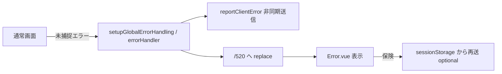
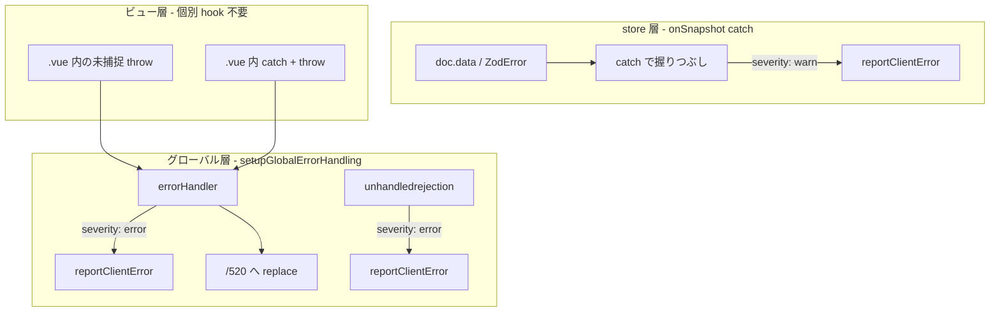

# 520 エラー通知

## 1. 概要

### 1.1 機能の目的

`user` / `admin` アプリで予期しないクライアントエラー（Zod バリデーション失敗、Vue レンダリングエラー、未捕捉 Promise 拒否など）が発生した際、ユーザーには既存の 520 エラーページを表示しつつ、運営側が **Cloud Logging で状況を追跡・アラート通知** できる仕組みを構築する。

現状、520 遷移時はブラウザの `console.error` のみに記録が残り、本番環境では運営が事象を把握できない。

### 1.2 主要な機能

- クライアントエラーの構造化レポート送信（Callable Function 経由）
- Cloud Logging への記録（`createModuleLogger` 使用、`module=clientError`）
- Zod エラー時の `issues`・Firestore ドキュメントパス等のコンテキスト付与
- 重複抑制（fingerprint によるデデュプリケーション）
- GCP Log-based Alert による運営通知（Phase 1 はログのみ、通知設定は GCP コンソール側）

### 1.3 対象ユーザー

| 区分 | 説明 |
|:--|:--|
| **エラー発生者** | `user` / `admin` アプリの一般ユーザー・主催者・店舗管理者（520 ページが表示される） |
| **通知・調査者** | Shokujii 運営（Cloud Logging / アラートで事象を把握・調査） |

### 1.4 520 エラーページについて

520 は HTTP ステータスコードではなく、Cloudflare の「Client Application Error」を参考にした **クライアントアプリケーションエラー用のルート** である。

- 表示文言: `base/src/locales/messages/ja.ts` の `error.520`
- ルート: `/520`（`user/src/pages/[[...error]].vue` / `admin/src/pages/[[...error]].vue`）
- 遷移元: `user/src/main.ts` / `admin/src/main.ts` が mount 後に呼び出す `setupGlobalErrorHandling`（`base/src/utils/setupGlobalErrorHandling.ts`）内の `app.config.errorHandler`

---

## 2. ねらい

### 2.1 ビジネス目標

- 本番で発生したクライアントエラーの **検知時間を短縮** し、データ不整合・スキーマ不整合によるユーザー影響を早期に解消する
- Zod エラー（Firestore データとスキーマの乖離）を **再現可能な情報** とともに記録し、修正サイクルを短くする

### 2.2 ユーザー価値

- 運営: 520 発生の事実・原因調査に必要な情報をサーバー側に集約できる
- エンドユーザー: 520 表示そのものは変わらない（レポート送信はバックグラウンド、UX をブロックしない）

### 2.3 成功指標（KPI）

| 指標 | 目標 |
|:--|:--|
| 520 発生の運営検知率 | Phase 1 完了後、本番 520 の **100%** が Cloud Logging に記録される |
| 初動対応時間 | アラート受信から Logs Explorer で原因特定可能になるまで **30 分以内**（Zod + documentPath 付きの場合） |
| 誤報・スパム | 同一 fingerprint の重複ログが **5 分以内に 1 件** に抑制される |

---

## 3. 前提条件

### 3.1 技術的前提条件

- Firebase Functions v2（`functions/default`、リージョン `asia-northeast1`）
- 既存の `createModuleLogger`（`functions/default/src/utils/logger.ts`）
- 既存の `httpsCallable` パターン（`base/src/apis/` + `common/src/apis/`）
- GCP Cloud Logging / Log-based Alert の設定権限（運営）

### 3.2 ビジネス的前提条件

- 運営が Logs Explorer またはアラート通知先（メール・Slack 等）を確認できる体制があること

### 3.3 依存関係

- `user` / `admin` のグローバルエラーハンドラ（`main.ts` → `setupGlobalErrorHandling`）
- Firestore `withConverter` + `common` Zod スキーマ（エラー発生源）
- Firebase Analytics（`base/src/firebase.ts` で初期化済み。Phase 2 で件数トレンド用に任意連携）

### 3.4 制約事項

- クライアントから Cloud Logging へ **直接書き込み不可**。必ず Callable Function を経由する
- **PII（個人識別情報）をログに含めない**（メールアドレス・氏名・電話番号等は送信しない）
- レポート送信の失敗で 520 表示やアプリ動作を **阻害しない**（fire-and-forget）

---

## 4. 画面仕様

### 4.1 画面遷移

本機能は **運営向けのバックエンド観測機能** であり、ユーザー向け UI の新規追加はない。



### 4.2 既存 UI（変更なし）

#### 4.2.1 520 エラーページ

- **タイトル**: Client Application Error
- **説明**: 予期しないエラーが発生しました
- **操作**: 「トップへ戻る」ボタン（`/` へ遷移）

ユーザー向けにエラー詳細や「報告しました」等のメッセージは **表示しない**（技術情報の漏洩防止）。

---

## 5. 技術仕様・データ構造設計

### 5.1 ストレージ方針

| Phase | 保存先 | 用途 |
|:--|:--|:--|
| Phase 1 | **Cloud Logging のみ** | エラーレポートの集約・検索・アラート |
| Phase 2（任意） | Firestore `client_error_reports` | ダッシュボード・長期保存・運営画面 |

Phase 1 では Firestore コレクションは **新規追加しない**。

### 5.2 エラー捕捉ポイント

エラー報告は **3 層** に分けて設計する。各層の役割が異なるため、store とビュー層の両方に同じ hook を仕込む必要はない（後述 5.2.3）。

| 層 | 仕組み | 捕捉するもの | 520 遷移 | ログ severity |
|:--|:--|:--|:--|:--|
| **グローバル** | `setupGlobalErrorHandling` の `errorHandler` | コンポーネントの render / lifecycle / watch 等 **未捕捉**の例外 | する | `error` |
| **グローバル** | `setupGlobalErrorHandling` の `unhandledrejection` | **未捕捉**の Promise 拒否 | しない | `error` |
| **store** | `onSnapshot` 等の `catch` + `reportClientError` | Zod 失敗など **握りつぶした**データ読み込みエラー | しない | `warn` |



#### 5.2.1 520 に至る経路（グローバル hook）

**配置**: `base/src/utils/setupGlobalErrorHandling.ts`  
**呼び出し**: `user/src/main.ts` / `admin/src/main.ts` が `app.mount('#app')` 後に dynamic import で実行

| 捕捉箇所 | 説明 |
|:--|:--|
| `app.config.errorHandler` | Vue コンポーネントの未捕捉例外。`componentInfo` に hook 情報が入る |
| `window.addEventListener('unhandledrejection', ...)` | 未捕捉 Promise 拒否。520 には遷移しない（アプリ状態が不定になりうるため） |

開発環境（`import.meta.env.DEV === true`）では `reportClientError` 自体が送信をスキップする。

#### 5.2.2 520 にならないが記録すべき経路（store hook）

store 内で `try/catch` により `console.error` のみで握りつぶしている箇所。`errorHandler` には届かないため、データ欠落としてユーザー影響が出る。**`severity: 'warn'` で Cloud Logging に記録** する（520 には遷移しない）。

**Phase 1 実装済み**:

| 対象 | ファイル |
|:--|:--|
| イベント / 注文 / メニュー snapshot | `base/src/stores/event.ts` |
| イベント一覧 | `base/src/stores/eventList.ts` |
| コミュニティ / メンバー snapshot | `base/src/stores/community.ts` |
| コミュニティ一覧 | `base/src/stores/communityList.ts` |
| 店舗 / メニュー snapshot | `base/src/stores/partner.ts` |
| レター snapshot | `base/src/stores/letter.ts` |

**Phase 1 未対応（将来追加候補）**:

| 対象 | ファイル | 備考 |
|:--|:--|:--|
| 注文一覧 snapshot | `base/src/stores/orderList.ts` | `console.error` のみ |
| 店舗一覧 snapshot | `base/src/stores/shopList.ts` | `console.error` のみ |

#### 5.2.3 ビュー層（.vue）への hook 方針

**結論: 各 `.vue` コンポーネントに個別に `reportClientError` を仕込む必要はない。**

理由:

1. **未捕捉のコンポーネントエラーはグローバル層が既にカバーしている**  
   render / lifecycle / watch 等で throw された例外は `setupGlobalErrorHandling` の `errorHandler` が捕捉し、`componentInfo` とともに `severity: 'error'` で報告したうえで `/520` へ遷移する。

2. **store の warn hook はビュー層の代替ではない**  
   store 内 catch は「エラーを握りつぶしてアプリを継続する」パターン専用。520 に至らないサイレント失敗を運営が追跡するためのもの。

3. **ビュー内の try/catch は多くが想定内の業務エラー**  
   未ログイン、バリデーション失敗、ユーザー向け snackbar 表示など。これらを一律 `reportClientError` するとノイズになる。

4. **`onErrorCaptured` を全ページに敷くと二重報告になりやすい**  
   子コンポーネントの未捕捉エラーは最終的に `errorHandler` にも届くため、個別 hook と重複する。

**ビュー層で検討が必要なケース**（例外的）:

| パターン | 推奨 |
|:--|:--|
| 想定外のシステムエラー | `throw` してグローバル `errorHandler` に任せる（520 + error ログ） |
| UX 上 catch するが運営にも残したい想定外エラー | その catch 内のみ `reportClientError`（`warn` または `error`） |
| 想定内の業務エラー（未ログイン等） | 報告しない |
| 既に `throw error` している catch | 追加不要（グローバルが拾う） |

**優先度**: ビュー全般への hook 追加より、同パターンの **残り store**（`orderList.ts`, `shopList.ts` 等）の対応を先に行う。

#### 5.2.4 Zod エラーの発生メカニズム

Firestore 読み込み時、`withConverter` の `fromFirestore` → スキーマクラスコンストラクタで `XxxAppSchema.parse()` が実行される。

```typescript
// common/src/schemas/Event.ts（例）
constructor(id: string, src: Partial<Event>) {
  Object.assign(this, EventAppSchema.parse({ ...src, event_id: id }))
  // ...
}
```

`ZodError` 発生時は `issues` 配列にフィールドパス・コード・メッセージが含まれる。可能な限り **Firestore ドキュメントパス**（`snapshot.ref.path`）をコンテキストに付与する。

### 5.3 API スキーマ（common）

**配置**: `common/src/apis/clientError.ts`

```typescript
import { z } from 'zod'

export const ClientErrorAppSchema = z.enum(['user', 'admin'])

export const ZodIssueSchema = z.object({
  path: z.array(z.union([z.string(), z.number()])),
  code: z.string(),
  message: z.string(),
})

export const ClientErrorReportRequestSchema = z.object({
  app: ClientErrorAppSchema,
  error_type: z.string().max(100),           // 'ZodError' | 'Error' | 'UnhandledRejection' 等
  message: z.string().max(500),
  stack: z.string().max(4000).optional(),
  zod_issues: z.array(ZodIssueSchema).max(20).optional(),
  route: z.string().max(500),                // 発生時の router path（fullPath）
  component_info: z.string().max(200).optional(), // Vue errorHandler の info
  document_path: z.string().max(300).optional(),  // Firestore パス（Zod 時）
  user_id: z.string().max(128).optional(),   // ログイン済み UID のみ
  user_agent: z.string().max(300).optional(),
  fingerprint: z.string().max(64),           // 重複抑制用ハッシュ
  severity: z.enum(['error', 'warn']).default('error'), // 520 相当 vs store 内サイレント失敗
})

export type ClientErrorReportRequest = z.infer<typeof ClientErrorReportRequestSchema>

export const ClientErrorReportResponseSchema = z.object({
  accepted: z.boolean(),
})

export type ClientErrorReportResponse = z.infer<typeof ClientErrorReportResponseSchema>
```

#### fingerprint の生成方針

クライアントは以下を連結して SHA-256 でハッシュ化して送信する（スキーマ必須フィールド）。**dedup 判定はサーバー側で検証済みフィールドから再計算** した fingerprint を使用する（クライアント送信値は信頼しない）。

- `app`
- `error_type`
- `message`（先頭 200 文字）
- `route`
- `document_path`（あれば）
- Zod の場合: 先頭 issue の `path` + `code`

### 5.4 フロントエンド（base / user / admin）

#### 5.4.1 レポートユーティリティ

**配置**: `base/src/utils/reportClientError.ts`

```typescript
// 処理概要
// 1. configureClientErrorReporting({ app }) で user/admin を起動時注入（store 経由レポート用）
// 2. err を ClientErrorReportRequest にシリアライズ（error_type は max 100 に切り詰め）
// 3. ZodError なら issues を展開
// 4. getAuth().currentUser?.uid があれば user_id に設定（メール等は含めない）
// 5. httpsCallable(functions, 'reportClientError')(payload) を fire-and-forget
// 6. 失敗時は console.error のみ（ユーザー UX に影響させない）
```

**配置**: `base/src/apis/clientError.ts`（`httpsCallable` ラッパー）

#### 5.4.2 main.ts への組み込み

`user/src/main.ts` / `admin/src/main.ts` は `Promise.all` で plugin 読み込み後、**mount 前**に `configureClientErrorReporting({ app: 'user' | 'admin' })` を呼び出す。`setupGlobalErrorHandling` は mount 後に dynamic import で実行する。

```typescript
// user/src/main.ts, admin/src/main.ts（概要）
import { configureClientErrorReporting } from '@shokujii/base/utils/reportClientError.js'

Promise.all([/* plugins */]).then((plugins) => {
  configureClientErrorReporting({ app: 'user' }) // admin は 'admin'
  for (const plugin of plugins) { /* ... */ }
  app.mount('#app')
  // setupGlobalErrorHandling は mount 後
})
```

```typescript
// base/src/utils/setupGlobalErrorHandling.ts（概要）
app.config.errorHandler = (err, _instance, info) => {
  reportClientError(err, {
    app: appName,
    route: router.currentRoute.value.fullPath,
    componentInfo: info,
    severity: 'error',
  })
  router.replace('/520')
}

window.addEventListener('unhandledrejection', (event) => {
  reportClientError(event.reason, {
    app: appName,
    route: router.currentRoute.value.fullPath,
    severity: 'error',
  })
  // unhandledrejection では /520 へ遷移しない
})
```

#### 5.4.3 520 ページからの再送（保険、Phase 1 任意）

`errorHandler` 内で `sessionStorage` に直前エラーを 1 件保存し、`[[...error]].vue` の `onMounted` で未送信なら再送。Callable 失敗時の取りこぼし防止。

#### 5.4.4 開発環境

`import.meta.env.DEV === true` のときは送信を **スキップ** する（エミュレータノイズ防止）。本番・ステージングのみ送信。

### 5.5 Functions 設計

#### 5.5.1 Callable Function: `reportClientError`

**配置**: `functions/default/src/clientErrorReport.ts`

| 項目 | 内容 |
|:--|:--|
| 種別 | Callable（`onCall`） |
| リージョン | `asia-northeast1` |
| 認証 | **任意**（未ログイン時の Zod エラーも記録対象のため必須にしない） |
| 引数 | `ClientErrorReportRequest`（Zod バリデーション） |
| 戻り値 | `{ accepted: boolean }` |

**処理フロー**:

1. `request.data` を `ClientErrorReportRequestSchema.parse()` で検証
   - 失敗時: `HttpsError('invalid-argument')`（サイズ超過・スパム対策）
2. 検証済みフィールドから **サーバー側で fingerprint を再計算**（`functions/default/src/utils/clientErrorFingerprint.ts`）
3. 再計算 fingerprint による **重複抑制**（5 分以内の同一 fingerprint は `accepted: true` を返してログ省略）
4. `severity` に応じてログレベルを切り替え
   - `error` → `logger.error('Client application error', { ... })`
   - `warn` → `logger.warn('Client application error', { ... })`
5. `{ accepted: true }` を返却

**ログ出力例**（`createModuleLogger('clientError')`）:

```json
{
  "message": "Client application error",
  "module": "clientError",
  "app": "user",
  "error_type": "ZodError",
  "error_message": "Invalid enum value...",
  "stack": "ZodError: ...",
  "route": "/c/example/e/abc123",
  "document_path": "communities/xxx/events/abc123",
  "zod_issues": [{ "path": ["event_status", "value"], "code": "invalid_enum_value", "message": "..." }],
  "user_id": "uid123",
  "fingerprint": "a1b2c3..."
}
```

> Cloud Logging のトップレベル `message` は logger の固定文言（`"Client application error"`）。エラー本文は `error_message` フィールドに格納する（`message` キーの重複を避けるため）。

**index.ts**: `functions/default/src/index.ts` の export に追加。

#### 5.5.2 重複抑制（Phase 1）

Functions インスタンス内の **インメモリ Map**（`fingerprint → lastReportedAt`）で 5 分 TTL を管理。fingerprint は **サーバー再計算値** をキーにする。

- TTL 超過エントリは判定前に `pruneExpiredEntries` で削除
- 最大件数上限（1000 件）を超えた場合は最古エントリから削除
- メリット: Firestore 不要、実装が単純
- デメリット: コールドスタート・インスタンス分散で完全なグローバル dedup にはならない
- Phase 2: Firestore または Memorystore によるグローバル dedup を検討

#### 5.5.3 レート制限

| 制限 | 値 | 目的 |
|:--|:--|:--|
| payload 各フィールド | スキーマ上の max 長 | Callable サイズ・コスト対策 |
| 同一 IP / UID（任意） | Phase 2 | 悪意ある大量 POST 対策 |
| fingerprint dedup | 5 分 | 同一エラーのログ洪水防止 |

認証不要 Callable のため、**invalid-argument で弾くバリデーション** と **dedup** を Phase 1 の主な防御とする。

### 5.6 運営通知（GCP 設定）

Functions コード内から Slack / メールを直接送るのではなく、Phase 1 は **Log-based Alert** を推奨する。

#### 5.6.1 Logs Explorer クエリ例

```
resource.type="cloud_run_revision"
jsonPayload.module="clientError"
severity>=ERROR
```

Zod エラーに絞る場合:

```
jsonPayload.module="clientError"
jsonPayload.error_type="ZodError"
```

#### 5.6.2 アラート条件（例）

- 条件: 上記ログが **5 分間に 1 件以上**
- 通知先: 運営メール / Slack（GCP Monitoring 連携）
- 初動: Logs Explorer で `document_path`・`route`・`zod_issues` を確認 → Firestore データ修正 or スキーマ修正

#### 5.6.3 Phase 2: メール通知（任意）

Zod エラーかつ `severity=error` のみ、既存 SendGrid（`functions/default/src/utils/sendgrid.ts`）で `SUPPORT_MAIL` へ 1 通送信。Log-based Alert と併用する場合は **dedup を厳密化** すること。

### 5.7 Firestore セキュリティルール

Phase 1 では Firestore への書き込みがないため **ルール変更なし**。

Phase 2 で `client_error_reports` を追加する場合は **クライアント直接書き込み禁止**（Functions Admin SDK のみ）。

### 5.8 処理フロー（全体）

#### 5.8.1 520 発生時（グローバル層）

1. ユーザーが画面操作中に ZodError 等の未捕捉エラーが発生（コンポーネント render / lifecycle / watch 等）
2. `setupGlobalErrorHandling` 内の Vue `errorHandler` が呼ばれる
3. `reportClientError` が非同期で Callable を invoke（UX をブロックしない）
4. `router.replace('/520')` でエラーページ表示
5. Callable `reportClientError` が payload を検証
6. dedup 通過後、`createModuleLogger('clientError').error(...)` で Cloud Logging に記録
7. Log-based Alert が運営に通知（GCP 設定済みの場合）

#### 5.8.2 store 内サイレント失敗時（store 層、warn）

1. `onSnapshot` コールバック内で `doc.data()` が ZodError を throw
2. `catch` で `reportClientError(..., { severity: 'warn' })` を呼ぶ
3. Cloud Logging に warn レベルで記録（520 には遷移しない）
4. 運営が warn ログを監視対象に含める場合はアラート条件を別途設定

---

## 6. 実装優先度

### 6.1 Phase 1（コード実装）

- [x] `common/src/apis/clientError.ts` スキーマ定義
- [x] `functions/default/src/clientErrorReport.ts` Callable 実装
- [x] `functions/default/src/index.ts` への export 追加
- [x] `base/src/utils/reportClientError.ts` + `base/src/apis/clientError.ts`
- [x] `base/src/utils/setupGlobalErrorHandling.ts` 追加
- [x] `user/src/main.ts` / `admin/src/main.ts` から `setupGlobalErrorHandling` 呼び出し
- [x] 主要 store の catch への hook（`event.ts`, `eventList.ts`, `community.ts`, `communityList.ts`, `partner.ts`, `letter.ts`。`subscribeOrders` 含む）
- [x] 開発環境での送信スキップ

### 6.2 Phase 1（運用・デプロイ）

- [ ] Functions `reportClientError` のデプロイ
- [ ] `user` / `admin` アプリのデプロイ
- [ ] GCP Log-based Alert 設定（セクション 9.3 参照）
- [ ] staging 環境での E2E 確認（DEV では Callable 送信されない）

### 6.3 Phase 2（将来対応）

- [ ] 残り store の catch への hook（`orderList.ts`, `shopList.ts` 等）
- [ ] Firebase Analytics `client_error` カスタムイベント（件数トレンド）
- [ ] Firestore `client_error_reports` による長期保存・運営ダッシュボード
- [ ] グローバル dedup（Firestore / Memorystore）
- [ ] IP・UID ベースのレート制限
- [ ] Zod 系のみ SendGrid で SUPPORT_MAIL 通知
- [ ] `fromFirestore` 共通ラッパーでの `document_path` 自動付与
- [ ] 520 ページ `sessionStorage` 再送

---

## 7. 注意事項

### 7.1 既存システムへの影響

#### 7.1.1 アプリケーション

- **フロントエンド**: `user` / `admin` の `main.ts`、`base/src/utils/setupGlobalErrorHandling.ts`、一部 `base` store
- **バックエンド**: Callable 1 本追加
- **ユーザー体験**: 520 表示は現状維持。レポート送信は非同期

#### 7.1.2 コスト

- Callable 呼び出し回数がエラー発生数に比例して増加
- fingerprint dedup・開発環境スキップで抑制
- Cloud Logging 保持期間は GCP プロジェクト設定に依存（デフォルト 30 日）

### 7.2 セキュリティ考慮事項

- **PII 禁止**: `user_email`・`user_name` 等は payload に含めない。UID のみ可
- **認証不要 Callable**: 悪用可能なため、strict な Zod バリデーションと dedup 必須
- **スタックトレース**: 本番でも送信するが、ログ閲覧権限は運営に限定（GCP IAM）
- **document_path**: Firestore パスは調査に必要だが、エンドユーザー UI には表示しない

### 7.3 運用考慮事項

- **初動調査**: Logs Explorer → `document_path` で該当ドキュメント確認 → スキーマ / データ修正
- **Zod エラーが多発する場合**: デプロイ直後のスキーマ変更とデータ移行漏れを疑う
- **warn と error の使い分け**: 520 に至るものは `error`、一覧から1件欠落する程度は `warn`
- **ビュー層への hook**: 原則不要（5.2.3 参照）。想定外エラーは throw してグローバルに任せる
- **アラート疲れ**: 全 warn を通知しない。Phase 1 は `severity=ERROR` のみ通知推奨

### 7.4 既存コードとの関係

| ファイル | 現状 | 本機能での扱い |
|:--|:--|:--|
| `user/src/main.ts` / `admin/src/main.ts` | mount 後に `setupGlobalErrorHandling` を呼び出し | グローバル errorHandler + unhandledrejection を有効化 |
| `base/src/utils/setupGlobalErrorHandling.ts` | 新規追加 | errorHandler / unhandledrejection の実装本体 |
| `base/src/stores/event.ts` `subscribeOrders` | try-catch + `reportClientError`（warn） | Phase 1 対応済み |
| `base/src/stores/orderList.ts` / `shopList.ts` | try-catch あり、`console.error` のみ | Phase 2 で hook 追加候補 |
| `base/src/firebase.ts` | `getAnalytics` 初期化済み | Phase 2 でイベント送信 |

---

## 8. 参考資料

- 仕様書テンプレート: `documents/00_仕様概要/02_仕様書追加ルールとテンプレート.md`
- Zod / スキーマ: `documents/実装メモ/common_schemas における zod の使い方.md`
- Functions 実装ルール: `.agents/skills/shokujii-functions-implementation/SKILL.md`
- 既存 logger: `functions/default/src/utils/logger.ts`
- グローバルエラーハンドラ: `base/src/utils/setupGlobalErrorHandling.ts`
- 520 表示文言: `base/src/locales/messages/ja.ts`（`error.520`）
- エンタープライズ監査ログ（Cloud Logging 二重出力の参考）: `documents/08_エンタープライズ/04_エンタープライズ_詳細仕様_監査ログ.md`

---

## 9. 運用手順（Phase 1）

### 9.1 デプロイ確認

Functions デプロイ後、以下を確認する。

1. `functions/default/src/index.ts` から `reportClientError` が export されていること
2. Firebase Console → Functions に `reportClientError`（リージョン: `asia-northeast1`）が表示されること
3. `user` / `admin` アプリをデプロイ済みであること（`setupGlobalErrorHandling` が有効化される）

### 9.2 Logs Explorer クエリ

GCP Console → Logging → Logs Explorer で以下のクエリを使用する。

**全クライアントエラー（ERROR 以上）:**

```
resource.type="cloud_run_revision"
jsonPayload.module="clientError"
severity>=ERROR
```

**Zod エラーのみ:**

```
jsonPayload.module="clientError"
jsonPayload.error_type="ZodError"
```

**アプリ別:**

```
jsonPayload.module="clientError"
jsonPayload.app="user"
```

### 9.3 Log-based Alert 設定

GCP Console → Monitoring → Alerting → Create policy

| 項目 | 設定値 |
|:--|:--|
| 条件 | Log match condition |
| クエリ | `jsonPayload.module="clientError"` かつ `severity>=ERROR` |
| しきい値 | 5 分間に 1 件以上 |
| 通知先 | 運営メール / Slack（Monitoring 通知チャネル） |

warn レベル（store 内サイレント失敗）は Phase 1 ではアラート対象外とし、調査時に Logs Explorer で参照する。

### 9.4 初動調査フロー

1. アラートまたはユーザー報告を受けて Logs Explorer を開く
2. ログの `route` で発生画面を特定
3. `error_type` が `ZodError` の場合:
   - `document_path` で Firestore ドキュメントを確認
   - `zod_issues` で不正フィールドを特定
   - スキーマ修正 or データ修正を判断
4. `user_id` があれば該当ユーザーの操作経路を追跡
5. 修正後、同一 `fingerprint` の再発がないかログで確認（dedup TTL: 5 分）

### 9.5 開発環境での動作

`import.meta.env.DEV === true` のとき、クライアントから Callable は **送信されない**。ローカル検証は Functions emulator を使い、`import.meta.env.DEV` を一時的に bypass するか、staging 環境で確認する。
