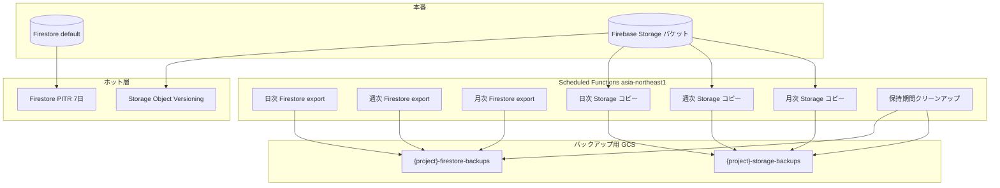

# Firestore と Storage の自動バックアップ

## 1. 概要

### 1.1 目的

Shokujii の本番データ（Firestore / Firebase Storage）について、次を満たすバックアップ体制を整える。

- **直近の障害・誤操作**から素早く復旧できる（ホット層）
- **中長期の復元ポイント**を一定数残す（ウォーム / コールド層）
- **Storage はフルコピーのため容量コストが大きい**ため、Firestore より保持本数・期間を短く設定する

本ドキュメントでは採用方針として **推奨案 A（バランス型）** を定義する。実装は段階的に進め、各環境（本番 / sandbox 等）で同一ポリシーを適用する。

### 1.2 採用方針: 推奨案 A（バランス型）

Firestore と Storage で **保持 tier を分ける段階保持（GFS 的）** とする。**Storage は Firestore より保持を短く**し、コストを抑える（ホット層のみ別方式）。

| データ | ホット（すぐ戻す） | ウォーム（日次） | コールド（週次） | アーカイブ（月次） |
|:--|:--|:--|:--|:--|
| **Firestore** | PITR 7 日 | export **14 日分** | export **12 週** | export **24 ヶ月** |
| **Storage** | 本番バケット versioning（短期）※ | フルコピー **7 日分** | フルコピー **8 週** | フルコピー **12 ヶ月** |

※ Storage のホット層は別途「本番バケット設定」として検討する（後述 3.2.1）。

### 1.3 対象

| 区分 | 内容 |
|:--|:--|
| **対象データ** | Firestore `(default)` データベース、Firebase Storage **既定バケット**内オブジェクト（**全オブジェクト**） |
| **対象外** | `{PROJECT}-invoice` 等の **別 GCS バケット**（請求書 PDF 用。バックアップ対象に含めない） |
| **対象プロジェクト** | 本番 Firebase プロジェクト（sandbox / 検証環境は必要に応じ同ポリシーまたは短縮版） |
| **実施主体** | 運営（設定・監視）、エンジニア（Functions / Terraform 実装・復旧作業） |

### 1.4 関連ドキュメント

| ドキュメント | 用途 |
|:--|:--|
| [firestoreデータ移行手順_手動.md](../firebaseプロジェクト/firestoreデータ移行手順_手動.md) | export データの import・プロジェクト間移行 |
| [storageデータ移行手順_手動.md](../firebaseプロジェクト/storageデータ移行手順_手動.md) | Storage バケット間コピー・移行 |
| [03_エンタープライズ_セキュリティチェックシート.md](../08_エンタープライズ/03_エンタープライズ_セキュリティチェックシート.md) | バックアップ体制の対外回答（4-2, 4-3） |

---

## 2. ねらい

### 2.1 ビジネス目標

- データ消失・誤更新から **許容可能な時間内** に復旧できる
- エンタープライズ向けセキュリティチェック（バックアップ・リカバリ）に **方針と手順** で回答できる
- Storage の保管コストを **予測可能な上限** に抑える

### 2.2 RPO / RTO（目標値）

| 指標 | 定義 | 目標（案 A） |
|:--|:--|:--|
| **RPO**（Recovery Point Objective） | 最大どれだけ古いデータまで戻せるか | Firestore: **数時間以内**（PITR）〜 **最大 1 日**（日次 export）。Storage: **最大 7 日**（日次フルコピー） |
| **RTO**（Recovery Time Objective） | 復旧完了までの時間 | **4 時間以内**（手順書に沿った import / バケット復元。大規模障害時は別途判断） |

### 2.3 成功指標

| 指標 | 目標 |
|:--|:--|
| 日次バックアップ成功率 | **99%** 以上（月次集計） |
| 保持ポリシー違反 | 期限超過オブジェクトが **意図せず残存しない**（クリーンアップ Job 成功） |
| 復旧手順の実施 | **年 1 回** 以上、検証環境でリストア訓練（任意だが推奨） |

---

## 3. バックアップ tier 詳細

### 3.1 Firestore

#### 3.1.1 ホット: PITR（ポイントインタイムリカバリ）

| 項目 | 内容 |
|:--|:--|
| 方式 | Firestore ネイティブ PITR |
| 保持 | **7 日間**（Firestore の上限） |
| 用途 | 数時間〜数日前への細かい復旧、誤操作の即時対応 |
| 設定 | GCP Console / gcloud で `(default)` DB に有効化 |
| 備考 | export より **細かい時点** に戻せる。セキュリティチェックシート 4-2 に記載済み |

#### 3.1.2 ウォーム: 日次 export

| 項目 | 内容 |
|:--|:--|
| 方式 | Firestore マネージド export（`exportDocuments`） |
| スケジュール | **毎日 2:00 JST** |
| 保持 | **14 日分**（15 日目以降の日次分は削除） |
| 出力先 | `gs://{PROJECT}-firestore-backups/daily/`（prefix は実装時に統一） |
| 用途 | PITR 期間外・特定日へのリストア、監査用スナップショット |

#### 3.1.3 コールド: 週次 export

| 項目 | 内容 |
|:--|:--|
| 方式 | 同上（週 1 回の export） |
| スケジュール | **毎週日曜 2:30 JST**（日次と重ならない時刻） |
| 保持 | **12 本**（約 3 ヶ月） |
| 出力先 | `gs://{PROJECT}-firestore-backups/weekly/` |
| ストレージクラス | 作成から **30 日経過後 Coldline** へ移行（コスト削減） |

#### 3.1.4 アーカイブ: 月次 export

| 項目 | 内容 |
|:--|:--|
| 方式 | 同上（月 1 回の export） |
| スケジュール | **毎月 1 日 3:00 JST** |
| 保持 | **24 ヶ月**（25 ヶ月目以降の月次分は削除） |
| 出力先 | `gs://{PROJECT}-firestore-backups/monthly/` |
| ストレージクラス | **Coldline** または **Archive**（コスト優先なら Archive） |
| 備考 | **永久保持はしない**。24 ヶ月超過分は削除ポリシーで廃棄 |

### 3.2 Storage

Firebase Storage には Firestore と同等のマネージド export API がない。**別 GCS バケットへのフルコピー**でバックアップする。

#### 3.2.1 ホット: 本番バケット Object Versioning（推奨・別設定）

| 項目 | 内容 |
|:--|:--|
| 方式 | 本番 Storage バケットで **Object Versioning 有効** |
| 保持 | 旧バージョン **7 日** で lifecycle 削除 |
| 用途 | **個別ファイル**の誤削除・上書きの短期復元 |
| 備考 | バックアップバケットより安価なことが多い。全体リストアには不向き |

#### 3.2.2 ウォーム: 日次フルコピー

| 項目 | 内容 |
|:--|:--|
| 方式 | 本番バケット → バックアップバケットへ `cp --recursive` 相当 |
| スケジュール | **毎日 2:15 JST**（Firestore 日次 export の後） |
| 保持 | **7 日分**（8 日目以降の日次分は削除） |
| 出力先 | `gs://{PROJECT}-storage-backups/daily/YYYY-MM-DD/` |
| 対象 | **本番 Storage バケット全体**（Firebase 既定バケット。`{PROJECT}-invoice` は含めない） |

#### 3.2.3 コールド: 週次フルコピー

| 項目 | 内容 |
|:--|:--|
| スケジュール | **毎週日曜 2:45 JST** |
| 保持 | **8 本**（約 2 ヶ月） |
| 出力先 | `gs://{PROJECT}-storage-backups/weekly/YYYY-MM-DD/` |
| 対象 | **本番 Storage 既定バケット全体**（`{PROJECT}-invoice` は含めない） |
| ストレージクラス | 30 日経過後 **Coldline** |

#### 3.2.4 アーカイブ: 月次フルコピー

| 項目 | 内容 |
|:--|:--|
| スケジュール | **毎月 1 日 3:15 JST** |
| 保持 | **12 ヶ月**（13 ヶ月目以降の月次分は削除） |
| 出力先 | `gs://{PROJECT}-storage-backups/monthly/YYYY-MM/` |
| 対象 | **本番 Storage 既定バケット全体**（`{PROJECT}-invoice` は含めない） |
| ストレージクラス | **Coldline** / **Archive** |

---

## 4. アーキテクチャ

### 4.1 全体構成



### 4.2 バケット命名規則

| バケット | 名前 | リージョン |
|:--|:--|:--|
| Firestore export 先 | `{PROJECT}-firestore-backups` | `asia-northeast1`（本番 DB と同一） |
| Storage コピー先 | `{PROJECT}-storage-backups` | `asia-northeast1` |

prefix 例:

```
gs://{PROJECT}-firestore-backups/daily/2026-06-03T17:00:07_99530/
gs://{PROJECT}-firestore-backups/weekly/2026-06-01T17:30:00_12345/
gs://{PROJECT}-firestore-backups/monthly/2026-06-01T03:00:00_67890/

gs://{PROJECT}-storage-backups/daily/2026-06-03/
gs://{PROJECT}-storage-backups/weekly/2026-06-01/
gs://{PROJECT}-storage-backups/monthly/2026-06/
```

### 4.3 タイムゾーン

- すべてのスケジュール判定・「日付」ラベルは **`Asia/Tokyo`** で統一する
- Cloud Scheduler / `onSchedule` の `timeZone` に `Asia/Tokyo` を指定する

### 4.4 保持期間の削除

GCS lifecycle だけでは「tier ごとに本数を固定」しにくいため、次を組み合わせる。

1. **prefix 分離**（`daily/` / `weekly/` / `monthly/`）
2. **保持期間クリーンアップ Scheduled Function**（日次 4:00 JST 推奨）
   - 各 prefix 内のオブジェクト / フォルダを列挙
   - 上記 tier 表の本数・日数を超えたものを削除
3. **lifecycle rule（補助）**
   - Firestore `daily/` に `age: 15` 日削除、Storage `daily/` に `age: 8` 日削除（安全マージン）
   - `monthly/` は Coldline / Archive への自動移行のみ（削除は Function 側）

---

## 5. 実装方針

### 5.1 現状

| 項目 | 状態 |
|:--|:--|
| Firestore / Storage バックアップ | **`functions/default/src/backup/`** に v2 Scheduled Function 実装済み |
| legacy export | **`functions/legacy/src/backup.js` 削除済み** |
| Terraform | **`terraform/storage.tf`** にバックアップバケット・IAM、**`firebase.tf`** に PITR 定義 |
| 検証記録 | [02_firestoreとstorageの自動バックアップ_検証記録.md](./02_firestoreとstorageの自動バックアップ_検証記録.md) |
| 本番デプロイ | Terraform apply + Functions deploy + 5.5 実測 **未実施**（検証記録テンプレート参照） |

### 5.2 実装ファイル

| パス | 内容 |
|:--|:--|
| `functions/default/src/backup/constants.ts` | 保持本数・バケット名・dry-run 判定 |
| `functions/default/src/backup/firestoreExport.ts` | Firestore export + operation 完了待ち |
| `functions/default/src/backup/storageCopy.ts` | 既定バケット → storage-backups へコピー |
| `functions/default/src/backup/retention.ts` | tier 別保持削除・legacy 直下 export 削除 |
| `functions/default/src/backup/scheduled.ts` | 7 本の Scheduled Function |
| `terraform/storage.tf` | バックアップ用 GCS + IAM |
| `terraform/firebase.tf` | PITR 有効化 |

**環境変数:**

| 変数 | 用途 |
|:--|:--|
| `GCLOUD_PROJECT` | 自動設定。バケット名の組み立てに使用 |
| `BACKUP_RETENTION_DRY_RUN=true` | 初回デプロイ時。削除せずログのみ（**検証後に削除または false**） |

### 5.3 実装タスク（Phase 1: MVP）

1. **GCS バケット作成**（Terraform または Console）
   - `{PROJECT}-firestore-backups`
   - `{PROJECT}-storage-backups`
2. **IAM**
   - Firestore サービスエージェント → firestore-backups バケットへ書き込み
   - バックアップ用 SA → 本番 Storage 読み取り + storage-backups 書き込み
3. **Functions（`functions/default`）**
   - `backup.ts`（またはモジュール分割）: Firestore 日次 / 週次 / 月次 export
   - `storageBackup.ts`: Storage 日次 / 週次 / 月次コピー
   - `backupRetention.ts`: 保持期間クリーンアップ
   - **legacy の廃止**: `functions/legacy/src/backup.js` の `scheduled_firestore_export` を削除し、default デプロイと同時に legacy から当該 Function が消えることを確認する（二重 export 防止）
4. **Monitoring**
   - 各 Job 失敗時に Cloud Monitoring アラート（メール / Slack 等）
5. **PITR 有効化確認**（本番 DB）
6. **本番 Storage versioning**（任意だが推奨）

### 5.4 実装タスク（Phase 2: コスト最適化）

- 週次・月次バックアップの **Coldline / Archive 移行** automation
- **年 1 回** のリストア訓練手順の整備・実施記録

### 5.5 参考: 既存 legacy 実装（削除済み）

```javascript
// functions/legacy/src/backup.js（抜粋）— default 実装デプロイ後に削除
// 毎日 2:00 JST → gs://{PROJECT}-firestore-backups（prefix なし・保持削除なし）
```

公式: [Schedule data exports](https://firebase.google.com/docs/firestore/solutions/schedule-export)

### 5.6 実装前の検討事項

実装着手前・本番適用前に確認・決定する項目。後述 9 章の「要確認」と対応する。

#### 5.6.1 対象 GCS の範囲 — **確定**

| 区分 | 方針 |
|:--|:--|
| **Storage バックアップ対象** | Firebase **既定バケット**内の **全オブジェクト** |
| **対象外** | `{PROJECT}-invoice`（請求書 PDF 用。`terraform/storage.tf` で定義）— **バックアップ不要** |
| **Firestore** | `(default)` データベース全体 export |

既定バケット名はプロジェクトごとに異なる。Firebase Console の **Storage** または GCP **Cloud Storage** で実バケット名（例: `{project}.appspot.com`）を確認してから実装する。

#### 5.6.2 legacy 日次 export との切替 — **確定（実装済み）**

| 区分 | 方針 |
|:--|:--|
| **legacy** | `functions/legacy/src/backup.js` の `scheduled_firestore_export` は **やめる**（ソース削除 + デプロイ） |
| **新規実装** | **`functions/default`** に v2 `onSchedule` で実装（日次 / 週次 / 月次 + 保持削除） |
| **切替時** | default デプロイと legacy 削除を **同一 PR / 同一デプロイ** で行い、日次 export が二重に走らないことを確認する |
| **既存 export データ** | legacy が出力したバケット直下のフォルダは、新 prefix（`daily/` 等）と混在する。`backupRetentionCleanup` が **legacy 直下**（`daily/` / `weekly/` / `monthly/` 以外）で `overall_export_metadata` あり prefix を削除する |
| **初回クリーンアップ** | **必ず** `BACKUP_RETENTION_DRY_RUN=true` で 1 回実行し、GCS Console で削除対象 prefix（特に legacy 直下）を確認してから dry-run を OFF にする |

#### 5.6.3 Storage 全量コピーを Functions で回せるか — **要確認**

Firebase Storage 既定バケットの **全量フルコピー**を Scheduled Function で実行する前提だが、**バケット容量と実行時間上限**により Functions 単体では不十分な可能性がある。本番適用前に **検証環境で実測** する。

**確認手順（例）:**

1. **現容量の把握**（対象プロジェクトに切り替えて実行）

```bash
gcloud config set project <PROJECT_ID>
# 既定バケット名は Console で確認して置き換える
gcloud storage du -s gs://<DEFAULT_BUCKET>/**
```

2. **1 回分コピーの所要時間を計測**（検証用バケットへコピー。本番→本番は避ける）

```bash
time gcloud storage cp -r "gs://<DEFAULT_BUCKET>/*" "gs://<TEST_BACKUP_BUCKET>/benchmark-$(date +%Y%m%d)/"
```

3. **Functions の制約と比較**

| 項目 | 目安 |
|:--|:--|
| Cloud Functions 第2世代 `timeoutSeconds`（**Scheduled / `onSchedule`**） | 最大 **1800 秒（30 分）**（HTTP は 3600 秒） |
| 現行 `pollingTask` | 540 秒 — バックアップ用途には短い可能性 |
| 判定 | 計測時間が **タイムアウトの 80% 未満（1440 秒）** なら Functions 候補。超える場合は代替を検討 |

4. **代替案（Functions 不可の場合）**

| 方式 | 概要 |
|:--|:--|
| **Cloud Run Job** | 長時間 `gcloud storage cp` をコンテナで実行 |
| **Storage Transfer Service** | スケジュール転送。大容量向き |
| **ハイブリッド** | 日次のみ Functions、週次・月次は Transfer Service 等 |

5. **記録**

確認結果（バケット容量 GB、コピー時間、採用方式）を **本ドキュメントまたは実装 PR** に残す。

#### 5.6.4 export 非同期完了とクリーンアップの競合 — **対策実装済み・本番前に dry-run 確認**

Firestore `exportDocuments` は **非同期**（Function が return しても export が GCS 書き込み中のことがある）。クリーンアップ Job（4:00 JST 推奨）が **未完成 export を削除**しないよう、実装前に方針を決め、検証環境で確認する。

**想定リスク:**

- export 開始直後にクリーンアップが走り、空または未完成の prefix を削除
- 日次・週次・月次が同一日に重なり、export 処理が並列で GCS に書き込み中

**確認・対策の候補（実装時に採否を決める）:**

| # | 対策 | 内容 |
|:--|:--|:--|
| 1 | **スケジュール分離** | export 2:00〜3:15 JST、クリーンアップ **4:00 JST 以降**（ドキュメント 4.4 どおり） |
| 2 | **完了待ち** | Function 内で Firestore Admin API の **operation 完了**までポーリングしてから終了 |
| 3 | **削除条件** | 削除対象 prefix に `overall_export_metadata` が **存在する**こと、または作成から **N 時間経過**を条件にする |
| 4 | **dry-run** | クリーンアップ初回デプロイは **削除せずログのみ** → 問題なければ本削除 |
| 5 | **監視** | export 直後に daily prefix のオブジェクト数 / メタデータ有無を Cloud Logging で記録 |

**確認手順（例）:**

1. 検証環境で日次 export を手動または Scheduled で 1 回実行
2. export operation の完了時刻と GCS 上の `overall_export_metadata` 出現時刻を記録
3. クリーンアップ Job を dry-run で実行し、**当日分が削除対象に含まれない**ことを確認
4. 月次 1 日・日曜（週次と日次が重なる日）の **export 本数と GCS 書き込み時間**を確認

**実装済み対策:** `firestoreExport.ts` で operation 完了まで待機。クリーンアップは 4:00 JST、`overall_export_metadata` がある prefix のみ削除。`BACKUP_RETENTION_DRY_RUN=true` で初回 dry-run。

**本番適用前:** [検証記録](./02_firestoreとstorageの自動バックアップ_検証記録.md) 4 章の手順で dry-run を実施すること。

#### 5.6.5 本番適用前の Storage コスト試算 — **要確認**

Storage は **フルコピー × 保持本数（最大 27 スナップショット相当）** のため、本番適用前に **月額概算** を出し、予算内であることを確認する。

**試算手順（例）:**

1. **ソースバケットの使用量**（5.5.3 と同様）

```bash
gcloud storage du -s gs://<DEFAULT_BUCKET>/**
```

2. **保持による保管量の概算**

```
概算保管量 ≒ バケットサイズ × 保持スナップショット本数
保持本数 = 日次 7 + 週次 8 + 月次 12 = 27（最大）
```

例: バケット 50 GB → 最大約 **1.35 TB** 相当が backup バケット側に載るイメージ（tier 重複・Coldline 移行前は Standard 単価で試算）。

3. **転送コスト**（日次フルコピー）

- 毎日 **読み取り ≒ バケットサイズ 1 回分** の Class A / ネットワーク（同一リージョン内は転送無料だが操作課金あり）
- 月間転送量 ≒ `バケットサイズ × 30日`

4. **GCP 料金計算**

- [Cloud Storage 料金](https://cloud.google.com/storage/pricing) と [料金計算ツール](https://cloud.google.com/products/calculator) で **Standard / Coldline** を分けて試算
- 週次・月次 tier の Coldline 移行（Phase 2）後の単価も別途見積もる

5. **判断基準（例）**

| 結果 | 対応 |
|:--|:--|
| 月額が予算内 | ドキュメントどおり本番適用 |
| 月額超過 | 保持短縮・Transfer Service・Coldline 早期移行等を **9 章見直し** で再検討 |
| バケット **100 GB 超** | ドキュメント 9 章の見直しトリガーに該当 |

6. **記録**

試算結果（GB、月額円、採用 / 見直し判断）を **本ドキュメントまたは運営メモ** に残す。

---

## 6. コスト・運用上の注意

### 6.1 Firestore export

- export は **毎回フル**（増分 export なし）
- 保持本数: 日次 14 + 週次 12 + 月次 24 ≒ 最大 **50 スナップショット相当**（DB サイズ × 本数が概算コスト）
- 古い tier は **Coldline / Archive** で単価を下げる

### 6.2 Storage コピー

- **本番 Storage バケット全体**を毎回フルコピーするため、バケットサイズ × 保持本数に比例してコストが増える
- 保持本数: 日次 7 + 週次 8 + 月次 12 ≒ 最大 **27 スナップショット相当**（Firestore export より転送・保管単価の影響が大きい）
- **本番適用前にバケット容量と月次コスト試算**を実施する（手順は **5.6.5**）
- 週次・月次 tier は **Coldline / Archive** で単価を下げる

### 6.3 セキュリティ

- バックアップバケットは **Uniform bucket-level access**
- 本番アプリからバックアップバケットへの **直接読み書き禁止**（IAM は運営・Functions SA のみ）
- バックアップに **個人情報が含まれる**ため、アクセスログ・削除ポリシーを文書化する

---

## 7. 復旧手順（概要）

詳細は [firestoreデータ移行手順_手動.md](../firebaseプロジェクト/firestoreデータ移行手順_手動.md) および [storageデータ移行手順_手動.md](../firebaseプロジェクト/storageデータ移行手順_手動.md) を参照。

### 7.1 Firestore

| シナリオ | 推奨手段 |
|:--|:--|
| 直近数時間の誤更新 | **PITR** から復元 |
| 特定日（7 日超）への復元 | 該当 **export** を `gcloud firestore import` |
| 別プロジェクトへの移行 | export を移行先バケットへコピー → import |

import 前に **対象 DB のデータ削除** が必要な場合がある（移行手順書参照）。本番復旧は **メンテナンス枠** を確保する。

### 7.2 Storage

| シナリオ | 推奨手段 |
|:--|:--|
| 単一ファイルの誤削除 | **Object Versioning** から復元 |
| バケット全体・広範囲 | 該当 **daily / weekly / monthly** コピーを本番バケットへ `cp --recursive` |
| 別プロジェクトへ移行 | [storageデータ移行手順_手動.md](../firebaseプロジェクト/storageデータ移行手順_手動.md) |

---

## 8. 監視・アラート

| 監視対象 | 条件 | 通知先（例） |
|:--|:--|:--|
| Firestore export Job | Functions 実行失敗 / export operation 失敗 | 運営メール / Slack |
| Storage コピー Job | Functions 実行失敗 / 転送件数 0 | 同上 |
| クリーンアップ Job | 実行失敗 | 同上 |
| バックアップバケット | 直近 25 時間に daily prefix が増えていない | 同上 |

### 8.1 Cloud Logging クエリ（Log-based Alert 用）

```
resource.type="cloud_run_revision"
jsonPayload.module="backup"
severity>=ERROR
```

```
resource.type="cloud_run_revision"
jsonPayload.module="backup"
textPayload:"Firestore export completed" OR jsonPayload.message="Firestore export completed"
```

```
resource.type="cloud_run_revision"
jsonPayload.module="backup"
jsonPayload.message="Storage backup copy completed"
jsonPayload.copiedCount=0
```

初回デプロイ後、Cloud Console → **Monitoring → Alerting** で上記クエリを Log-based alert として登録する。

### 8.2 デプロイ手順（development → production）

1. `cd terraform && terraform plan` を実行し、バケットが **create** になる場合は新規、**既存バケットと衝突**する場合は [検証記録 5.1 章](./02_firestoreとstorageの自動バックアップ_検証記録.md) の import を先に実施
2. **PITR**（`terraform/firebase.tf` の `point_in_time_recovery_enablement`）は **development で先行 plan/apply** し、課金・差分を確認してから production へ進む
3. `terraform apply`（対象 `var.project`）
4. GitHub Actions **Deploy functions**（development ブランチ）または `firebase deploy --only functions`（backup 7 関数含む）
5. `BACKUP_RETENTION_DRY_RUN=true` を Functions 環境変数（`.env` / GitHub `FUNCTIONS_ENV`）に設定して 1 日運用
6. GCS で `daily/` / `weekly/` / `monthly/` prefix の生成を確認
7. dry-run ログで削除対象が意図どおりか確認（**legacy 直下 export が含まれていないか**も Console で確認）→ `BACKUP_RETENTION_DRY_RUN` を削除
8. [検証記録](./02_firestoreとstorageの自動バックアップ_検証記録.md) 1〜4 章を記入
9. production へ同手順（コスト試算済みであること）

詳細チェックリスト: [検証記録 5 章](./02_firestoreとstorageの自動バックアップ_検証記録.md)

---

## 9. 未決定事項・見直しトリガー

### 9.1 未決定

| 項目 | 内容 |
|:--|:--|
| リストア訓練 | 実施時期・担当 |

### 9.2 要確認（本番適用前）

| 項目 | 参照 | 状態 |
|:--|:--|:--|
| Storage 全量コピーを Functions で回せるか | **5.6.3** / [検証記録 2 章](./02_firestoreとstorageの自動バックアップ_検証記録.md) | 要確認（容量・コピー時間の実測） |
| export 非同期完了とクリーンアップの競合 | **5.6.4** / [検証記録 4 章](./02_firestoreとstorageの自動バックアップ_検証記録.md) | 対策実装済み。**dry-run 確認**は未実施 |
| Storage コスト試算 | **5.6.5** / [検証記録 3 章](./02_firestoreとstorageの自動バックアップ_検証記録.md) | 要確認（月額概算と予算判断） |
| Terraform / Functions デプロイ | **8.2** / [検証記録 5 章](./02_firestoreとstorageの自動バックアップ_検証記録.md) | 未実施 |

### 9.3 確定済み

| 項目 | 方針 |
|:--|:--|
| Storage バックアップ対象 | Firebase **既定バケット全体**。`{PROJECT}-invoice` は **対象外**（**5.6.1**） |
| legacy export | **廃止済み**。新規は **`functions/default`** のみ（**5.6.2**） |

**保持期間（2026-06-03 確定）:**

| 対象 | 日次 | 週次 | 月次 | コピー範囲 |
|:--|:--|:--|:--|:--|
| **Firestore** | 14 日 | 12 週 | 24 ヶ月 | 全 DB export |
| **Storage** | 7 日 | 8 週 | 12 ヶ月 | 既定バケット全体（invoice 除く） |

**見直しトリガー:** 本番 Storage が **100 GB 超**、月次バックアップコストが予算超過、エンタープライズ監査要件変更。

---

## 10. 変更履歴

| 日付 | 内容 |
|:--|:--|
| 2026-06-03 | 初版。推奨案 A（バランス型）を採用方針として定義 |
| 2026-06-03 | 保持期間確定: Firestore 日次 14 日・週次 12 週・月次 24 ヶ月。Storage 日次 7 日・週次 8 週・月次 12 ヶ月。Storage コピー範囲は全バケット |
| 2026-06-03 | 5.5 実装前の検討事項を追加。invoice 対象外・legacy 廃止/default 実装を確定。Storage Functions 可否・export/クリーンアップ競合・コスト試算は要確認として手順を記載 |
| 2026-06-03 | 実装: functions/default/src/backup、terraform バケット/IAM/PITR、legacy backup 削除。検証記録テンプレート・監視/デプロイ手順を追記 |
| 2026-06-03 | レビュー指摘対応: firestore-backups への Compute SA IAM、Storage コピー nextQuery ページング・並列化、legacy 初回 dry-run / terraform import / PITR 注意をドキュメント追記 |
