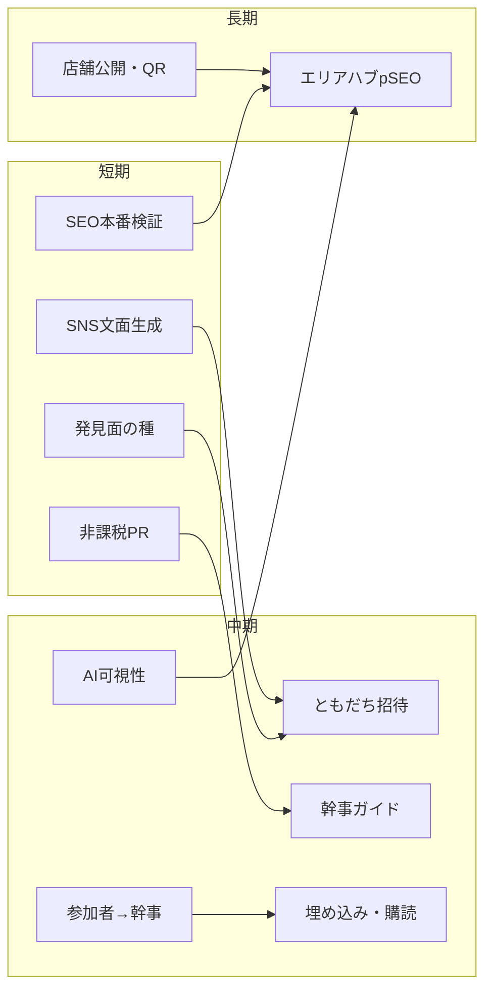

# 露出獲得施策（開発 × プロモーション）

Shokujii（shokujii.jp）をより多くの人に知ってもらうための施策を、**プロダクト開発**と**プロモーション**の両面から整理する。実装仕様の正本ではなく、優先度付け・Issue 化・施策実行のたたき台とする。

## 関連ドキュメント

| ドキュメント | 役割 |
| --- | --- |
| [12_SEO対策/01_SEO対策_タスク.md](../12_SEO対策/01_SEO対策_タスク.md) | 技術 SEO・Phase 0〜4 のタスク正本（#2195） |
| [12_SEO対策/02_SEO対策_コンテンツ戦略.md](../12_SEO対策/02_SEO対策_コンテンツ戦略.md) | キーワード・ピラー・Hub/Spoke（P4-0） |
| [02_主催者獲得と継続/17_主催自動化.md](../02_主催者獲得と継続/17_主催自動化.md) | 集客自動化アイデア（A-xx / K-xx 等） |
| [10_競合調査・営業資料/01_競合調査_概要.md](../10_競合調査・営業資料/01_競合調査_概要.md) | ポジショニング・市場背景 |
| [03_参加者獲得/02_友人招待機能.md](../03_参加者獲得/02_友人招待機能.md) | 招待機能仕様 |

**関連スキル（施策設計時）**: `/content-strategy`、`/programmatic-seo`、`/seo-audit`、`/ai-seo`

**優先度の正本**: [§6 工数×効果マトリクス](#6-工数効果マトリクス)（Tier 1〜5・バンドル A/B/C）

---

## 1. 概要

### 1.1 目的

- 新規の**主催者**・**参加者**・**法人検討者**にサービスを認知してもらう
- 認知から初回利用（コミュニティ参加・イベント注文・幹事登録）までの導線を増やす
- 広告単価に依存せず、**既存ユーザーと検索・メディア**からの流入を積み上げる

### 1.2 解決する課題

| 課題 | 内容 |
| --- | --- |
| 検索流入が小さい | GSC ベースライン（2026-07 時点）で約 645 クリック / 3 ヶ月。インデックス未登録 URL が多かった |
| プロダクト外の露出が弱い | PR・ガイドコンテンツ・業界マップ等の体系化が未着手 |
| シェアの摩擦 | 主催者・参加者が SNS / 同僚に届けるための素材・招待導線が一部未整備 |

### 1.3 期待される効果

- 短期: 既存公開 URL の検索表示改善、主催者 1 人あたりのリーチ拡大
- 中期: 「◯◯ ランチ会」「食事会 幹事」等の検索需要獲得、事例・メディア言及の蓄積
- 長期: エリア × ジャンルの programmatic SEO、店舗・コミュニティ双方からの相互送客

### 1.4 対象

| セグメント | 露出の意味 |
| --- | --- |
| 幹事・コミュニティ管理者 | 新規主催者獲得 |
| イベント参加者 | 招待・シェアによる周辺リーチ |
| 人事・総務（法人） | エンタープライズ / PF 幹事の両方に接続しうる |
| 飲食店パートナー | 店舗経由のイベント・ブランド認知 |

---

## 2. ねらい

### 2.1 ビジネス目標

- オーガニック流入（検索・シェア・紹介）の比率を高める
- 主催者あたりの告知・招待の**自動化・半自動化**で、運営工数を増やさずリーチを伸ばす（[17_主催自動化](../02_主催者獲得と継続/17_主催自動化.md) と整合）

### 2.2 プロダクト上の前提（露出の最短経路）

Shokujii は**主催者がイベントを立て、参加者が誘われて参加する**構造が強い。

```
認知 → 主催者 or 参加者 → イベント公開 → 注文・参加 → 招待・SNS → 新規認知
```

そのため **プロダクト内のシェア・招待・OGP・告知自動化** の費用対効果が、冷たい流入獲得広告より高くなりやすい。検索 SEO は「幹事・エリア需要」の新規獲得として中長期で積む。

### 2.3 成功指標（KPI 案）

| 指標 | 計測 | 目安（要合意） |
| --- | --- | --- |
| オーガニッククリック | GSC | Phase 2 本番後: 前四半期比 +30%（P3-1 と連動） |
| インデックス登録率 | GSC「ページ」 | 未登録 68 件 → 50% 削減（01 SEO タスク目標） |
| イベント URL のシェア | UTM / リファラ（将来） | 施策ごとにベースライン取得 |
| 招待経由の新規登録 | 招待機能計測（A-03 実装後） | 月次 |
| メディア・第三者言及 | 手動記録 + AI 可視性（P3-5-1） | 四半期 |

---

## 3. 現状認識（2026-07 時点）

### 3.1 できていること（露出の受け皿）

- OGP 動的注入、robots.txt、sitemap、ページ別 title / description / canonical、JSON-LD、プリレンダー HTML、h1 整備（**01 SEO Phase 1〜3 実装済み・本番検証一部残**）
- コミュニティ・イベント公開 URL（`/c/**`、`/c/**/e/**`）、`/communitylist`
- チラシ Function、友達基盤（`friendsService`）、メール・プッシュ各種

### 3.2 空白・ボトルネック

| 領域 | 状態 |
| --- | --- |
| 検索の新規ページ | Phase 4（エリアハブ・ガイド）未着手。P4-0-1 ボリューム未計測 |
| 本番 SEO 検証 | P2-4-V 本番、GSC sitemap 送信、Soft 404 解消確認が残 |
| プロモーション | PR・事例・幹事ガイドの運用設計が未体系化 |
| 外部イベント媒体 | A-01（Peatix 等）自動化は探索段階 |
| **プラットフォーム内発見** | 公開在庫のフィード・ダイジェスト・related が弱い（§8・§9 D4） |
| **参加者→幹事転換** | Eventbrite 型の供給側ループが未体系化（§9 D5） |
| **店舗・社内常駐** | 店頭 QR・埋め込みウィジェットが未整備（§9 D6） |

### 3.3 ポジショニング（プロモーションの軸）

[競合調査](../10_競合調査・営業資料/01_競合調査_概要.md) に沿い、**「個人のランチ補助・弁当デリバリー」ではなく「食事を通じた社内交流・幹事の食事会運営」** を前面に出す。2026 年 4 月の食事補助非課税上限引き上げは、人事・総務向け PR の時事フックになりうる。

---

## 4. 開発タスク（露出獲得向け）

工数記号は [01_SEO対策_タスク.md](../12_SEO対策/01_SEO対策_タスク.md) に準拠（S / M / L）。

### 4.1 Phase D0: 仕込み済み SEO の刈り取り（最優先）

| ID | タスク | 工数 | 露出への効果 | 正本 |
| --- | --- | --- | --- | --- |
| D0-1 | 本番 Rich Results / Soft 404 解消確認 | S | 既存イベント URL が検索結果に載りやすくなる | P2-4-V、検証チェックリスト |
| D0-2 | GSC に sitemap 送信・P3-1 再計測 | S | 168 既知 URL の登録率改善 | P3-1 |
| D0-3 | 旧 `/community/**` → `/c/**` 301 | S | リンクジュース・正規 URL 統一 | P2-6 |

**完了条件**: 代表イベント URL の GSC ライブテストで Soft 404 が解消、sitemap 受理。

### 4.2 Phase D1: バイラル・シェアループ（短期・高 ROI）

[17_主催自動化](../02_主催者獲得と継続/17_主催自動化.md) の集客系を露出施策として優先付け。

| ID | アイデア ID | 内容 | 確度 | 工数目安 | 備考 |
| --- | --- | --- | --- | --- | --- |
| D1-1 | A-05 | SNS 投稿文・ハッシュタグ自動生成 | 高 | S〜M | OGP 済み。主催者の告知コスト削減 |
| D1-2 | A-03 | 注文完了時のともだち招待 | 中 | M | [友人招待機能](../03_参加者獲得/02_友人招待機能.md) と整合 |
| D1-3 | A-07 | ics カレンダー配布 | 高 | S | カレンダー経由の副次露出 |
| D1-4 | A-06 | フライヤー PDF 自動配布 | 中 | M | 既存 flyer Function |
| D1-5 | A-04 | 告知スケジュール自動化 | 高 | M | レター・メール・プッシュと連携 |
| D1-6 | A-08 | 前回参加者への優先案内 | 中 | M | リピーター集客 |
| D1-7 | 08 短縮URL | 計測可能な短縮 URL（未実装なら） | — | S | [08_短縮URL生成](../03_参加者獲得/08_短縮URL生成.md) |

**プロモーション連携**: D1-1 出力を PR・事例投稿のテンプレートとしても利用可能。

### 4.3 Phase D2: 検索・AI 可視性（中期）

| ID | タスク | 工数 | 内容 |
| --- | --- | --- | --- |
| D2-1 | P3-5 AI Visibility Audit | S | 「食事会 東京」「ランチ会 幹事」等 10〜20 クエリ |
| D2-2 | P3-5-2 プリレンダー extractability | S | AI クローラー向け本文整理 |
| D2-3 | P4-0-1 / P4-0-2 | S | キーワードボリューム・マッピング表完成 |
| D2-4 | P4-1 住所構造 backfill | L | エリア pSEO の前提（batch 側） |
| D2-5 | P4-4 + P4-6 エリアハブ + レンダリング | L | `/events/tokyo/` 等。CSR のみでは不十分 |
| D2-6 | P4-2 終了イベントアーカイブ | M | 開催実績をハブページの独自性に |
| D2-7 | P4-5 店舗公開ページ | L | LocalBusiness・店舗指名検索（別 Issue 推奨） |
| D2-8 | K-06 年間振り返り SNS シェア | 低 | 工数大・拡散力大（探索） |

コンテンツ方針の正本: [02_SEO対策_コンテンツ戦略.md](../12_SEO対策/02_SEO対策_コンテンツ戦略.md)（食事会・ランチ会を本命、仕出し・デリバリー量産 pSEO は非推奨）。

### 4.4 Phase D3: 探索

| ID | アイデア ID | 内容 |
| --- | --- | --- |
| D3-1 | A-01 / A-02 | Peatix / connpass 等への半自動投稿・同期 |
| D3-2 | A-12 | Slack / LINE コミュニティ自動告知 |
| D3-3 | I-04 | 公開 API / MCP（外部連携の土台） |

**判断**: D3-1 はプロモーション側で手動クロスポストの効果検証後に開発投資。

---

## 5. プロモーションタスク

開発不要または開発と並行できる施策。担当・予算は別途。

### 5.1 Phase P0: ニュースフック PR（短期）

| ID | 施策 | 内容 | 連携 |
| --- | --- | --- | --- |
| P0-1 | 非課税改正 PR | 「補助枠を交流・食事会に」ストーリー。PR TIMES 等 | 競合調査 §3 |
| P0-2 | カオスマップ・比較記載 | 食の福利厚生カオスマップ等への掲載打診 | カテゴリ 6「交流型」 |
| P0-3 | 人事メディア寄稿 | HR 系メディアへの幹事・ランチ会企画の寄稿 | ピラー A（コンテンツ戦略） |

**効果**: 第三者引用は GEO（P3-5）・ブランド検索にも効く。

### 5.2 Phase P1: コンテンツ・事例

| ID | 施策 | 形式 | Searchable / Shareable |
| --- | --- | --- | --- |
| P1-1 | 開催レポート | コミュニティインタビュー + 写真（アルバム） | Shareable |
| P1-2 | 幹事ガイド先行記事 | 「食事会 幹事 やり方」「新入社員 ランチ会」等 3〜5 本 | Searchable |
| P1-3 | 比較記事 | ケータリング vs 食事会プラットフォーム（ピラー D） | 両方 |
| P1-4 | about / 公式サイト | 既存 about.shokujii.jp の訴求整理 | — |

**URL 置き場**: `/guides/**` は P4-4 確定前。先行公開時は about ブログまたは静的ページ方針を開発と合意。

### 5.3 Phase P2: リファラル・パートナー

| ID | 施策 | 開発依存 |
| --- | --- | --- |
| P2-1 | 招待キャンペーン設計 | D1-2 実装後 |
| P2-2 | 店舗 SNS・店頭での co-branding | P4-5 あると効果増 |
| P2-3 | 主催者向け「告知キット」PDF / Notion | D1-1 / A-06 と共通化 |

### 5.4 Phase P3: 外部媒体検証

| ID | 施策 | 成功時の次ステップ |
| --- | --- | --- |
| P3-1 | 代表イベントを Peatix / connpass に手動掲載 | D3-1 自動化の Issue 化 |
| P3-2 | コミュニティ主催者へのクロスポスト依頼テンプレ | A-01 要件の入力 |

---

## 6. 工数×効果マトリクス

優先度のたたき台。§4〜§5・§9 の全 ID を、**工数（実装・運用コスト）**と**露出効果（期待リーチ × 転換距離 × レバレッジ）**で整理する。2026-07-31 時点のコードベース（SEO Phase 2 実装済み・トップに人気/開催予定一覧・SNS シェア・チラシ・`friendsService` 等）を反映。

### 6.1 評価軸

| 軸 | 内容 |
| --- | --- |
| **工数** | XS = 開発ほぼ不要（運用のみ）。S / M / L は [01_SEO対策_タスク](../12_SEO対策/01_SEO対策_タスク.md) と同義 |
| **効果** | **高** = 既存在庫・全イベントに効く / 転換に近い / 計測可能。**中** = 条件付きで効く。**低** = 中長期・探索・前提不足 |
| **Tier** | 1 = 最優先、5 = 意図的に後回し |

### 6.2 象限（俯瞰）

| 工数 ↓ / 効果 → | **高** | **中** | **低** |
| --- | --- | --- | --- |
| **XS〜S** | Tier 1〜2（D0, P0, P4, D5-1, D1-1, D6-4 等） | D2-1〜3, D4-1（一部）, P1-2 | D2-8, P5-7 |
| **M** | D1-2, D4-3, D1-5, D5-4, P1-1 | D4-2, D5-2, D1-4, P5-2 | D4-4, D5-3, D6-1 |
| **L** | D2-5（中長期の本命） | D2-6, D2-7 | D4-5, D3-1（検証前） |

### 6.3 施策一覧マトリクス

| Tier | ID | 施策（要約） | 工数 | 効果 | 種別 | 根拠・備考 |
| --- | --- | --- | --- | --- | --- | --- |
| **1** | D0-1 | SEO 本番検証（Soft 404 / Rich Results） | S | 高 | 開発 | **実装済みの刈り取り**。168 既知 URL |
| **1** | D0-2 | GSC sitemap 送信・P3-1 再計測 | S | 高 | 開発 | 同上 |
| **1** | D0-3 | `/community/**` → `/c/**` 301 | S | 高 | 開発 | 正規 URL 統一 |
| **1** | P0-1 | 非課税改正 PR | XS | 高 | プロモ | 開発不要。ブランド・人事 |
| **1** | P0-2 | カオスマップ・比較掲載打診 | XS | 中〜高 | プロモ | 第三者引用・GEO |
| **1** | P4-1 | こくちーず / Peatix 等への手動並行掲載 | XS | 高 | プロモ | 自社 DA 弱い間の SEO 借り |
| **1** | P2-3 | 告知キット（Notion 等への手順統合） | XS | 中〜高 | プロモ | 既存スライド・チラシを束ねる |
| **2** | D5-1 | イベント名ウィザード | S | 高 | 開発 | 全在庫の検索・OGP・並行掲載に効く |
| **2** | D1-1 | SNS 投稿文・ハッシュタグ自動生成（A-05） | S〜M | 高 | 開発 | シェア UI は既存。文面が不足 |
| **2** | D6-4 | 共有 URL の UTM プリセット | S | 高 | 開発 | D1-1 とセット。以降の判断材料 |
| **2** | D6-5 | シェアボタン押下・コピー率計測 | S | 中〜高 | 開発 | 効果検証の基盤 |
| **2** | D5-4 | イベント後「幹事 CTA」（設定コピー） | S〜M | 高 | 開発 | 参加者→主催者。LTV 大 |
| **2** | D1-3 | ics カレンダー配布（A-07） | S | 中〜高 | 開発 | 社内カレンダー常駐 |
| **2** | P0-3 | 人事メディア寄稿 | XS〜S | 中 | プロモ | Searchable |
| **3** | D1-2 | 注文完了時のたべとも招待（A-03） | M | 高 | 開発 | CV に最も近い。仕様あり・未実装 |
| **3** | D4-3 | related events（近くの公開食事会） | M | 高 | 開発 | 1 PV を横断露出 |
| **3** | D1-5 | 告知スケジュール自動化（A-04） | M | 中〜高 | 開発 | メール・レター・プッシュ既存 |
| **3** | D1-6 | 前回参加者優先案内（A-08） | M | 中 | 開発 | リピート・FOMO |
| **3** | P1-1 | 開催レポート 1 本 | XS | 中〜高 | プロモ | Shareable・営業素材 |
| **3** | P1-2 | 幹事ガイド 3〜5 本 | XS〜M | 中〜高 | プロモ | about / note 先行可 |
| **3** | P1-3 | ケータリング vs 食事会比較 | XS〜S | 中 | プロモ | Consideration |
| **4** | D4-1 | トップ「今週」「締切間近」等 | S〜M | 中 | 開発 | 人気/開催予定は既存。改善分のみ S 寄り |
| **4** | D4-2 | 公開イベント週間ダイジェスト | M | 中 | 開発 | 在庫・リストが増えてから ROI ↑ |
| **4** | D5-2 | 未ログイン閲覧の厚み | M | 中〜高 | 開発 | D0 で流入増後に AB しやすい |
| **4** | D1-4 | フライヤー PDF 自動配布（A-06） | M | 中 | 開発 | flyer 既存。「公開時添付」に絞れば S 寄り |
| **4** | D2-1〜3 | AI 可視性・キーワード調査 | S | 中 | 開発 | 直接流入は増やさない。判断材料 |
| **4** | D6-2 | コミュニティ ics 購読 URL | S〜M | 中 | 開発 | D1-3 の拡張 |
| **4** | P2-1 | 招待キャンペーン | XS | 中 | プロモ | D1-2 後 |
| **4** | P3-1 / P3-2 | 外部掲載・クロスポストテンプレ | XS | 中 | プロモ | P4-1 の横展開 |
| **4** | P5-2 | 非課税シミュレータ LP | M | 中〜高 | プロモ | P0-1 とセット |
| **5** | D2-4〜5 | 住所 backfill + エリア pSEO | L | 高（中長期） | 開発 | D0・P4-1 結果後に着手 |
| **5** | D2-6 | 終了イベントアーカイブ | M | 中 | 開発 | pSEO とセット |
| **5** | D2-7 | 店舗公開ページ（P4-5） | L | 中〜高（中長期） | 開発 | 別 Issue 級 |
| **5** | D2-8 / K-06 | 年間振り返り SNS | L / 低 | 低〜中 | 開発 | 探索 |
| **5** | D3-1 | 外部媒体自動投稿 | M〜L | 低（検証前） | 開発 | **P4-1 効果確認後** |
| **5** | D4-4 | 非メンバーフォロー通知 | M | 中 | 開発 | [§11 #5/#6](#11-未決事項)。D4-3 より後 |
| **5** | D4-5 | プラットフォーム内有料ブースト | L | 低（現状） | 開発 | DAU・在庫不足 |
| **5** | D5-3 / D5-5 / D5-7 | 気になるリード / 主催打診 / カバーテンプレ | M | 中 | 開発 | 流入・デザイン工数 |
| **5** | D5-6 | LinkedIn / Slack OGP 差分 | S | 中 | 開発 | B2B 共有の改善 |
| **5** | D6-1 | 埋め込みウィジェット | M | 中 | 開発 | [§11 #7](#11-未決事項) |
| **5** | D6-3 / D6-6 | 店舗 QR キット / 初回チャネル属性 | M | 中 | 開発 | D6-4 より後 |
| **5** | D1-7 | 短縮 URL | S | 低 | 開発 | UTM 付き通常 URL で当面可 |
| **5** | P5-1 / P5-4〜9 | 白書・提携・文化施策 | XS〜L | 低〜中 | プロモ | 中長期・探索 |

### 6.4 推奨バンドル（実務セット）

| バンドル | 期間 | 含める施策 | 目的 |
| --- | --- | --- | --- |
| **A** | 1〜2 週間 | D0 → D5-1 → D1-1 + D6-4 + D6-5。並行 P0-1/2, P4-1, P2-3 | 検索刈り取り + 主催者シェア + 外部 SEO 借り |
| **B** | 〜1 ヶ月 | A + **D1-2** または **D5-4**（どちらか先） | 招待＝参加者リーチ / 幹事 CTA＝供給側 |
| **C** | 2〜3 ヶ月 | B + D4-3 + D1-5 + P1-1/2。GSC 結果で D2-4/5 判断 | 横断露出 + リピート告知 + コンテンツ |

**B の選択**: 露出×転換の直線距離は **D1-2（招待）** が長い。幹事供給を急ぐなら **D5-4** を先。

### 6.5 誤優先（意図的に後ろに下げる）

| やりがち | 理由 |
| --- | --- |
| pSEO ハブを D0 より先 | 既存 URL の Soft 404・未登録が残る |
| D4-4 を D4-3 より先 | 設計・未決事項が重い |
| D3-1 を P4-1 より先 | 自動化だけ工数が増える |
| D6-6 を D6-4 より先 | UTM + シェア計測で足りる |
| D4-2 を在庫少のうちに全量 | 空ダイジェストリスク |

---

## 7. 統合ロードマップ

| 時期 | 開発（優先） | プロモーション（優先） |
| --- | --- | --- |
| **短期（〜1 ヶ月）** | D0-1〜3、D1-1（A-05）、**D4-1〜2（発見面の種）**、**D5-1（イベント名ガイド）** | P0-1〜2、**P4-1（並行掲載の手動検証）** |
| **中期（1〜3 ヶ月）** | D1-2〜5、D2-1〜3、**D4-3〜4、D5-2〜3、D6-1** | P1-1〜3、P2-1、**P5-1（白書・シミュレータ企画）** |
| **長期（3 ヶ月〜）** | D2-4〜7、D6-2〜3、K-06 検討、**D4-5（有料ブーストは在庫十分後）** | P2-2〜3、P3-1〜2、**P5-2〜4（チャネル提携）** |



**他社ギャップを踏まえた追加優先帯**（§8・§9）。詳細優先度は **§6 工数×効果マトリクス** を正本とする:

| 優先 | 施策帯 | 他社根拠 |
| --- | --- | --- |
| すぐ | 公開イベントの発見 UI / 週間ダイジェストの設計着手 | Peatix・Eventbrite |
| すぐ | イベント名ガイド＋未ログイン閲覧の厚み | こくちーず SEO＋Partiful |
| 短期 | related events / 近くの公開会 | Eventbrite |
| 短期 | 参加者→幹事 CTA | Eventbrite 成長ループ |
| 中期 | 埋め込み・カレンダー購読 | Luma |
| 中期 | 店舗 QR・パートナーキット | Shokujii 固有 |
| 中期 | 白書・非課税シミュレータ | PR 弾薬 |
| 検証後 | 外部媒体並行掲載の半自動 | こくちーず / Peatix の DB・SEO を借りる |
| 探索 | プラットフォーム内有料ブースト | Peatix Ads 型（DAU・在庫十分後） |

---

## 8. 他社事例（イベント告知サービス）

調査日: 2026-07-31。公開ヘルプ・サービスページ・成長論考に基づく整理。料金・数値は変動しうる。

### 8.1 他社が勝っている構造（結論）

機能単体ではなく、次のどれか（多くは複数）で露出を稼いでいる。

| # | 型 | 代表 | Shokujii のギャップ（2026-07） |
| --- | --- | --- | --- |
| 1 | **プラットフォーム内の発見**（検索・レコメンド・メルマガ） | Peatix、Eventbrite | 公開在庫の再配信・フィードが弱い |
| 2 | **招待そのものが広告**（低摩擦・見た目・FOMO） | Partiful、Luma | OGP はあるが未ログイン体験・ゲストリスト設計が薄い |
| 3 | **ドメインオーソリティで検索** | こくちーずプロ | 自社 DA は成長途上。並行掲載が現実解 |
| 4 | **参加者 → 主催者への転換** | Eventbrite | 「初めての幹事」導線が露出施策として未体系化 |
| 5 | **ニッチ独占** | connpass（IT 勉強会） | 「社内ランチ会／食事でつながる」の言語・ハブ占有が未完 |

Shokujii の固有資産は **食事＋注文＋交流＋店舗パートナー**。欠けているのは、その在庫を見せる**発見面**と**供給側ループ**である。

### 8.2 Peatix

| 仕組み | 内容 | Shokujii への示唆 |
| --- | --- | --- |
| 公開＝媒体露出 | 審査後、検索結果・類似参加者向けメルマガに掲載 | `is_public` イベントをプラットフォーム側が再配信する設計 |
| グループフォロー → 自動通知 | フォロワーへ新規公開・開催前通知 | 非メンバーの「フォローして待つ」UX |
| カテゴリ多軸 | メイン＋サブで関心層を束ねる | タグ横断の発見ハブ |
| 有料ブースト | 類似参加者メール・検索上位 | 将来の「注目ランチ会」枠（在庫十分後） |
| カバー画像＝広告素材 | ページ自体が SNS クリエイティブ | メニュー写真は Peatix より強い素材になりうる |

参考: [Peatix 集客サービス](https://services.peatix.com/ja/event-promotion)、[主催者ヘルプ（無料機能）](https://help-organizer.peatix.com/)

### 8.3 Eventbrite

| 仕組み | 内容 | 示唆 |
| --- | --- | --- |
| 発見＝検索＋レコメンド | 「探していない人」にも届ける（Spotify 型） | トップの「今週の公開食事会」フィード |
| related events | イベントページ下部に類似 | 1 PV を他コミュニティへクロスルート |
| attendee → organizer | 参加者を主催者に転換する成長エンジン | イベント後 CTA・設定コピー提案 |
| 外部配布 | Meta 等でチケット配布、申込は自社 | A-01（告知外部・申込 shokujii）と同型 |

参考: [First Round — Eventbrite growth](https://review.firstround.com/answers-to-your-tough-questions-about-growth-learned-while-scaling-eventbrites-5b-growth-engine/)

### 8.4 こくちーずプロ

| 仕組み | 内容 | 示唆 |
| --- | --- | --- |
| ドメイン力でイベントページ上位 | 検索流入比率が高いとされる | DA が弱い間は**並行掲載で SEO を借りる** |
| タイトル設計 | 「地域＋対象＋テーマ」 | イベント名ウィザード（§9 D5-1） |

### 8.5 connpass / Doorkeeper / Meetup

| サービス | 露出の型 | 示唆 |
| --- | --- | --- |
| connpass | IT ニッチ独占＋シリーズ | 「社内ランチ会」ニッチを言語・カテゴリ・ハブで占有 |
| Doorkeeper | メンバーシップ・継続 | 定期参加（17 の S-08）は口コミ密度の源泉 |
| Meetup | 位置情報レコメンド | エリア × 今日・今週の食事会 |

### 8.6 Partiful / Luma（近年のバイラル型）

| 仕組み | 内容 | 示唆 |
| --- | --- | --- |
| 招待＝成長ループ | 1 招待ごとに新規が触れる | 参加・注文フローの各画面を「見た人が欲しくなる」設計に |
| アカウント不要 RSVP | 摩擦ゼロ | 注文はログイン必須でも、閲覧・興味表明は未ログインで厚く |
| ゲストリスト FOMO | 誰が行くか見える | `is_show_member` を露出装置として再設計 |
| テンプレ／リミックス | 見た目が SNS で回る | 食事会専用カバー・テーマ |
| Calendar subscribe | 主催カレンダー購読 | コミュニティ今後開催の ics / 購読 URL |
| 埋め込み | Notion・社内ポータル | iframe / ウィジェット |

※日本では SMS より **LINE 共有・グループ投稿**が本線。Partiful の SMS バイラルをそのまま真似しない。

### 8.7 戦略上の注意（真似の境界）

1. **Peatix 型の全公開**と社内コミュニティの安心感は衝突しやすい → **公開レイヤーを分ける**（プライベート運用 + 公開サンプルイベント）。
2. **仕出し・デリバリー量産 pSEO**は [コンテンツ戦略](../12_SEO対策/02_SEO対策_コンテンツ戦略.md) どおり避ける。発見面も「交流・幹事・ランチ会」に寄せる。
3. **こくちーず級 SEO**はドメイン年齢で勝てない期間が長い → 自前 pSEO と**借りる SEO（並行掲載）**の二刀流。
4. **プラットフォーム内有料広告**は DAU・公開在庫が十分になってから（D4-5）。

---

## 9. 追加アイデア（発見面・転換・店舗・PR 弾薬）

§4・§5 の外側。ID は `D4` / `D5` / `D6` / `P4` / `P5` で採番。

### 9.1 Phase D4: プラットフォーム内「発見面」（他社ギャップ本丸）

| ID | 内容 | 工数目安 | 他社根拠 | 備考 |
| --- | --- | --- | --- | --- |
| D4-1 | トップ / communitylist に「今週開催」「満席間近」 | S〜M | Eventbrite 発見 | `is_public` のみ |
| D4-2 | 公開イベントの週間ダイジェストメール（エリア・ジャンル） | M | Peatix メルマガ | オプトイン必須 |
| D4-3 | イベント詳細の「近くの他コミュニティの食事会」（related） | M | Eventbrite related | 簡易距離 or 同一エリア |
| D4-4 | コミュニティフォロー（非メンバー）→ 公開イベント通知 | M | Peatix グループフォロー | 参加ハードルを下げてリーチ |
| D4-5 | プラットフォーム内「注目枠」有料ブースト | L | Peatix Ads | 探索。在庫・DAU 条件付き |

### 9.2 Phase D5: 第一印象・検索タイトル・幹事転換

| ID | 内容 | 工数目安 | 他社根拠 | 備考 |
| --- | --- | --- | --- | --- |
| D5-1 | イベント名ウィザード（エリア｜シーン｜店名） | S | こくちーず タイトル | 強制せず提案 |
| D5-2 | 未ログインでもメニュー写真・人数・店・雰囲気をフル表示 | M | Partiful 第一印象 | ログイン壁の前に「欲しい」を作る |
| D5-3 | ワンタップ「気になる」（メール / LINE リード） | M | 低摩擦 RSVP | 注文前リード |
| D5-4 | イベント後 CTA「今度はあなたが幹事（設定コピー）」 | S〜M | Eventbrite attendee→org | [04_イベントコピー](../02_主催者獲得と継続/04_イベントコピー.md) 連携 |
| D5-5 | 参加回数上位への主催打診 | M | 同上 | 運営 or 自動 |
| D5-6 | LinkedIn / Slack 向け OGP 文言バリエーション | S | B2B 共有 | チャネル別カード |
| D5-7 | 食事会カバーテンプレ・リミックス | M | Partiful テンプレ | SNS 回遊用 |

### 9.3 Phase D6: 埋め込み・店舗・計測

| ID | 内容 | 工数目安 | 備考 |
| --- | --- | --- | --- |
| D6-1 | Notion / 社内ポータル用埋め込みウィジェット（来週のランチ会） | M | Luma embed 相当 |
| D6-2 | コミュニティ「今後の食事会」カレンダー購読 URL（ics） | S〜M | A-07 のコミュニティ版 |
| D6-3 | 店舗向け店頭 QR・紹介文（パートナーキットのプロダクト側） | M | P2-2 / P4-5 とセット |
| D6-4 | 共有 URL の UTM プリセット（SNS / メール / フライヤー） | S | A-05 と一体 |
| D6-5 | 共有ボタン押下・コピー率の計測 | S | どの文言がどれだけ回るか |
| D6-6 | ユーザーの「初回接触チャネル」属性保持 | M | プロモ予算配分の根拠 |

### 9.4 Phase P4: 外部媒体で SEO・DB を借りる

| ID | 施策 | 開発依存 | 備考 |
| --- | --- | --- | --- |
| P4-1 | 代表イベントをこくちーず / Peatix / connpass に手動並行掲載 | なし → 効果あれば D3-1 | タイトルに地域・シーンを入れる |
| P4-2 | 主催者向け「並行掲載チェックリスト」 | なし | P3-2 の拡張 |
| P4-3 | TECHPLAY 等ニッチ媒体は対象外を明記 | — | IT 勉強会層はコア ICP でない限り優先度低 |

### 9.5 Phase P5: PR 弾薬・チャネル提携・文化

| ID | 施策 | 内容 |
| --- | --- | --- |
| P5-1 | 「食事でつながる白書」（年次） | 匿名の開催曜日・平均人数・ジャンル。メディア引用用 |
| P5-2 | 非課税 7,500 円「使い方シミュレータ」LP | 人事が稟議に貼るツール。P0-1 と連動 |
| P5-3 | 幹事負荷の時間換算コンテンツ | スプレッドシート幹事 vs Shokujii |
| P5-4 | HR SaaS マーケットプレイス掲載打診 | SmartHR 等の日常導線 |
| P5-5 | 宅配・ケータリングとの「補完提携」 | 「交流したい日は Shokujii」 |
| P5-6 | 商工会議所・自治体・大学サークルの公式会 | [17 S-04 公式オープンテーブル](../02_主催者獲得と継続/17_主催自動化.md) と接続 |
| P5-7 | Podcast / YouTube「はじめての幹事」 | 検索＋信頼。開発不要 |
| P5-8 | #食事でつながる UGC・幹事アンバサダー | アルバム二次利用許諾＋公式リポスト |
| P5-9 | 季節の運営公式イベント（忘年会・花見・新入社員週） | 検索・SNS のフック在庫を自前供給 |

### 9.6 17_主催自動化・既存仕様との対応

| 本 doc | 既存 |
| --- | --- |
| D4-2 / D4-4 | A-04 告知スケジュール、A-08 前回参加者案内の拡張 |
| D5-4 | [04_イベントコピー](../02_主催者獲得と継続/04_イベントコピー.md)、U-03 成功パターンコピー |
| D6-2 | A-07 ics |
| D6-3 / P2-2 | P4-5 店舗公開、パートナー営業 |
| P5-6 | S-04 公式オープンテーブル |
| P4-1 / D3-1 | A-01 / A-02 外部プラットフォーム |

---

## 10. Issue 化・オーナーシップ（案）

| バンドル | 推奨 Issue | 備考 |
| --- | --- | --- |
| SEO 本番検証 + GSC | #2195 継続 | 01 SEO タスクと同一 |
| シェア・集客 Phase D1 | 新規（[doc] または [user][functions]） | 17 の A-xx を子タスク化 |
| **発見面 Phase D4** | 新規 | D4-1 から。公開イベント方針（§11 #5）確定後 |
| **幹事転換・第一印象 D5** | 新規または D1 と同 PR | D5-1 / D5-4 は S で先行可 |
| **埋め込み・計測 D6** | 新規 | 法人・社内常駐とセット |
| Phase 4 pSEO | #2195 派生または新規 | P4-8 パイロット単位 |
| プロモーション P0 / P5 | 運営タスク（Issue 任意） | コード変更なし〜LP のみ |
| 外部並行掲載 P4 | 運営 → 効果後に D3-1 | |

---

## 11. 未決事項

| # | 論点 | 影響 |
| --- | --- | --- |
| 1 | SEO / PR の主 CV 先: PF 幹事 vs エンタープライズ法人 | P0-1・P1-2・P5-2 の訴求・リンク先 |
| 2 | `/guides/**` の Hosting・noindex 方針 | ガイド先行公開の実装コスト |
| 3 | 招待・キャンペーンの法務（景表・特商法） | P2-1 |
| 4 | 店舗 co-branding の掲載同意 | P2-2 / P4-5 / D6-3 |
| 5 | **公開イベントの発見面をどこまで広げるか**（社内安心感との境界） | D4 全体の前提 |
| 6 | **非メンバーフォローとコミュニティ参加の権限差** | D4-4 |
| 7 | **埋め込みウィジェットの認証・テナント境界**（PF / エンプラ） | D6-1 |
| 8 | 白書用データの匿名化粒度・公開可否 | P5-1 |

---

## 12. 更新履歴

| 日付 | 内容 |
| --- | --- |
| 2026-07-31 | 初版。開発 D0〜D3・プロモ P0〜P3・KPI・ロードマップを整理 |
| 2026-07-31 | 他社事例と追加アイデア D4〜D6・P4〜P5 を追記 |
| 2026-07-31 | §6 工数×効果マトリクス・推奨バンドル A/B/C・章番号整理（§7〜12） |
