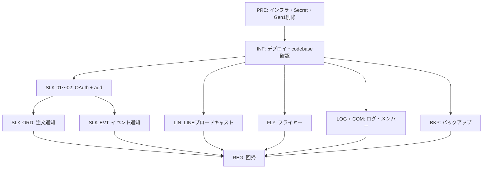

# bot / legacy → default 移行 実機テスト項目書

## 1. 文書情報

| 項目 | 内容 |
|------|------|
| 対象 | `functions/legacy` / `shokujii-slackbot` / `shokujii-linebot` → `functions/default` 完全移行 |
| 参照仕様 | [21_bot_legacy移行.md](../07_リファクタリング/21_bot_legacy移行.md) |
| 関連 | [22_Slack連携セットアップ.md](../07_リファクタリング/22_Slack連携セットアップ.md)、[15_EventMemberOrder_SlackBot.md](../07_リファクタリング/15_EventMemberOrder_SlackBot.md) |
| テスト種別 | 実機（sandbox → development → production の順を推奨） |
| 前提 | Phase 3 デプロイ完了、Secret Manager 登録済み、旧 Gen1 関数削除済み（移行仕様 §5.10） |

## 2. テスト対象関数一覧

| ID | 関数名（export 名） | 種別 | 移行元 | 備考 |
|----|---------------------|------|--------|------|
| F-01 | `flyer` | onRequest | legacy | URL 形式維持必須 |
| F-02 | `backupFirestore` | onSchedule | legacy `scheduled_firestore_export` | **関数名がリネーム済み** |
| F-03 | `log_event_status` | onDocumentWritten | legacy | |
| F-04 | `onCommunityMemberWritten` | onDocumentWritten | legacy `on_write_community_members` 統合 | |
| F-05 | `send_email` | — | legacy | **廃止**。存在しないことを確認 |
| F-06 | `slackbot` | onRequest | shokujii-slackbot | Bolt 遅延初期化 |
| F-07 | `slackEventNotification` | onSchedule | shokujii-slackbot `eventNotification` | 1 分間隔。**関数名リネーム済み** |
| F-08 | `slackOrderNotification` | onDocumentWritten | shokujii-slackbot `orderNotification` | member_orders 集約。**関数名リネーム済み** |
| F-09 | `broadcast_event_message_request` | onRequest | shokujii-linebot | HTTP 手動実行可 |
| F-10 | `line_event_information` | onSchedule | shokujii-linebot | 金曜 12:15 JST |

## 3. テスト環境・事前準備

### 3.1 環境要件

| 項目 | 確認内容 |
|------|----------|
| Firebase プロジェクト | テスト対象（sandbox / dev / prod）を 1 つ特定 |
| 1 プロジェクト = 1 Slack App | Slack App / Secret / 管理画面 URL が同一プロジェクト |
| Secret Manager | `SLACK_*` 5 件 + `LINE_CHANNEL_ACCESS_TOKEN` + 既存 Secret 5 件 |
| FUNCTIONS_ENV | `EVENT_HOST`, `PARTNER_HOST`, `SLACK_COMMAND_NAME`（任意）, `CORS` |
| USER_ENV | `VITE_SLACK_BOT_FUNCTION_URL` = 現行 `slackbot` の Cloud Run URL |
| CI | GitHub Actions `Deploy functions` が exit code 0 |

### 3.2 デプロイ後インフラ確認（共通）

| # | 手順 | 期待結果 |
|---|------|----------|
| PRE-01 | `firebase functions:list --project <PROJECT_ID> --region asia-northeast1` | codebase が **default のみ** |
| PRE-02 | 上記一覧に F-01〜F-04, F-06〜F-10 が存在 | 10 関数すべて Gen2 で稼働 |
| PRE-03 | `send_email` を一覧で検索 | **存在しない** |
| PRE-04 | Gen1 関数 8 件（移行仕様 §5.10）が残存していないか確認 | 残存なし |
| PRE-05 | Firebase Console → Functions → 各関数のログに Healthcheck 失敗がない | 起動成功 |
| PRE-06 | `slackbot` の URL と Slack App の OAuth Redirect / Request URL が一致 | [22_Slack連携セットアップ.md](../07_リファクタリング/22_Slack連携セットアップ.md) §3 準拠 |

### 3.3 テスト用アカウント・データ

| 用途 | 準備物 |
|------|--------|
| Slack | テスト用ワークスペース、通知先チャンネル |
| LINE | Messaging API チャネル、友だち追加済みテスト端末 |
| user アプリ | 一般ユーザーアカウント（注文・フライヤー用） |
| partner アプリ | コミュニティ管理者アカウント |
| Firestore | Slack 連携済みコミュニティ、注文受付中イベント |

---

## 4. テスト項目

### 4.1 インフラ・デプロイ（INF）

| ID | 優先度 | 項目 | 前提 | 操作 | 期待結果 |
|----|--------|------|------|------|----------|
| INF-01 | 必須 | CI デプロイ成功 | 対象ブランチをデプロイ | GitHub Actions `Deploy functions` を確認 | 緑、exit code 0 |
| INF-02 | 必須 | codebase 一本化 | PRE-01 実施済 | functions 一覧を確認 | legacy / slackbot / linebot codebase なし |
| INF-03 | 必須 | 旧 Callable 廃止 | — | `send_email` を Console / CLI で検索 | 関数なし。フロントから呼べない |
| INF-04 | 高 | Secret 読み込み | Secret 登録済 | `slackbot` / LINE 関数に 1 回ずつリクエスト or スケジュール実行 | 500 や Secret 未設定エラーが出ない |
| INF-05 | 高 | 関数名 URL 維持 | user アプリデプロイ済 | Network タブで flyer リクエスト URL を確認 | `.../cloudfunctions.net/flyer/...` 形式（Gen2 でも関数名ベース URL が有効） |

---

### 4.2 Slack 連携 — OAuth・スラッシュコマンド（SLK）

参照: [22_Slack連携セットアップ.md](../07_リファクタリング/22_Slack連携セットアップ.md)

| ID | 優先度 | 項目 | 前提 | 操作 | 期待結果 |
|----|--------|------|------|------|----------|
| SLK-01 | 必須 | OAuth インストール | user 管理画面に Slack 設定タブ | コミュニティ管理 → Slack設定 → インストール URL から OAuth | 成功画面。Firestore に `slackbots/{teamId}` と `.../channels/{channelId}` 作成 |
| SLK-02 | 必須 | add コマンド（正常） | SLK-01 完了、同一チャンネル | `/{SLACK_COMMAND_NAME} add {community_account}-{community_id}` を実行 | 「コミュニティ ○○ を登録しました！」。`communities/{id}/bots/{botKey}` 作成 |
| SLK-03 | 必須 | remove コマンド | SLK-02 完了 | `/{SLACK_COMMAND_NAME} remove {community_account}-{community_id}` | 「コミュニティ ○○ を削除しました！」。bots ドキュメント削除 |
| SLK-04 | 高 | Request URL 疎通 | — | Slack でコマンド実行後、Cloud Run ログ確認 | `POST .../slack/events` → **200** |
| SLK-05 | 中 | 別チャンネルで add | OAuth 未実施チャンネル | 未インストールチャンネルで add | 「このチャンネルにはボットが登録されていません」 |
| SLK-06 | 中 | 不正 community ID | SLK-01 完了 | 存在しない ID で add | 「入力された値があっていません」 |
| SLK-07 | 中 | 未サポート subcommand | — | `/{cmd} foo ...` | 「foo はサポートされていません」 |
| SLK-08 | 高 | プロジェクト不一致検知 | 別プロジェクトの community ID を入力 | add 実行 | 「入力された値があっていません」（別 Firestore を参照していない） |
| SLK-09 | 中 | sandbox コマンド名 | `SLACK_COMMAND_NAME` が `shokujii` 以外 | 管理画面コピー文字列のプレフィックスを手動置換して add | SLK-02 と同様に成功 |

**SLK-01 Firestore 確認項目**

| パス | 必須フィールド例 |
|------|------------------|
| `slackbots/{teamId}` | `oauth_data` |
| `slackbots/{teamId}/channels/{channelId}` | `url`, `channel`, `channel_id` |
| `communities/{communityId}/bots/{botKey}` | チャンネル ref 等 |

---

### 4.3 Slack 注文通知 — slackOrderNotification（SLK-ORD）

参照: [15_EventMemberOrder_SlackBot.md](../07_リファクタリング/15_EventMemberOrder_SlackBot.md)

| ID | 優先度 | 項目 | 前提 | 操作 | 期待結果 |
|----|--------|------|------|------|----------|
| SLK-ORD-01 | 必須 | 1 品注文 | SLK-02 完了、注文受付中イベント | user アプリで 1 メニューを注文確定 | Slack に **1 件** の通知。形式: `<ユーザー\|名前> さんが、<イベント\|名前> で、{メニュー名} を注文したよ！` |
| SLK-ORD-02 | 必須 | 複数品同時注文（集約） | 同上 | 同一注文で 2〜3 メニューを同時確定 | Slack 通知 **1 件のみ**（スパムにならない）。`唐揚げ×2 と 牛丼` 形式 |
| SLK-ORD-03 | 高 | リンク URL | SLK-ORD-01 完了 | 通知内リンクをクリック | `EVENT_HOST` ベースのユーザー URL・イベント URL が正しく遷移 |
| SLK-ORD-04 | 高 | bots 未登録 | add 未実施 or remove 済 | 注文確定 | Slack 通知なし。Functions ログに `No bots found`（info） |
| SLK-ORD-05 | 中 | in_cart のみ | カート投入のみ | カートに入れるだけ | 通知なし（`ordered` 遷移時のみ） |
| SLK-ORD-06 | 中 | 二重通知なし | SLK-ORD-02 実施 | Cloud Logging で `slackOrderNotification` 実行回数確認 | 複数 member_order 更新でも Webhook POST は 1 回 |

**SLK-ORD-02 確認ポイント**

- トリガーパス: `communities/.../members/{memberId}/member_orders/{orderId}`
- 発火条件: `before.status !== 'ordered' && after.status === 'ordered'`
- 最小 `order_id` のトリガーのみが送信担当

---

### 4.4 Slack イベント通知 — slackEventNotification（SLK-EVT）

スケジュール: **毎分**（`*/1 * * * *` JST）。テストは「対象時刻が現在の 1 分ウィンドウに入るイベント」を用意するか、Cloud Scheduler から手動実行する。

| ID | 優先度 | 項目 | 前提 | 操作 | 期待結果 |
|----|--------|------|------|------|----------|
| SLK-EVT-01 | 必須 | 注文期限 3 日前 | bots 登録済コミュニティのイベント | `event_deadline_datetime` を「今+3日±1分」に設定し 1〜2 分待機 | 「注文期限3日前となりました。忘れずに注文しよう！」 |
| SLK-EVT-02 | 必須 | 注文期限 1 日前 | 同上 | 期限を「今+1日±1分」に設定 | 「注文期限1日前…」メッセージ |
| SLK-EVT-03 | 必須 | 注文確定（期限当日） | 同上 | 期限を「今±1分」（beforeDays=0） | 「注文が確定しました。参加者はこちらのみなさんです…」 |
| SLK-EVT-04 | 高 | 開始 60 分前 | 同上 | `event_start_datetime` を「今+60分±1分」 | 「開始60分前になりました。」 |
| SLK-EVT-05 | 高 | イベント終了 | 同上 | `event_end_datetime` を「今±1分」 | 「終了しました。次回開催をお楽しみに！」 |
| SLK-EVT-06 | 中 | bots 未登録 | bots なしコミュニティ | SLK-EVT-01 相当のイベント | 通知なし（エラーで全体失敗しない） |
| SLK-EVT-07 | 中 | スケジューラ実行 | GCP Console | Cloud Scheduler → `firebase-schedule-slackEventNotification-asia-northeast1` → 「今すぐ実行」 | ログに `slackEventNotification tick`。対象イベントがあれば Slack 通知 |

---

### 4.5 LINE 通知（LIN）

| ID | 優先度 | 項目 | 前提 | 操作 | 期待結果 |
|----|--------|------|------|------|----------|
| LIN-01 | 必須 | HTTP ブロードキャスト | `LINE_CHANNEL_ACCESS_TOKEN` 登録済 | `broadcast_event_message_request` の URL に GET/POST | HTTP **200** `OK`。LINE 公式アカウントにカルーセル配信 |
| LIN-02 | 必須 | 配信内容 | 公開・注文受付中・締切未来・空席ありイベントが存在 | LIN-01 実行 | 最大 10 件のイベントカルーセル。イベント名・日時・場所・URL・カバー画像 |
| LIN-03 | 高 | 満席除外 | 満席イベントのみ | LIN-01 実行 | 満席イベントはカルーセルに含まれない |
| LIN-04 | 高 | 定期実行 | — | 金曜 12:15 JST に `line_event_information` を待つ、または Scheduler で手動実行 | LIN-01 と同様のブロードキャスト |
| LIN-05 | 中 | Secret 未設定時 | （staging のみ検証可） | トークン無効で実行 | HTTP 500。ログに `broadcast_event_message_request failed` |
| LIN-06 | 中 | 対象イベントなし | 該当イベント 0 件 | LIN-01 実行 | 200。ログ `carouselCount: 0`（配信スキップ or 空） |

**LIN-01 URL 例**

```
https://asia-northeast1-<PROJECT_ID>.cloudfunctions.net/broadcast_event_message_request
```

Gen2 環境では Cloud Run URL でも可。外部から叩く想定のため認証なし（public）。

---

### 4.6 フライヤー PDF — flyer（FLY）

| ID | 優先度 | 項目 | 前提 | 操作 | 期待結果 |
|----|--------|------|------|------|----------|
| FLY-01 | 必須 | PDF ダウンロード（A4） | ログイン済み、イベント作成済 | user → イベント管理 → フライヤー → A4 ダウンロード | PDF が正常取得・表示。Adobe PDF Services エラーなし |
| FLY-02 | 高 | PDF サイズ変更 | 同上 | 別サイズ（利用可能な size）でダウンロード | 指定サイズの PDF |
| FLY-03 | 高 | 認証必須 | 未ログイン | flyer URL を直接 fetch | 401 / 拒否 |
| FLY-04 | 中 | CORS | partner / user 各オリジン | ブラウザ Network で preflight 確認 | `CORS` 設定オリジンから成功 |
| FLY-05 | 中 | URL 形式維持 | — | DevTools でリクエスト URL 確認 | `https://asia-northeast1-${VITE_PROJECT_ID}.cloudfunctions.net/flyer/${eventId}?size=...` |

---

### 4.7 イベント変更ログ — log_event_status（LOG）

| ID | 優先度 | 項目 | 前提 | 操作 | 期待結果 |
|----|--------|------|------|------|----------|
| LOG-01 | 必須 | イベント更新ログ | イベント存在 | partner/user でイベント名等を更新（`updated_by` 付き） | `communities/{cid}/events/{eid}/logs` に差分ドキュメント追加 |
| LOG-02 | 高 | 変更なしスキップ | 同上 | 同一内容で再保存 | 新規 log なし。ログ `no change` |
| LOG-03 | 中 | updated_by 欠落 | — | `updated_by` 無しで更新 | log 書き込みスキップ。warn ログ |

---

### 4.8 コミュニティメンバー — onCommunityMemberWritten（COM）

legacy `on_write_community_members` 統合。二重実行がないことも確認する。

| ID | 優先度 | 項目 | 前提 | 操作 | 期待結果 |
|----|--------|------|------|------|----------|
| COM-01 | 必須 | メンバー数再集計 | コミュニティ存在 | メンバー参加 or 退会 | `communities.community_num_members` / `members` が正しく更新 |
| COM-02 | 必須 | マネージャー追加メール | SendGrid 設定済 | メンバーをマネージャーに昇格 | マネージャー追加メール 1 通（二重送信なし） |
| COM-03 | 必須 | マネージャー削除メール | 同上 | マネージャー権限を剥奪 | 削除通知メール 1 通 |
| COM-04 | 高 | ユーザープロフィール集計 | — | COM-01 と同時 | ユーザーの `joined_community_count` / `managed_community_count` 更新 |
| COM-05 | 高 | 二重トリガーなし | — | メンバー変更 1 回 | Functions ログで legacy `on_write_community_members` が **存在しない**ことと、`onCommunityMemberWritten` のみ 1 回実行 |

---

### 4.9 Firestore バックアップ — backupFirestore（BKP）

| ID | 優先度 | 項目 | 前提 | 操作 | 期待結果 |
|----|--------|------|------|------|----------|
| BKP-01 | 必須 | 手動エクスポート | `terraform apply` 済み、または [firestore_backup.tf](../../terraform/firestore_backup.tf) 相当のバケット + IAM が手動整備済み | Cloud Scheduler で `backupFirestore` を「今すぐ実行」 | ログ `Firestore export started`。バケットに新規 export フォルダ |
| BKP-02 | 高 | 定期実行 | — | 翌日 2:00 JST 以降にバケット確認 | 自動 export 成功 |
| BKP-03 | 中 | 旧関数名不在 | — | `scheduled_firestore_export` を functions 一覧で検索 | **存在しない**（`backupFirestore` のみ） |

---

### 4.10 切替・回帰（REG）

| ID | 優先度 | 項目 | 操作 | 期待結果 |
|----|--------|------|------|----------|
| REG-01 | 必須 | デプロイ直後の短時間不通 | Phase 3 切替タイミングを記録 | Slack/LINE/flyer が数分以内に復旧 |
| REG-02 | 必須 | 既存 Slack 連携の継続 | 移行前に連携済みのコミュニティで注文 | 追加の OAuth / add なしで通知が届く |
| REG-03 | 高 | 既存 Firestore データ互換 | 移行前の `slackbots` / `bots` データ | SLK-ORD-01 成功（スキーマ変更なし） |
| REG-04 | 高 | dotenv 廃止確認 | 関数 Cold Start 後の初回リクエスト | Healthcheck 失敗・モジュール読込例外なし |
| REG-05 | 中 | firebase-tools 15.15.0 | CI ログ確認 | デプロイ成功（旧 dotenv 問題が再発しない） |

---

## 5. テスト実施順序（推奨）



1. **PRE / INF** — デプロイと関数一覧の確認（ここで失敗なら以降は実施不可）
2. **SLK セットアップ** — OAuth → add（以降の Slack 通知の前提）
3. **SLK-ORD / SLK-EVT** — ビジネスクリティカルな通知
4. **LIN / FLY** — 並行可能
5. **LOG / COM / BKP** — Firestore・メール・バックアップ
6. **REG** — 移行前データでの回帰

---

## 6. 結果記録テンプレート

| テスト ID | 環境 | 実施日 | 実施者 | 結果（OK/NG/Skip） | 備考・チケット |
|-----------|------|--------|--------|-------------------|----------------|
| SLK-ORD-01 | sandbox2510 | | | | |
| … | | | | | |

**NG 時の最低記録**: スクリーンショット、Cloud Logging の requestId / 関数名、Firestore パス、使用した community_id / event_id。

---

## 7. 既知の注意点（テスト設計に含める）

1. **`backupFirestore` リネーム**: 移行仕様 §8.5 の `scheduled_firestore_export` は実装名 `backupFirestore`。Gen1 削除時は旧名 `scheduled_firestore_export` を対象にする（§5.10）。
2. **`send_email` 廃止**: 正常系テストは不要。INF-03 / PRE-03 で「存在しない」ことを確認。
3. **Slack sandbox**: `SLACK_COMMAND_NAME` が `shokujii` 以外の場合、管理画面コピー文字列は手動置換（SLK-09）。
4. **`slackEventNotification` リネーム**: 旧 `eventNotification` Gen2 が残ると毎分二重通知。デプロイ後 §5.12 の `functions:delete` を実施し、`firebase functions:list` で旧名不在を確認。
5. **`slackEventNotification`**: 毎分実行のため、イベント日時は「現在時刻 ±1 分」で合わせる。待ち時間最大 2 分を見込む。
6. **`slackOrderNotification` 集約**: 複数品テストは「同一 confirmOrder / stripeWebhook バッチ」を使う（カートからまとめて確定）。
7. **1 Firebase = 1 Slack App**: プロジェクト不一致は SLK-06/08 の典型原因。

---

## 8. 完了基準（Exit Criteria）

- [ ] 必須（優先度「必須」）項目が対象環境ですべて **OK**
- [ ] `firebase functions:list` が default のみ、移行 10 関数が Gen2 で稼働
- [ ] 旧 Gen1 関数 8 件 + `send_email` が存在しない
- [ ] Slack 注文通知・イベント通知・LINE ブロードキャスト・flyer PDF が実機で 1 回以上成功
- [ ] 移行前から連携済みのコミュニティで追加設定なしに通知が届く（REG-02）
